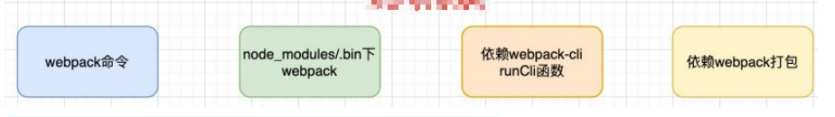
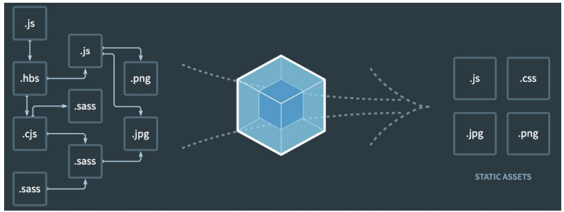

# Webpack基础打包

## 认识 webpack

* 随着前端的快速发展，前端的开发变的越来越复杂：
  * 比如开发过程中我们需要通过[模块化](https://github.com/clouddawn/blog/blob/main/md/md7/249_%E6%A8%A1%E5%9D%97%E5%8C%96%E5%BC%80%E5%8F%91.md)的方式来提高效率；
  * 比如也会使用一些高级的特性来加快我们的开发效率或者安全性，比如通过 ES6+、TypeScript 开发脚本逻辑，通过 sass、less 等方式来编写 css 样式代码；
  * 比如开发过程中，我们还希望实时的监听文件的变化并且反映到浏览器上，提高开发的效率；
  * 比如开发完成后我们还需要将代码进行压缩、合并以及其他相关的优化；
  * 等等….
* 但是对于很多的前端开发者来说，并不需要思考这些问题，日常的开发中根本就没有面临这些问题：
  * 这是因为目前前端开发我们通常都会直接使用三大框架来开发：Vue、React、Angular；
  * 但是事实上，这三大框架的创建过程我们都是借助于脚手架（CLI）的；
  * 事实上 Vue-CLI、create-react-app、Angular-CLI 都是基于 webpack 来帮助我们支持模块化、less、TypeScript、打包优化等的；

## Webpack 到底是什么呢？

* 我们先来看一下官方的解释：
  * webpack  is a *static module bundler* for modern JavaScript applications.
* webpack 是一个静态的模块化[打包](https://github.com/clouddawn/blog/blob/main/md/md7/252_webpack%E4%B8%AD%E7%9A%84%E6%89%93%E5%8C%85.md)工具，为现代的 JavaScript 应用程序；
* 我们来对上面的解释进行拆解：
  * 打包 bundler：webpack 可以将帮助我们进行打包，所以它是一个打包工具
  * 静态的 static：这样表述的原因是我们最终可以将代码打包成最终的静态资源（部署到静态服务器）；
  * 模块化 module：webpack 默认支持各种模块化开发，ES Module、CommonJS、AMD 等；
  * 现代的 modern：我们前端说过，正是因为现代前端开发面临各种各样的问题，才催生了 webpack 的出现和发
    展；
* webpack的官方文档是https://webpack.js.org/
  * webpack的中文官方文档是https://webpack.docschina.org/

## Vue 项目加载的文件有哪些呢？

* JavaScript 的打包：
  * 将 ES6 转换成 ES5 的语法；
  * TypeScript 的处理，将其转换成 JavaScript；
* Css 的处理：
  * CSS 文件模块的加载、提取；
  * Less、Sass 等预处理器的处理；
* 资源文件 img、font：
  * 图片 img 文件的加载；
  * 字体 font 文件的加载；
* HTML 资源的处理：
  * 打包 HTML 资源文件；
* 处理 vue 项目的 SFC 文件. vue 文件；

## Webpack 的安装

* webpack 的安装目前分为两个：webpack、webpack-cli

* 那么它们是什么关系呢？
  * 执行 webpack 命令，会执行 node_modules 下的 .bin 目录下的 webpack；
  * webpack 在执行时是依赖 webpack-cli 的，如果没有安装就会报错；
  * 而 webpack-cli 中代码执行时，才是真正利用 webpack 进行编译和打包的过程；
  * 所以在安装 webpack 时，我们需要同时安装 webpack-cli（第三方的脚手架事实上是没有使用 webpack-cli 的，而是类似于自己的 vue-service-cli 的东西）



* 全局安装

```
npm install webpack webpack-cli -g
```

* 局部安装

```
npm install webpack webpack-cli -D
```

## Webpack 的默认打包

* 我们可以通过 webpack 进行打包，之后运行打包之后的代码
  * 在目录下直接执行 `webpack` 命令
* 生成一个 dist 文件夹，里面存放一个 main.js 的文件，就是我们打包之后的文件：
  * 这个文件中的代码被压缩和丑化了；
  * 另外我们发现代码中依然存在 ES6 的语法，比如箭头函数、const等，这是因为默认情况下 webpack 并不清楚我们打包后的文
    件是否需要转成 ES5 之前的语法，后续我们需要通过 babel 来进行转换和设置；
* 我们发现是可以正常进行打包的，但是有一个问题，webpack 是如何确定我们的入口的呢？
  * 事实上，当我们运行 webpack 时，webpack 会查找当前目录下的  src/index.js 作为入口；
  * 所以，如果当前项目中没有存在 src/index.js 文件，那么会报错；
  * 当然，我们也可以通过配置来指定入口和出口

```
npx webpack --entry ./src/main.js --output-path ./build
```

## 创建局部的 webpack

* 前面我们直接执行 webpack 命令使用的是全局的 webpack，如果希望使用局部的可以按照下面的步骤来操作。

* 第一步：创建 package.json 文件，用于管理项目的信息、库依赖等

  ```js
  npm init
  ```

* 第二步：安装局部的 webpack

  ```js
  npm install webpack webpack-cli -D
  ```

* 第三步：使用局部的 webpack

  ```JS
  npx webpack
  ```

* 第四步：在 package.json 中创建 scripts 脚本，执行脚本打包即可

  ```js
  "scripts": {
      "build": "webpack"
  }
  ```

  .

  ```
  npm run build
  ```

## Webpack 配置文件

* 在通常情况下，webpack 需要打包的项目是非常复杂的，并且我们需要一系列的配置来满足要求，默认配置必然是不可以的。
* 我们可以在根目录下创建一个 webpack.config.js 文件，来作为 webpack 的配置文件：

```js
const path = require('path');
 // 导出配置信息
module.exports = {
    entry: "./src/main.js",
    output: {
        filename: "bundle.js",
        path: path.resolve(__dirname,"./dist")
    }
}
```

## Webpack 的依赖图

* webpack 到底是如何对我们的项目进行打包的呢？
  * 事实上 webpack 在处理应用程序时，它会根据命令或者配置文件找到入口文件；
  * 从入口开始，会生成一个 依赖关系图，这个依赖关系图会包含应用程序中所需的所有模块（比如 .js 文件、css 文件、图片、字
    体等）；
  * 然后遍历图结构，打包一个个模块（根据文件的不同使用不同的 loader 来解析）；



## css-loader 的使用

* loader 可以用于对模块的源代码进行转换；

* 我们可以将 css 文件也看成是一个模块，我们是通过 import 来加载这个模块的；

* 在加载这个模块时，webpack 其实并不知道如何对其进行加载，我们必须指定对应的 loader 来完成这个功能；

* 对于加载 css 文件来说，我们需要一个可以读取 css 文件的 loader；

* 这个 loader 最常用的是 css-loader；

* css-loader 的安装：

  ```js
  npm install css-loader -D
  ```

## loader 配置方式

* 在 webpack.config.js 文件中写明配置信息：
  * module.rules 中允许我们配置多个 loader（因为我们也会继续使用其他的loader，来完成其他文件的加载）；
  * 这种方式可以更好的表示 loader 的配置，也方便后期的维护，同时也让你对各个 Loader 有一个全局的概览；
* module.rules 的配置如下：
* rules 属性对应的值是一个数组：[Rule]
* 数组中存放的是一个个的 Rule，Rule 是一个对象，对象中可以设置多个属性：
  * test 属性：用于对 resource（资源）进行匹配的，通常会设置成正则表达式；
  * use 属性：对应的值是一个数组：[UseEntry]
    * UseEntry 是一个对象，可以通过对象的属性来设置一些其他属性
      * loader：必须有一个 loader属性，对应的值是一个字符串；
      * options：可选的属性，值是一个字符串或者对象，值会被传入到 loader 中；
      * query：目前已经使用 options 来替代；
    * 传递字符串（如：`use: [ 'style-loader' ]`）是 loader 属性的简写方式（如：`use: [ { loader: 'style-loader'} ]`）；
    * loader 属性： `Rule.use: [ { loader } ] `的简写。

```js
  module: {
    rules: [
      {
        test: /\.css$/,
        // loader: "css-loader" // 写法一
        // use: ["css-loader"] // 写法二
        // 写法三
        use: [
          {
            loader: "css-loader"
          }
        ]
      }
    ]
  }
```

## 认识 style-loader

* 我们已经可以通过 css-loader 来加载 css 文件了

  * 但是你会发现这个 css 在我们的代码中并没有生效（页面没有效果）。

* 这是为什么呢？

  * 因为 css-loader 只是负责将 .css 文件进行解析，并不会将解析之后的 css 插入到页面中；
  * 如果我们希望再完成插入 style 的操作，那么我们还需要另外一个 loader，就是 style-loader；

* 安装 style-loader：

  ```js
  npm install style-loader -D
  ```

## 配置 style-loader

* 因为 loader 的执行顺序是从右向左（或者说从上到下，或者说从后到前的），所以我们需要将 style-loader 写到 css-loader 的前面；

```js
rules: [
    {
        test: /\.css$/,
        use: [
            {loader: "style-loader"},
            {loader: "css-loader"}
        ]
    }
]
```

## less-loader 处理

```js
npm install less-loader -D
```

.

```js
{
    test: /\.less$/,
    use: [
        {loader: "style-loader"},
        {loader: "css-loader"},
        {loader: "less-loader"}
    ]
}
```

## 认识 PostCSS 工具

* 什么是 PostCSS 呢？
  * PostCSS 是一个通过 JavaScript 来转换样式的工具；
  * 这个工具可以帮助我们进行一些 CSS 的转换和适配，比如自动添加浏览器前缀、css 样式的重置；
  * 但是实现这些功能，我们需要借助于 PostCSS 对应的插件；
* 如何使用 PostCSS 呢？主要就是两个步骤：
  * 第一步：查找 PostCSS 在构建工具中的扩展，比如 webpack 中的 postcss-loader；
  * 第二步：选择可以添加你需要的 PostCSS 相关的插件；

## postcss-loader

```js
npm install postcss-loader -D
```

* 因为 postcss 需要有对应的插件才会起效果，所以我们需要配置它的 plugin

```js
{
    loader: "postcss-loader",
    options: {
        postcssOptions: {
            plugins: [
                require('autoprefixer')
            ]
        }
    }
}
```

## 单独的 postcss 配置文件

* 可以将配置信息放到一个单独的文件中进行管理：
  * 在根目录下创建 postcss.config.js

```js
module.exports = {
    plugins: [
        require("autoprefixer")
    ]
}
```

## postcss-preset-env

* 事实上，在配置 postcss-loader 时，我们配置插件并不需要使用 autoprefixer。
* 我们可以使用另外一个插件：postcss-preset-env
  * postcss-preset-env 也是一个 postcss 的插件；
  * 它可以帮助我们将一些现代的 CSS 特性，转成大多数浏览器认识的 CSS，并且会根据目标浏览器或者运行时环境添加所需的 polyfill；
  * 也包括会自动帮助我们添加 autoprefixer（所以相当于已经内置了 autoprefixer）；

* 首先，我们需要安装 postcss-preset-env :

  ```js
  npm install postcss-preset-env -D
  ```

* 之后，我们直接修改掉之前的 autoprefixer 即可：

  ```js
  plugins: [
      require("postcss-preset-env")
  ]
  ```

  


