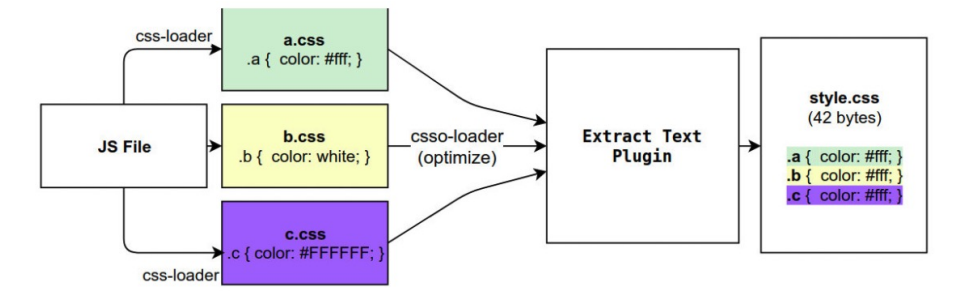
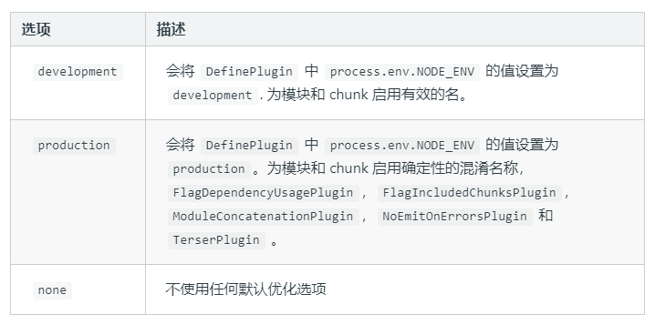
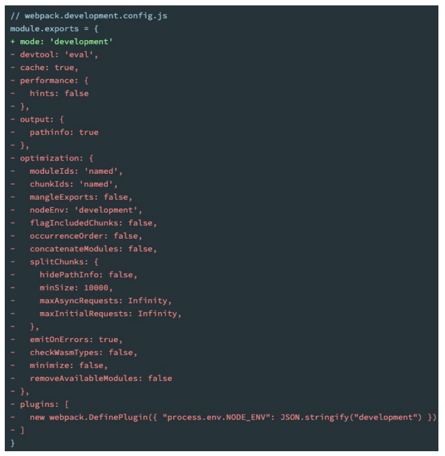
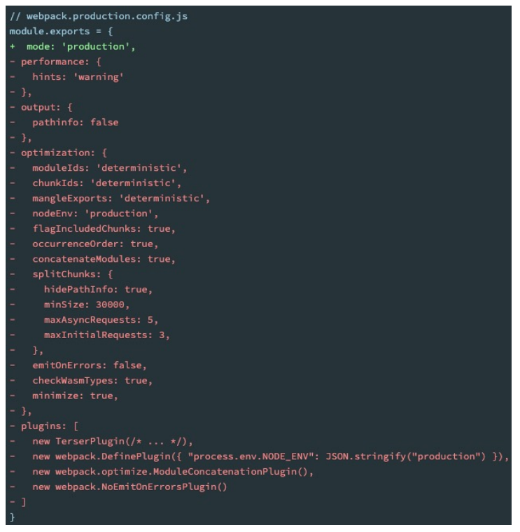

# Webpack 打包其他资源

## 加载图片案例准备

```js
// image元素
const zznhImage = new Image();
zznhImage.src=require("../img/zznh.png");
element.appendChild(zznhImage);

// 增加一个div,用于存放图片
const bgDiv = document.createElement('div');
bgDiv.style.width = 200 + 'px';
bgDiv.style.height = 200 + 'px';
bgDiv.style.display =.'inline-block';
bgDiv.className = 'bg-image';
bgDiv.style.backgroundColor = 'red' ;
element.appendChild(bgDiv);
```

.

```css
.bg-image {
    background-image: url("../img/nhlt.jpg");
    background-size: contain;
}
```

## file-loader

* 要处理 jpg、png 等格式的图片，我们也需要有对应的 loader：file-loader
  
* file-loader 的作用就是帮助我们处理 import/require() 方式引入的一个文件资源，并且会将它放到我们输出的文件夹中；
  
* 安装 file-loader

  ```js
  npm install file-loader -D
  ```

* 配置处理图片的 rule：

  ```js
  {
      test: /\.(png|jpe?g|gif|svg)$/i,
      use: {
          loader: "file-loader"
      }
  }
  ```

## 文件的命名规则

* 有时候我们处理后的文件名称按照一定的规则进行显示：
  * 比如保留原来的文件名、扩展名，同时为了防止重复，包含一个 hash 值等；
* 这个时候我们可以使用 PlaceHolders 来完成，webpack 给我们提供了大量的 PlaceHolders 来显示不同的内容：
  * https://webpack.js.org/loaders/file-loader/#placeholders
* 常用的 placeholder：
  * `[ext]`： 处理文件的扩展名；
  * `[name]`：处理文件的名称；
  * `[hash]`：文件的内容，使用 MD4 的散列函数处理，生成的一个128位的hash值（32个十六进制）；
  * `[contentHash]`：在 file-loader 中和 [hash] 结果是一致的；
  * `[hash:<length>]`：设置 hash 的长度，默认32个字符太长了；
  * `[path]`：文件相对于 webpack 配置文件的路径；

## 设置文件的名称

```js
{
    test: /\.(png|jpe?g|gif|svg)$/i,
    use: {
        loader: "file-loader",
        options: {
            name: "img/[name].[hash:8].[ext]",
            // outputPath: "img"
        }
    }
}
```

## url-loader

* url-loader 和 file-loader 的工作方式是相似的，但是可以将较小的文件，转成 base64 的 URI。

* 安装 url-loader：

```js
npm install url-loader -D
```

* 默认情况下 url-loader 会将所有的图片文件转成 base64 编码

* 但是开发中我们往往是小的图片需要转换，大的图片直接使用即可

  * 因为小的图片转换 base64 之后可以和页面一起被请求，减少不必要的请求过程；
  * 如果大的图片也进行转换，反而会影响页面的请求速度；

* url-loader 有一个 options 属性 limit，可以用于设置转换的限制；

  ```js
  {
      test: /\.(png|jpe?g|gif|svg)$/i,
      use: {
          loader: "url-loader",
          options: {
              limit: 100 * 1024,
              name: "[name].[hash:8].[ext]",
              outputPath: "img"
          }
      }
  }
  ```

## **认识 asset module type**

* 我们当前使用的 webpack 版本是 webpack5：
  * 在 webpack5 之前，加载这些资源我们需要使用一些 loader，比如 raw-loader 、url-loader、file-loader；
  * 在 webpack5 开始，我们可以直接使用资源模块类型（asset module type），来替代上面的这些 loader；
* 资源模块类型 (asset module type)，通过添加 4 种新的模块类型，来替换所有这些 loader：
  * asset/resource 发送一个单独的文件并导出 URL。之前通过使用 file-loader 实现；
  * asset/inline 导出一个资源的 data URI。之前通过使用 url-loader 实现；
  * asset/source 导出资源的源代码。之前通过使用 raw-loader 实现；
  * asset 在导出一个 data URI 和发送一个单独的文件之间自动选择。之前通过使用 url-loader，并且配置资源体积限制实现；

## asset module type的使用

* 比如加载图片，我们可以使用下面的方式：

```js
{
    test: /\.(png|svg|jpg|jpeg|gif)$/i,
    type: "asset/resource"
}
```

* 但是，如何自定义文件的输出路径和文件名呢？

  * 方式一：修改 output，添加 assetModuleFilename 属性；

  ```js
  output: {
      filename: "js/boundle.js",
      path: path.resolve(__dirname, "./dist"),
      assetModuleFilename: "img/[name].[hash:6][ext]"
  }
  ```

  * 方式二：在 Rule 中，添加一个 generator 属性，并且设置 filename；

  ```js
  {
      test: /\.(png|svg|jpg|jpeg|gif)$/i,
      type: "asset/resource",
      generator: {
          filename: "img/[name].[hash:6][ext]"
      }
  }
  ```

## url-loader 的 limit 效果

* 步骤一：将 type 修改为 asset；
* 步骤二：添加一个 parser 属性，并且制定 dataUrl 的条件，添加 maxSize 属性；

```js
{
    test: /\.(png|svg|jpg|jpeg|gif)$/i,
    type: "asset/resource",
    generator: {
        filename: "img/[name].[hash:6][ext]"
    },
    parser: {
        dataUrlCondition: {
            maxSize: 100 * 1024
        }
    }
}
```

## 字体的打包

```js
{
    test: /\.(woff2?|eot|ttf)$/,
        type: "asset/resource",
        generator: {
        	filename: "font/[name].[hash:6][ext]"
        }
}
```

## **认识Plugin**

* Loader 是用于特定的模块类型进行转换；
* Plugin 可以用于执行更加广泛的任务，比如打包优化、资源管理、环境变量注入等；



## ClenWebpackPlugin

* 打包时，自动删除 dist 文件夹：

  ```js
  npm install clean-webpack-plugin -D
  ```

  .

  ```JS
  const { CleanWebpackPlugin } = require('clean-webpack-plugin');
  
  module.exports = {
      plugins: [
          new CleanWebpaclPlugin()
      ]
  }
  ```

## HtmlWebpackPlugin

* 我们的 HTML 文件是编写在根目录下的，而最终打包的 dist 文件夹中是没有 index.html 文件的。
* 在进行项目部署的时，必然也是需要有对应的入口文件index.html；
* 所以我们也需要对 index.html 进行打包处理；
* 对HTML进行打包处理我们可以使用另外一个插件: HtmlWebpackPlugin；

```js
npm install html-webpack-plugin -D
```

```js
const HtmlWebpackPlugin = require('html-webpack-plugin');
module.exports = {
    plugins: [
        new HtmlWepackPlugin({
            title: "webpack案例"
        })
    ]
}
```

## 生成的 index.html 分析

* 现在自动在 dist 文件夹中，生成了一个 index.html 的文件：
  * 该文件中也自动添加了我们打包的 bundle.js 文件；

```html
<!DOCTYPE html>
<html>
<head>
  <meta charset="utf-8">
  <title>webpack案例</title>
  <meta name="viewport" content="width=device-width, initial-scale=1">
  <script defer src="bundle.js"></script>
</head>
<body>
</body>
</html>
```

* 这个文件是如何生成的呢？
  * 默认情况下是根据 ejs 的一个模板来生成的；
  * 在 html-webpack-plugin 的源码中，有一个 default_index.ejs 模块；

## 自定义 HTML 模板

* 如果我们想在自己的模块中加入一些比较特别的内容：
  * 比如添加一个 noscript 标签，在用户的 JavaScript 被关闭时，给予响应的提示；
  * 比如在开发 vue 或者 react 项目时，我们需要一个可以挂载后续组件的根标签 `<div id="app"></div>`；
* 这个我们需要一个属于自己的 index.html 模块：


## 自定义模板数据填充

* 上面的代码中，会有一些类似这样的`语法<% 变量 %>`，这个是 EJS 模块填充数据的方式。
* 在配置 HtmlWebpackPlugin 时，我们可以添加如下配置：
  * template：指定我们要使用的模块所在的路径；
  * title：在进行 `htmlWebpackPlugin.options.title` 读取时，就会读到该信息；

```js
const HtmlWebpackPlugin = require("html-webpack-plugin");
module.exports = {
    plugins: [
        new CleanWebpackPlugin(),
        new HtmlWebpackPlugin({
            title: "webpack项目",
            template: "./public/index.html"
        })
    ]
}
```

## **DefinePlugin 的介绍**

* 这个时候编译还是会报错，因为在我们的模块中还使用到一个BASE_URL的常量：

  ```js
  ERROR in Template execution failed: ReferenceError: BASE_URL is not defined
  
  ERROR in   ReferenceError: BASE_URL is not defined
  ```

* 这是因为在编译 `template` 模块时，有一个 `BASE_URL`：

  * `<link rel="icon" href="<%= BASE_URL %>favicon.ico">`；
  * 但是我们并没有设置过这个常量值，所以会出现没有定义的错误；

* 这个时候我们可以使用 DefinePlugin 插件；

## **DefinePlugin 的使用**

* DefinePlugin 允许在编译时创建配置的全局常量，是一个 webpack 内置的插件（不需要单独安装）：

```js
const { DefinePlugin } = require('webpack');

module.exports = {
    plugins: [
        new DefinePlugin({
            BASE_URL: '"./"'
        })
    ]
}
```

* 这个时候，编译 template 就可以正确的编译了，会读取到 BASE_URL 的值；

## **CopyWebpackPlugin**

* 在 vue 的打包过程中，如果我们将一些文件放到 public 的目录下，那么这个目录会被复制到 dist 文件夹中。
  
* 这个复制的功能，我们可以使用 CopyWebpackPlugin 来完成；
  
* 安装

  ```js
  npm install copy-webpack-plugin -D
  ```

* 接下来配置 CopyWebpackPlugin 即可
  * 复制的规则在 patterns 中设置
  * `from·：设置从哪一个源中开始复制；
  * `to·：复制到的位置，可以省略，会默认复制到打包的目录下；
  * `globOptions`：设置一些额外的选项，其中可以编写需要忽略的文件：
    * `.DS_Store`：mac 目录下回自动生成的一个文件；
    * `index.html`：也不需要复制，因为我们已经通过 HtmlWebpackPlugin 完成了 index.html 的生成；

```js
new CopyWebpackPlugin({
  patterns: [
    {
      from: "public",
      globOptions: {
        ignore: [
          '**/index.html'
        ]
      }
    }
  ]
})
```

## Mode 配置

* Mode 配置选项，可以告知 webpack 使用响应模式的内置优化：
  * 默认值是 production（什么都不设置的情况下）；
  * 可选值有：'none' | 'development' | 'production'；

* 区别



## Mode 配置代表更多






