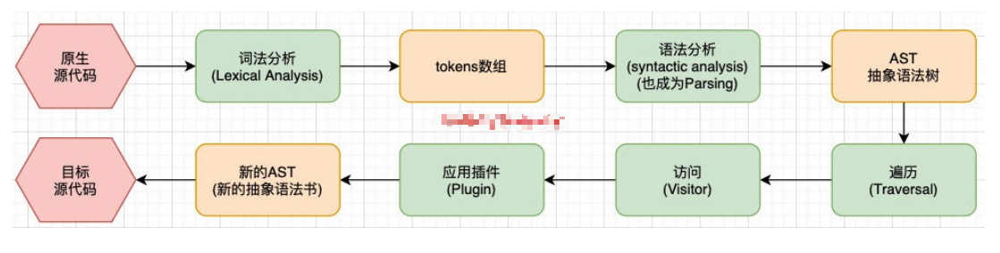
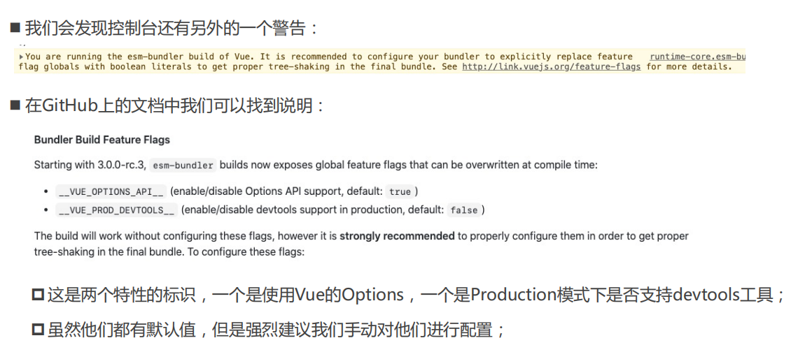

# babel

## babel 是什么？

* Babel 是一个工具链，主要用于旧浏览器或者环境中将 ECMAScript 2015+ 代码转换为向后兼容版本的
   JavaScript；
* 包括：语法转换、源代码转换等；

## babel 的底层原理

* babel 是如何做到将我们的一段代码（ES6、TypeScript、React）转成另外一段代码（ES5）的呢？
  * 从一种源代码（原生语言）转换成另一种源代码（目标语言），这是编译器的工作，事实上我们可以将 babel 看成是一个编译器。
  * Babel 编译器的作用就是将我们的源代码，转换成浏览器可以直接识别的另外一段源代码；
* Babel 也拥有编译器的工作流程：
  * 解析阶段（Parsing）
  * 转换阶段（Transformation）
  * 生成阶段（Code Generation）

## babel 编译器执行原理

* babel 的执行阶段


* 当然，这只是一个简化版的编译器工具流程，在每个阶段又会有自己具体的工作：




## babel-loader

* 在实际开发中，我们通常会在构建工具中通过配置 babel 来对其进行使用的，比如在 webpack 中。
* 安装相关依赖：

```js
npm install babel-loader @babel/core
```

* 我们可以设置一个规则，在加载 js 文件时，使用我们的 babel：

```js
module: {
    rules: [
        {
            test: /\.m?js$/,
            use: {
                loader: "babel-loader"
            }
        }
    ]
}
```

## 指定使用的插件

* 必须指定使用的插件才会生效

```js
{
    test: /\.m?js$/,
    use: {
        loader: "babel-loader",
        options: {
            plugins: [
                "@babel/plugin-transform-block-scoping",
                "@babel/plugin-transform-arrow-functions"
            ]
        }
    }
}
```

## babel-preset

* 如果我们一个个去安装使用插件，那么需要手动来管理大量的 babel 插件，我们可以直接给 webpack 提供一个  preset，webpack 会根据我们的预设来加载对应的插件列表，并且将其传递给 babel。 

* 比如常见的预设有三个： 
  * env 
  * react 
  * TypeScript 

* 安装 preset-env：

  ```js
  npm install @babel/preset-env
  ```

.

```js
{
    test: /\.m?js$/,
    use: {
        loader: "babel-loader",
        options: {
            presets: [
                ["@babel/preset-env"]
            ]
        }
    }
}
```

## babel 的配置文件

* 像之前一样，我们可以将 babel 的配置信息放到一个独立的文件中，babel 给我们提供了两种配置文件的编写：
  * babel.config.json（或者.js，.cjs，.mjs）文件；
  * babelrc.json（或者.babelrc，.js，.cjs，.mjs）文件；
* 它们两个有什么区别呢？目前很多的项目都采用了多包管理的方式（babel本身、element-plus、umi等）；
  * .babelrc.json：早期使用较多的配置方式，但是对于配置 Monorepos 项目是比较麻烦的；
  * babel.config.json（babel7）：可以直接作用于 Monorepos 项目的子包，更加推荐；

```js
module.exports = {
    presets: [
        ["@babel/preset-env"]
    ]
}
```

## Vue 打包后不同版本解析

* `vue(.runtime).global(.prod).js`：
  * 通过浏览器中的` <script src="...">` 直接使用；
  * 会暴露一个全局的 Vue 来使用；
* `vue(.runtime).esm-browser(.prod).js`：
  * 用于通过原生 ES 模块导入使用 (在浏览器中通过 `<script type="module">` 来使用)。
* `vue(.runtime).esm-bundler.js`：
  * 用于 webpack，rollup 和 parcel 等构建工具；
  * 构建工具中默认是 `vue.runtime.esm-bundler.js`；
  * 如果我们需要解析模板 template，那么需要手动指定 `vue.esm-bundler.js`；
* `vue.cjs(.prod).js`：
  * 服务器端渲染使用；
  * 通过 `require()` 在 Node.js 中使用；

## 「运行时 + 编译器」 vs 仅运行时

* 在 Vue 的开发过程中我们有三种方式来编写 DOM 元素：
  * 方式一：template 模板的方式；
  * 方式二：render 函数的方式，使用 h 函数来编写渲染的内容；
  * 方式三：通过 .vue 文件中的 template 来编写模板；
* 它们的模板分别是如何处理的呢？
  * 方式二中的 h 函数可以直接返回一个虚拟节点，也就是 Vnode 节点；
  * 方式一和方式三的 template 都需要有特定的代码来对其进行解析：
    * 方式三 .vue 文件中的 template 可以通过在 vue-loader 对其进行编译和处理；
    * 方式一种的 template 我们必须要通过源码中一部分代码来进行编译；
* 所以，Vue 在让我们选择版本的时候分为 「运行时 + 编译器」 vs 仅运行时
  * 「运行时+编译器」包含了对 template 模板的编译代码，更加完整，但是也更大一些；
  * 仅运行时没有包含对 template 版本的编译代码，相对更小一些；



## 编写 App.vue 代码

```js
// js
import {createApp} from "vue/dist/vue.esm-bundler.js";
import App from "./vue/App.vue";

createApp(App).mount("#app");
```

```html
// vue
<template>
  <h2>{{ title }}</h2>
  <p>{{ content }}</p>
</template>

<script>
export default {
  data() {
    return {
      title: "我是App标题",
      content: "我是App的内容，哈哈哈"
    };
  }
};
</script>

<style lang="scss" scoped>
h2 {
  color: red;
}
p {
  color: blue;
}
</style>
```

## App.vue 的打包过程

* 现在直接对代码打包会报错，因为没有合适的 loader 来处理文件。

* 需要使用 vue-loader

  ```js
  npm install vue-loader -D
  ```

* 在 webpack 的模板规则中进行配置：

  ```js
  {
      test: /\.vue$/,
      loader: "vue-loader"
  }
  ```

## @vue/compiler-sfc

* 现在打包依然会报错，还需要添加 @vue/compiler-sfc 来对 template 进行解析：

  ```js
  npm install @vue/compiler-sfc -D
  ```

* 另外还需要配置对应的 Vue 插件

  ```js
  const { VueLoaderPlugin } = require('vue-loader/dist/index');
  
  new VueLoaderPlugin();
  ```

* 重新打包即可支持 App.vue 的写法

## 为什么要搭建本地服务器？

* 运行现在的代码需要两个操作：
  * 操作一：`npm run build`，编译相关的代码；
  * 操作二：通过 `live server` 或者直接通过浏览器，打开`index.html` 代码，查看效果；
* 这个过程经常操作会影响开发效率，希望可以做到，当文件发生变化时，自动的完成编译和展示；
* webpack 提供了几种可选的方式：
  * webpack watch mode；
  * webpack-dev-server（常用）；
  * webpack-dev-middleware；

## Webpack watch

* webpack 给我们提供了 watch 模式：
  * 在该模式下，webpack 依赖图中的所有文件，只要有一个发生了更新，那么代码将被重新编译；
  * 我们不需要手动去运行 `npm run build` 指令了；
* 如何开启 watch 呢？两种方式：
  * 方式一：在导出的配置中，添加 watch: true；
  * 方式二：在启动 webpack 的命令中，添加 --watch 的标识；
* 这里我们选择方式二，在 package.json 的 scripts 中添加一个 watch 的脚本：

```json
  "scripts": {
    "build": "webpack --config wk.config.js",
    "watch": "webpack --watch --config wk.config.js"
  },
```

## webpack-dev-server

* 监听文件的变化，并自动刷新浏览器

* 安装

  ```js
  npm install webpack-dev-server -D
  ```

* 修改配置文件

  ```js
  devServer: {
      static: {
          directory: path.resolve(__dirname, 'videos')
      }
  }
  ```

  .

  ```js
  "scripts": {
      "build": "webpack --config wk.config.js",
      "watch": "webpack --watch --config wk.config.js",
      "serve": "webpack serve --config wk.config.js"
  }
  ```

* `webpack-dev-server` 在编译之后不会写入到任何输出文件，而是将 bundle 文件保留在内存中：
  
  * `webpack-dev-server` 使用了一个库叫 memfs（memory-fs）。

## 认识模块热替换（HMR）

* 什么是 HMR 呢？
  * HMR 的全称是 Hot Module Replacement，翻译为模块热替换；
  * 模块热替换是指在应用程序运行过程中，替换、添加、删除模块，而无需重新刷新整个页面；
* HMR 通过如下几种方式，来提高开发的速度：
  * 不重新加载整个页面，这样可以保留某些应用程序的状态不丢失；
  * 只更新需要变化的内容，节省开发的时间；
  * 修改了 css、js 源代码，会立即在浏览器更新，相当于直接在浏览器的 devtools 中直接修改样式；
* 如何使用 HMR 呢？
  * 默认情况下，webpack-dev-server 已经支持 HMR，我们只需要开启即可；
  * 在不开启 HMR 的情况下，当我们修改了源代码之后，整个页面会自动刷新，使用的是 live reloading；

## 开启 HMR

* 修改 webpack 的配置

  ```js
  devServer: {
    hot: true
  },
  ```

* 指定模块

  ```js
  import "./js/element";
  
  if (module.hot) {
    module.hot.accept("./js/element");
  }
  ```

## 框架的 HMR

* 开发 Vue 项目时，我们修改了组件，希望进行热更新，这个时候应该如何去操作呢？
  * vue-loader 支持 vue 组件的 HMR，提供开箱即用的体验；

## HMR 的原理

* 那么 HMR 的原理是什么呢？如何做到只更新一个模块中的内容呢？
  * webpack-dev-server 会创建两个服务：提供静态资源的服务（express）和 Socket 服务（net.Socket）；
  * express server 负责直接提供静态资源的服务（打包后的资源直接被浏览器请求和解析）；
* HMR Socket Server，是一个 socket 的长连接：
  * 长连接有一个最好的好处是建立连接后双方可以通信（服务器可以直接发送文件到客户端）；
  * 当服务器监听到对应的模块发生变化时，会生成两个文件 .json（manifest文件）和 .js文件（update chunk）；
  * 通过长连接，可以直接将这两个文件主动发送给客户端（浏览器）；
  * 浏览器拿到两个新的文件后，通过 [HMR runtime](https://github.com/clouddawn/blog/blob/main/md/md7/253_HMR_runtime.md) 机制，加载这两个文件，并且针对修改的模块进行更新；


