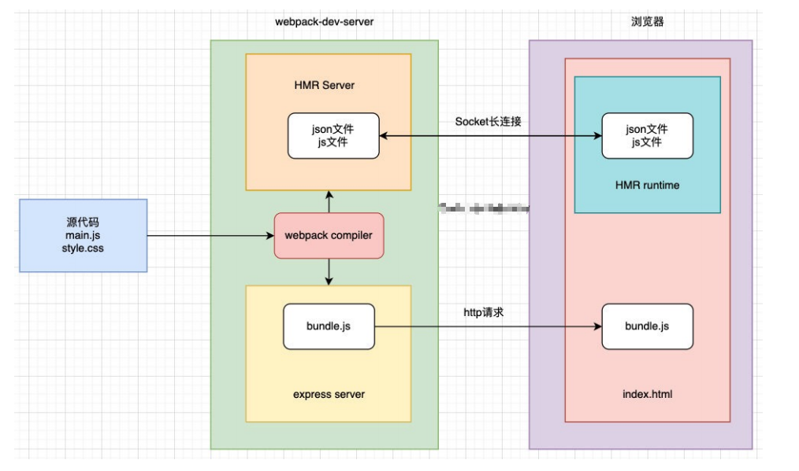

# babel

## babel 是什么？

* Babel 是一个工具链，主要用于旧浏览器或者环境中将 ECMAScript 2015+ 代码转换为向后兼容版本的
   JavaScript；
* 包括：语法转换、源代码转换等；

## babel 的底层原理

* babel 是如何做到将我们的一段代码（ES6、TypeScript、React）转成另外一段代码（ES5）的呢？
  * 从一种源代码（原生语言）转换成另一种源代码（目标语言），这是编译器的工作，事实上我们可以将 babel 看成是一个编译器。
  * Babel 编译器的作用就是将我们的源代码，转换成浏览器可以直接识别的另外一段源代码；
* Babel 也拥有编译器的工作流程：
  * 解析阶段（Parsing）
  * 转换阶段（Transformation）
  * 生成阶段（Code Generation）

## babel 编译器执行原理

* babel 的执行阶段


* 当然，这只是一个简化版的编译器工具流程，在每个阶段又会有自己具体的工作：


## babel-loader

* 在实际开发中，我们通常会在构建工具中通过配置 babel 来对其进行使用的，比如在 webpack 中。
* 安装相关依赖：

```js
npm install babel-loader @babel/core
```

* 我们可以设置一个规则，在加载 js 文件时，使用我们的 babel：

```js
module: {
    rules: [
        {
            test: /\.m?js$/,
            use: {
                loader: "babel-loader"
            }
        }
    ]
}
```

## 指定使用的插件

* 必须指定使用的插件才会生效

```js
{
    test: /\.m?js$/,
    use: {
        loader: "babel-loader",
        options: {
            plugins: [
                "@babel/plugin-transform-block-scoping",
                "@babel/plugin-transform-arrow-functions"
            ]
        }
    }
}
```

## babel-preset

* 如果我们一个个去安装使用插件，那么需要手动来管理大量的 babel 插件，我们可以直接给 webpack 提供一个  preset，webpack 会根据我们的预设来加载对应的插件列表，并且将其传递给 babel。 

* 比如常见的预设有三个： 
  * env 
  * react 
  * TypeScript 

* 安装 preset-env：

  ```js
  npm install @babel/preset-env
  ```

.

```js
{
    test: /\.m?js$/,
    use: {
        loader: "babel-loader",
        options: {
            presets: [
                ["@babel/preset-env"]
            ]
        }
    }
}
```

## babel 的配置文件

* 像之前一样，我们可以将 babel 的配置信息放到一个独立的文件中，babel 给我们提供了两种配置文件的编写：
  * babel.config.json（或者.js，.cjs，.mjs）文件；
  * babelrc.json（或者.babelrc，.js，.cjs，.mjs）文件；
* 它们两个有什么区别呢？目前很多的项目都采用了多包管理的方式（babel本身、element-plus、umi等）；
  * .babelrc.json：早期使用较多的配置方式，但是对于配置 Monorepos 项目是比较麻烦的；
  * babel.config.json（babel7）：可以直接作用于 Monorepos 项目的子包，更加推荐；

```js
module.exports = {
    presets: [
        ["@babel/preset-env"]
    ]
}
```

## Vue 打包后不同版本解析

* `vue(.runtime).global(.prod).js`：
  * 通过浏览器中的` <script src="...">` 直接使用；
  * 会暴露一个全局的 Vue 来使用；
* `vue(.runtime).esm-browser(.prod).js`：
  * 用于通过原生 ES 模块导入使用 (在浏览器中通过 `<script type="module">` 来使用)。
* `vue(.runtime).esm-bundler.js`：
  * 用于 webpack，rollup 和 parcel 等构建工具；
  * 构建工具中默认是 `vue.runtime.esm-bundler.js`；
  * 如果我们需要解析模板 template，那么需要手动指定 `vue.esm-bundler.js`；
* `vue.cjs(.prod).js`：
  * 服务器端渲染使用；
  * 通过 `require()` 在 Node.js 中使用；

## 「运行时 + 编译器」 vs 仅运行时

* 在 Vue 的开发过程中我们有三种方式来编写 DOM 元素：
  * 方式一：template 模板的方式；
  * 方式二：render 函数的方式，使用 h 函数来编写渲染的内容；
  * 方式三：通过 .vue 文件中的 template 来编写模板；
* 它们的模板分别是如何处理的呢？
  * 方式二中的 h 函数可以直接返回一个虚拟节点，也就是 Vnode 节点；
  * 方式一和方式三的 template 都需要有特定的代码来对其进行解析：
    * 方式三 .vue 文件中的 template 可以通过在 vue-loader 对其进行编译和处理；
    * 方式一种的 template 我们必须要通过源码中一部分代码来进行编译；
* 所以，Vue 在让我们选择版本的时候分为 「运行时 + 编译器」 vs 仅运行时
  * 「运行时+编译器」包含了对 template 模板的编译代码，更加完整，但是也更大一些；
  * 仅运行时没有包含对 template 版本的编译代码，相对更小一些；


## 编写 App.vue 代码

```js
// js
import {createApp} from "vue/dist/vue.esm-bundler.js";
import App from "./vue/App.vue";

createApp(App).mount("#app");
```

```html
// vue
<template>
  <h2>{{ title }}</h2>
  <p>{{ content }}</p>
</template>

<script>
export default {
  data() {
    return {
      title: "我是App标题",
      content: "我是App的内容，哈哈哈"
    };
  }
};
</script>

<style lang="scss" scoped>
h2 {
  color: red;
}
p {
  color: blue;
}
</style>
```

## App.vue 的打包过程

* 现在直接对代码打包会报错，因为没有合适的 loader 来处理文件。

* 需要使用 vue-loader

  ```js
  npm install vue-loader -D
  ```

* 在 webpack 的模板规则中进行配置：

  ```js
  {
      test: /\.vue$/,
      loader: "vue-loader"
  }
  ```

## @vue/compiler-sfc

* 现在打包依然会报错，还需要添加 @vue/compiler-sfc 来对 template 进行解析：

  ```js
  npm install @vue/compiler-sfc -D
  ```

* 另外还需要配置对应的 Vue 插件

  ```js
  const { VueLoaderPlugin } = require('vue-loader/dist/index');
  
  new VueLoaderPlugin();
  ```

* 重新打包即可支持 App.vue 的写法

## 为什么要搭建本地服务器？

* 运行现在的代码需要两个操作：
  * 操作一：`npm run build`，编译相关的代码；
  * 操作二：通过 `live server` 或者直接通过浏览器，打开`index.html` 代码，查看效果；
* 这个过程经常操作会影响开发效率，希望可以做到，当文件发生变化时，自动的完成编译和展示；
* webpack 提供了几种可选的方式：
  * webpack watch mode；
  * webpack-dev-server（常用）；
  * webpack-dev-middleware；

## Webpack watch

* webpack 给我们提供了 watch 模式：
  * 在该模式下，webpack 依赖图中的所有文件，只要有一个发生了更新，那么代码将被重新编译；
  * 我们不需要手动去运行 `npm run build` 指令了；
* 如何开启 watch 呢？两种方式：
  * 方式一：在导出的配置中，添加 watch: true；
  * 方式二：在启动 webpack 的命令中，添加 --watch 的标识；
* 这里我们选择方式二，在 package.json 的 scripts 中添加一个 watch 的脚本：

```json
  "scripts": {
    "build": "webpack --config wk.config.js",
    "watch": "webpack --watch --config wk.config.js"
  },
```

## webpack-dev-server

* 监听文件的变化，并自动刷新浏览器

* 安装

  ```js
  npm install webpack-dev-server -D
  ```

* 修改配置文件

  ```js
  devServer: {
      static: {
          directory: path.resolve(__dirname, 'videos')
      }
  }
  ```

  .

  ```js
  "scripts": {
      "build": "webpack --config wk.config.js",
      "watch": "webpack --watch --config wk.config.js",
      "serve": "webpack serve --config wk.config.js"
  }
  ```

* `webpack-dev-server` 在编译之后不会写入到任何输出文件，而是将 bundle 文件保留在内存中：
  
  * `webpack-dev-server` 使用了一个库叫 memfs（memory-fs）。

## 认识模块热替换（HMR）

* 什么是 HMR 呢？
  * HMR 的全称是 Hot Module Replacement，翻译为模块热替换；
  * 模块热替换是指在应用程序运行过程中，替换、添加、删除模块，而无需重新刷新整个页面；
* HMR 通过如下几种方式，来提高开发的速度：
  * 不重新加载整个页面，这样可以保留某些应用程序的状态不丢失；
  * 只更新需要变化的内容，节省开发的时间；
  * 修改了 css、js 源代码，会立即在浏览器更新，相当于直接在浏览器的 devtools 中直接修改样式；
* 如何使用 HMR 呢？
  * 默认情况下，webpack-dev-server 已经支持 HMR，我们只需要开启即可；
  * 在不开启 HMR 的情况下，当我们修改了源代码之后，整个页面会自动刷新，使用的是 live reloading；

## 开启 HMR

* 修改 webpack 的配置

  ```js
  devServer: {
    hot: true
  },
  ```

* 指定模块

  ```js
  import "./js/element";
  
  if (module.hot) {
    module.hot.accept("./js/element");
  }
  ```

## 框架的 HMR

* 开发 Vue 项目时，我们修改了组件，希望进行热更新，这个时候应该如何去操作呢？
  * vue-loader 支持 vue 组件的 HMR，提供开箱即用的体验；

## HMR 的原理

* 那么 HMR 的原理是什么呢？如何做到只更新一个模块中的内容呢？
  * webpack-dev-server 会创建两个服务：提供静态资源的服务（express）和 Socket 服务（net.Socket）；
  * express server 负责直接提供静态资源的服务（打包后的资源直接被浏览器请求和解析）；
* HMR Socket Server，是一个 socket 的长连接：
  * 长连接有一个最好的好处是建立连接后双方可以通信（服务器可以直接发送文件到客户端）；
  * 当服务器监听到对应的模块发生变化时，会生成两个文件 .json（manifest文件）和 .js文件（update chunk）；
  * 通过长连接，可以直接将这两个文件主动发送给客户端（浏览器）；
  * 浏览器拿到两个新的文件后，通过 [HMR runtime](https://github.com/clouddawn/blog/blob/main/md/md7/253_HMR_runtime.md) 机制，加载这两个文件，并且针对修改的模块进行更新；

## HMR 的原理图



## host 配置

* host 设置主机地址：
  * 默认值是 localhost；
* localhost
  * localhost：本质上是一个域名，通常情况下会被解析成127.0.0.1;
  * 127.0.0.1：回环地址(Loop Back Address)，表达的意思其实是主机自己发出去的包，直接被自己接收;
    * 正常的数据库包经过 应用层 - 传输层 - 网络层 - 数据链路层 - 物理层 ;
    * 而回环地址，是在网络层直接就被获取到了，是不会经过 数据链路层和物理层的;
    * 比如我们监听 127.0.0.1 时，在同一个网段下的主机中，通过 ip 地址是不能访问的;

## port、open、compress

* port 设置监听的端口，默认情况下是 8080
* open 是否打开浏览器：
  * 默认值是 false，设置为 true 会打开浏览器；
  * 也可以设置为类似于 Google Chrome 等值；
* compress 是否为静态文件开启 gzip compression：
  * 默认值是false，可以设置为true；

```js
  devServer: {
    static: {
      directory: path.resolve(__dirname, "videos")
    },
    hot: true,
    // host: "192.168.118.36",
    open: true,
    port: 8989,
    compress: true
  }
```

## proxy

* proxy 是我们开发中非常常用的一个配置选项，用它设置代理来解决跨域访问的问题：
  * 比如我们的一个api请求是 http://localhost:8888，但是本地启动服务器的域名是 http://localhost:8000，这个时候发送网络请求就会出现跨域的问题；
  * 那么我们可以将请求先发送到一个代理服务器，代理服务器和API服务器没有跨域的问题，就可以解决我们的跨域问题了；
* 我们可以进行如下的设置：
  * target：表示的是代理到的目标地址，比如 /api-hy/moment 会被代理到 http://localhost:8888/api-hy/moment；
  * pathRewrite：默认情况下，我们的 /api-hy 也会被写入到URL中，如果希望删除，可以使用 pathRewrite；
  * secure：默认情况下不接收转发到 https 的服务器上，如果希望支持，可以设置为false；
  * changeOrigin：它表示是否更新代理后请求的 headers 中 host 地址；

```js
devServer: {
  proxy: {
    '/api': {
      target: 'http://localhost:3000',
      pathRewrite: { '^/api': '' },
    },
  },
}
```

## changeOrigin 的解析

* 修改代理请求中的 headers 中的 host 属性：
  * 真实的请求是通过 http://localhost:8888 来请求的；
  * 但是因为使用了代理，默认情况下它的值是 http://localhost:8000；
  * 如果我们需要修改，那么可以将 changeOrigin 设置为 true 即可；

## historyApiFallback

* historyApiFallback 是开发中一个非常常见的属性，它主要的作用是解决 SPA 页面在路由跳转之后，进行页面刷新时，返回404的错误。
* boolean 值：默认是 false
  * 如果设置为 true，那么在刷新时，返回 404 错误时，会自动返回  index.html  的内容；
* object 类型的值，可以配置 rewrites 属性（了解）：
  * 可以配置 from 来匹配路径，决定要跳转到哪一个页面；
* 事实上 devServer 中实现 historyApiFallback 功能是通过 connect-history-api-fallback 库的：
  * 查看 [connect-history-api-fallback](https://github.com/bripkens/connect-history-api-fallback) 文档

## resolve 模块解析

* resolve 用于设置模块如何被解析：
  * 在开发中我们会有各种各样的模块依赖，这些模块可能来自于自己编写的代码，也可能来自第三方库；
  * resolve 可以帮助 webpack 从每个 require/import 语句中，找到需要引入的模块代码；
  * webpack 使用 [enhanced-resolve](https://github.com/webpack/enhanced-resolve) 来解析文件路径；
* webpack 能解析三种文件路径：
  * 绝对路径
    * 由于已经获得文件的绝对路径，因此不需要再做进一步解析。
  * 相对路径
    * 在这种情况下，使用 import 或 require 的资源文件所处的目录，被认为是上下文目录；
    * 在 import/require 中给定的相对路径，会拼接此上下文路径，来生成模块的绝对路径；
  * 模块路径
    * 在 resolve.modules 中指定的所有目录检索模块；
      * 默认值是 ['node_modules']，所以默认会从 node_modules 中查找文件；

## 文件 or 文件夹

* 如果是一个文件：
  * 如果文件具有扩展名，则直接打包文件；
  * 否则，将使用 resolve.extensions 选项作为文件扩展名解析；
* 如果是一个文件夹：
  * 会在文件夹中根据 resolve.mainFiles 配置选项中指定的文件顺序查找；
    * resolve.mainFiles 的默认值是 ['index']；
    * 再根据 resolve.extensions 来解析扩展名；

## extensions 和 alias 配置

* extensions 是解析到文件时自动添加扩展名：
  * 默认值是 ['.wasm', '.mjs', '.js', '.json']；
  * 所以如果我们代码中想要添加加载 .vue 或者 jsx 或者 ts 等文件时，我们必须自己写上扩展名；
* 配置别名alias：
  * 当项目的目录结构比较深，或者一个文件的路径可能需要  ../../../ 这种路径片段；
  * 我们可以给某些常见的路径起一个别名；

```js
resolve: {
    extensions: [".wasm", ".mjs", ".js", ".json", ".jsx", ".ts", ".vue"],
    alias: {
        "@": resolveApp("./src"),
        pages: resolveApp("./src/pages")
    }
}
```

## 如何区分开发环境

* 目前我们所有的 webpack 配置信息都是放到一个配置文件中的：webpack.config.js
  * 当配置越来越多时，这个文件会变得越来越不容易维护；
  * 并且某些配置是在开发环境需要使用的，某些配置是在生成环境需要使用的，当然某些配置是在开发和生成环
    境都会使用的；
  * 所以，我们最好对配置进行划分，方便我们维护和管理；
* 那么，在启动时如何可以区分不同的配置呢？
  * 方案一：编写两个不同的配置文件，开发和生成时，分别加载不同的配置文件即可；
  * 方式二：使用相同的一个入口配置文件，通过设置参数来区分它们；

```js
"scripts": {
    "build": "webpack --config ./config/common.config --env production",
    "serve": "webpack serve --config ./config/common.config"
}
```

## 入口文件解析

* 之前编写入口文件的规则是这样的：./src/index.js，但是如果配置文件所在的位置变成了 config 目录，是否应该该 ../src/index.js呢？
  * 不用，依然要写成 ./src/index.js；
  * 因为入口文件其实是和另一个属性有关 context；
    * context的作用是用于解析入口（entry point）和加载器（loader）：
    * 官方说法：默认是当前路径（经过测试，默认应该是webpack的启动目录）
    * 另外推荐在配置中传入一个值；

```js
module.exports = {
    context: path.resolve(__dirname, "../"),
    entry: "./src/index.js"
}
```

## 区分开发和生成环境配置

* 创建三个文件

  * webpack.comm.conf.js
  * webpack.dev.conf.js
  * webpack.prod.conf.js

  


