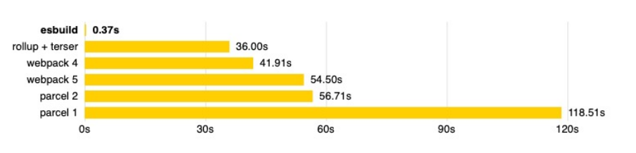

# vite

* 什么是 vite 呢？ 

  * 官方的定位：下一代前端开发与构建工具；

* 如何定义下一代开发和构建工具呢？ 

  * 在实际开发中，我们编写的代码往往是不能被浏览器直接识别的，比如 ES6、TypeScript、Vue 文件等等； 

  * 所以我们必须通过构建工具来对代码进行转换、编译，类似的工具有 webpack、rollup、parcel； 

  * 但是随着项目越来越大，需要处理的 JavaScript 呈指数级增长，模块越来越多； 

  * 构建工具需要很长的时间才能开启服务器，HMR也需要较长时间才能在浏览器反应出来；  

* Vite 是一种新型前端构建工具，能够显著提升前端开发体验。

## vite 的构造

* 它主要由两部分组成：
  * 一个开发服务器，它基于原生 ES 模块提供了丰富的内建功能， HMR 的速度非常快速；
  * 一套构建指令，它使用 rollup 打开我们的代码，并且它是预配置的，可以输出生成环境的优化过的静态资源；

## 浏览器原生支持模块化

```html
<script src="./src/main.js" type="module"></script>
```

* 如果我们不借助于其他工具，直接使用 ES Module 来开发有什么问题呢？
  * 首先，我们会发现在使用 loadash 时，加载了上百个模块的 js 代码，这对于浏览器发送请求是巨大的消耗；
  * 其次，代码中如果有 TypeScript、less、vue 等代码时，浏览器并不能直接识别；
  * 事实上，vite 帮助我们解决了上面的所有问题。

## vite 的安装和使用

* 安装

  ```js
  npm install vite -D 
  ```

* 通过 vite 来启动项目

  ```js
  npx vite
  ```

## vite 对 css 的支持

* vite 可以直接支持 css 的处理

  * 直接导入 css 即可；

* vite 可以直接支持 css 预处理器，比如 less

  * 直接导入 less；

  * 之后安装 less 编译器；

    ```js
    npm install less -D
    ```

* vite 直接支持 postcss 的转换：

  * 只需要安装 postcss，并且配置 postcss.config.js 的配置文件即可；

    ```JS
    npm install postcss postcss-preset-env -D
    ```

```js
// postcss.config.js
module.exports = {
  plugins: [
    require("postcss-preset-env")
  ]
};
```

## vite 对 typescript 的支持

* vite 对 TypeScript 是原生支持的，它会直接使用 ESBuild 来完成编译：
  * 只需要直接导入即可；
* 如果我们查看浏览器中的请求，会发现请求的依然是 ts 的代码：
  * 这是因为 vite 中的服务器 Connect 会对我们的请求进行转发；
  * 获取 ts 编译后的代码，给浏览器返回，浏览器可以直接进行解析；

## vite 对 vue 的支持

* 安装支持 vue 的插件：

  ```js
  npm install @vitejs/plugin-vue -D
  ```

* 在 vite.config.js 中配置插件：

  ```js
  import vue form "@vitejs/plugin-vue";
  module.exports = {
      plugins: [
          vue()
      ]
  }
  ```

## vite 打包项目

* 可以通过 vite build 完成对当前项目的打包

  ```js
  npx vite build
  ```

* 可以通过 preview 的方式，开启一个本地服务来预览打包后的效果

  ```js
  npx vite preview
  ```

## ESBuild 解析

* ESBuild 的特点：
  * 超快的构建速度，并且不需要缓存；
  * 支持 ES6 和 CommonJS 的模块化；
  * 支持 ES6 的 Tree Shaking；
  * 支持 Go、JavaScript 的 API；
  * 支持 TypeScript、JSX 等语法编译；
  * 支持 SourceMap；
  * 支持代码压缩；
  * 支持扩展其他插件；

## ESBuild 的构建速度

* ESBuild 的构建速度和其他构建工具速度对比：



* ESBuild 为什么这么快呢？
  * 使用 Go 语言编写的，可以直接转换成机器代码，而无需经过字节码；
  * ESBuild 可以充分利用 CPU 的多内核，尽可能让它们饱和运行；
  * ESBuild 的所有内容都是从零开始编写的，而不是使用第三方，所以从一开始就可以考虑各种性能问题；
  * 等等....


