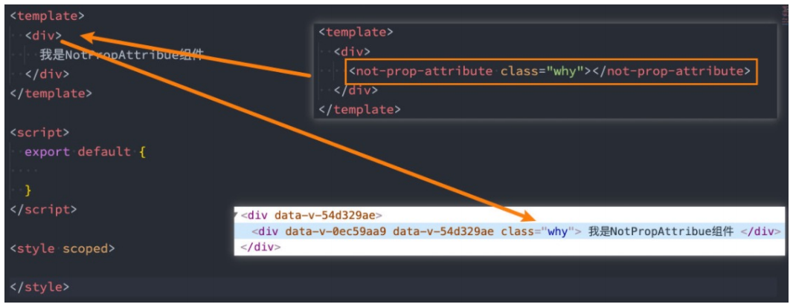
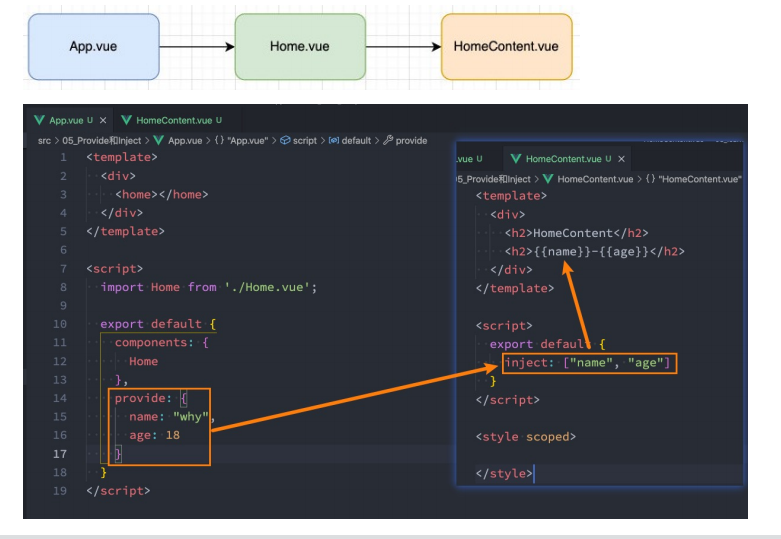

# Vue3 组件通信

## 父组件传递给子组件

* 什么是 Props 呢？
  * Props 是你可以在组件上注册一些自定义的 attribute；
  * 父组件给这些 attribute 赋值，子组件通过 attribute 的名称获取到对应的值；

```html
<template>
  <hello-world v-bind="message"></hello-world>
</template>

<script>
import HelloWorld from "./components/HelloWorld.vue";

export default {
  components: {
    HelloWorld
  },
  data() {
    return {
      message: {
        content: "沧浪之水",
        title: "天幕红尘"
      }
    };
  }
};
</script>

```

## 非 Prop 的 Attribute

* 什么是非 Prop 的 Attribute 呢？
  * 当我们传递给一个组件某个属性，但是该属性并没有定义对应的 props 或者 emits 时，就称之为 非 Prop 的 Attribute；
  * 常见的包括 class、style、id 属性等；
* Attribute 继承
  * 当组件有单个根节点时，非 Prop 的 Attribute 将自动添加到根节点的 Attribute 中：



## 禁用 Attribute 继承和多根节点

* 如果我们不希望组件的根元素继承 attribute，可以在组件中设置 `inheritAttrs: fasle` :

  ```js
  export default {
    inheritAttrs: false,
    props: {},
    data() {}
  };
  ```

  * 禁用 attribute 继承的常见情况是需要将 attribute 应用于根元素之外的其他元素；
  * 我们可以通过 `$attrs` 来访问所有的非 props 的 attribute；

  ```html
  <div>
    <h2 :hhh="$attrs.hhh">{{ message }}</h2>
    <p>{{ content }}</p>
    <p>{{ title }}</p>
  </div>
  ```

* 多个根节点的 attribute 如果没有显式的绑定会报警告，所以必须手动指定要绑定到哪一个属性上：

  ```html
  <template>
    <h2 :hhh="$attrs.hhh">{{ message }}</h2>
    <p v-bind="$attrs">{{ content }}</p>
    <p>{{ title }}</p>
  </template>
  ```

## 自定义事件的流程

* App.vue

```html
<template>
  <h2>{{ count }}</h2>
  <hello-world @add="count++" @addn="addn"></hello-world>
</template>

<script>
import HelloWorld from "./components/HelloWorld.vue";

export default {
  components: {
    HelloWorld
  },
  data() {
    return {
      count: 0
    };
  },
  methods: {
    addn(num) {
      this.count += num;
    }
  }
};
</script>
```

* HelloWorld.vue

```html
<template>
  <button @click="$emit('add')">+1</button>
  <input type="text" v-model.number="num">
  <button @click="$emit('addn',num)">+n</button>
</template>

<script>
export default {
  emits: {
    add: null,
    addn: (payload) => {
      return payload > 10;
    }
  },
  data() {
    return {
      num: 0
    };
  }
};
</script>
```

## Provide 和 Inject

* Provide/Inject 用于非父子组件之间共享数据：
  * 比如有一些深度嵌套的组件，子组件想要获取父组件的部分内
    容；
  * 在这种情况下，如果我们仍然将 props 沿着组件链逐级传递下
    去，就会非常的麻烦；

* 对于这种情况下，我们可以使用 Provide 和 Inject ：
  * 无论层级结构有多深，父组件都可以作为其所有子组件的依赖
    提供者；
  * 父组件有一个 provide 选项来提供数据；
  * 子组件有一个 inject 选项来开始使用这些数据；
* 实际上，你可以将依赖注入看作是 “long range props”，除了：
  * 父组件不需要知道哪些子组件使用它 provide 的 property
  * 子组件不需要知道 inject 的 property 来自哪里

## Provide 和 Inject 基本使用

* 我们开发这样一个结构：



## Provide 和 Inject 函数的写法

```js
provide(){
    return {
        name: "孙悟空",
        age: 23,
        length: this.names.length
    }
}
```

* 如果 Provide 中提供的一些数据是来自 data，我们想要通过 this 来获取，则必须使用函数写法。

## 处理响应式数据

* 此时，如果我们修改了this.names的内容，那么使用 length 的子组件是没有反应的：
  * 因为在 provide 中引入的 this.names.length 本身并不是响应式的；
* 那么怎么样让我们的数据变成响应式的呢？
  * 可以使用响应式的一些 API 来完成这些功能，比如说 computed 函数；
* 注意：我们在使用 length 的时候需要获取其中的 value
  * 这是因为 computed 返回的是一个 ref 对象，需要取出其中的 value 来使用；

```js
provide(){
    return {
        name: "why",
        age: 18,
        length: computed(() => this.names.length)
    }
}
```

.

```html
<div>
    <h2>
        {{length.value}}
    </h2>
</div>
```

## 全局事件总线 mitt 库

* 安装

  ```js
  npm install mitt
  ```

* 封装一个工具  eventbus.js

  ```js
  import mitt from 'mitt';
  
  const emitter = mitt();
  
  exporf default emitter;
  ```

## 使用事件总线工具

* 在项目中可以使用它们：
  * 在 Home.vue 中监听事件
  * 在 App.vue 中触发事件

```js
// Home.vue
import emitter from './eventBus';
export default {
    created(){
        emitter.on("why",(info) => {
            console.log("why event:", info);
        })
    }
}
```

.

```js
// App.vue
import emitter from './eventBus';
export default {
    components: {
        Home
    },
    methods: {
        triggerEvent(){
            emitter.emit("why", {name:"why", age:18});
        }
    }
}
```

## Mitt 的事件取消

```js
// 取消 emitter 中所有的监听
emitter.all.clear();

// 定义一个函数
function onFoo(){};
emitter.on('foo', onFoo); // 监听
emitter.off('foo', onFoo); // 取消监听
```


