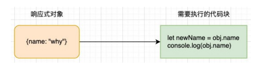
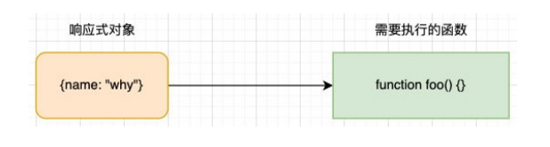
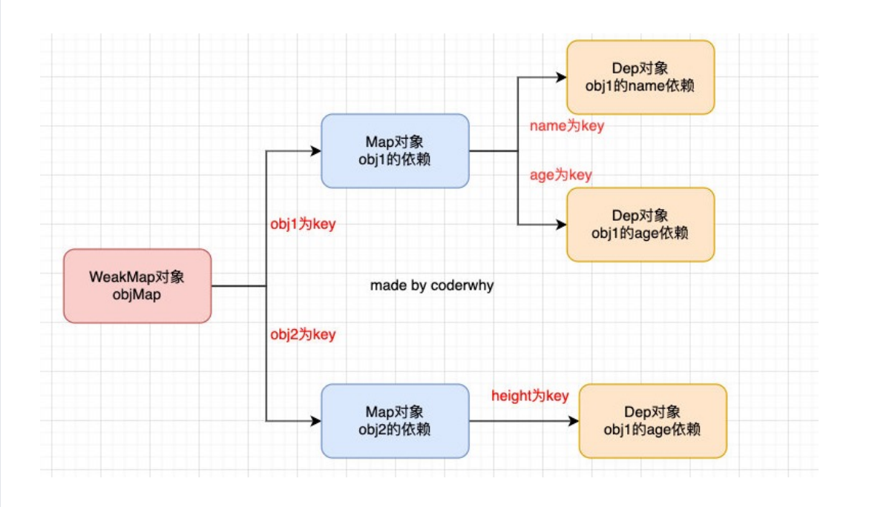

# 响应式原理

## 什么是响应式？

* 我们先来看一下响应式意味着什么？
  * m 有一个初始化的值，有一段代码使用了这个值；
  * 那么在 m 有一个新的值时，这段代码可以自动重新执行；

```js
let m = 20;
console.log(m);
console.log(m * 2);

m = 40;
```

* 这样一种可以自动响应数据变量的代码机制，就称之为是响应式的。
* 那么我们再来看一下对象的响应式：



## 响应式函数设计

* 首先，执行的代码中可能不止一行代码，所以我们可以将这些代码放到一个函数中：
  * 那么问题就变成了，当数据发生变化时，自动去执行某一个函数；



* 但是在开发中是有很多个函数的，如何区分一个函数需要响应式，还是不需要响应式呢？
  * 很明显，下面的函数中 foo 需要在 obj 的 name 发生变化时，重新执行，做出相应；
  * bar 函数是一个完全独立于 obj 的函数，它不需要执行任何响应式的操作；

```js
function foo(){
    let newName = obj.name;
    console.log(obj.name);
}

function bar(){
    const result = 20 + 30;
    console.log(result);
    console.log("Hello World");
}
```

## 响应式函数的实现 watchFn

* 但是我们怎么区分呢？
  * 这个时候我们可以封装一个新的函数 watchFn；
  * 凡是传入到 watchFn 的函数，就是需要响应式的；
  * 其他默认定义的函数都是不需要响应式的；

```js
const reactiveFns = [];

function watchFn(fn){
    reactiveFns.push(fn);
    fn();
}

watchFn(function(){
    let newName = obj.name;
    console.log(obj.name);
})

watchFn(function(){
    console.log("my name is" + obj.name)
})
```

## 响应式依赖的收集

* 目前我们收集的依赖是放到一个数组中来保存的，但是这里会存在数据管理的问题：
  * 我们在实际开发中需要监听很多对象的响应式；
  * 这些对象需要监听的不只是一个属性，它们很多属性的变化，都会有对应的响应式函数；
  * 我们不可能在全局维护一大堆的数组来保存这些响应函数；
* 所以我们要设计一个类，这个类用于管理某一个对象的某一个属性的所有响应式函数：
  * 相当于替代了原来的简单 reactiveFns 的数组；

```js
class Depend {
  constructor() {
    this.reactiveFns = [];
  }

  addDepend(fn) {
    this.reactiveFns.push(fn);
  }

  notify() {
    this.reactiveFns.forEach(fn => fn());
  }
}

const dep = new Depend();

function watchFn(fn){
    dep.addDepend(fn);
    fn();
}
```

## 监听对象的变化

* 方式一：通过 `Object.defineProperty` 的方式（vue2 采用的方式）；
* 方式二：通过 `new Proxy` 的方式（vue3 采用的方式）；
* 这里先以 Proxy 的方式来监听：

```js
const counterProxy = new Proxy(counter, {
  get(target, p, receiver) {
    return Reflect.get(target, p, receiver);
  },
  set(target, p, value, receiver) {
    console.log("设置了新的值", key, value);
    Reflect.set(target, p, value, receiver);
    dep.notify();
  }
});
```

## 对象的依赖管理

* 目前是创建了一个 Depend 对象，用来管理对于 name 变化需要监听的响应函数：
  * 但是实际开发中会有不同的对象、不同的属性需要管理；
  * 如何可以使用一种数据结构来管理不同对象的不同依赖关系呢？
* 可以通过 WeakMap 管理这种响应式的数据依赖：



## 对象依赖管理的实现

* 我们可以写一个 getDepend 函数专门来管理这种依赖关系：

```js
const targetMap = new WeakMap();

function getDepend(target, p) {
  let map = targetMap.get(target);
  if (!map) {
    map = new Map();
    targetMap.set(target, map);
  }

  let depend = map.get(p);
  if (!depend) {
    depend = new Depend();
    map.set(p, depend);
  }

  return depend;
}

const objProxy = new Proxy(obj, {
  get(target, p, receiver) {
    return Reflect.get(target, p, receiver);
  },
  set(target, p, value, receiver) {
    Reflect.set(target, p, value, receiver);
    const dep = getDepend(target, p);
    dep.notify();
  }
});
```

## 正确的依赖收集

* 我们之前收集依赖的地方是在 watchFn 中：
  * 但是这种收集依赖的方式我们根本不知道是哪一个 key 的哪一个 depend 需要收集依赖；
  * 你只能针对一个单独的 depend 对象来添加你的依赖对象；
* 那么正确的方式应该是在哪里收集呢？应该在我们调用了 Proxy 的 get 捕获器时
  * 因为如果一个函数中使用了某个对象的 key，那么它应该被收集依赖；

```js
let activeReactiveFn = null;

// 封装一个响应式的函数
function watchFn(fn) {
  activeReactiveFn = fn;
  fn();
  activeReactiveFn = null;
}

const objProxy = new Proxy(obj, {
  get(target, p, receiver) {
    const dep = getDenpend(target,key);
    dep.addDepend(activeReactiveFn);
    return Reflect.get(target, p, receiver);
  },
  set(target, p, value, receiver) {
    Reflect.set(target, p, value, receiver);
    const dep = getDepend(target, p);
    dep.notify();
  }
});
```

## 对 Depend 重构

* 但是这里有两个问题：
  * 问题一：如果函数中有用到两次 key，比如 name，那么这个函数会被收集两次；
  * 问题二：我们并不希望将添加 activeReactiveFn 放到 get 中，以为它是属于 Dep 的行为；
* 所以我们需要对 Depend 类进行重构：
  * 解决问题一的方法：不使用数组，而是使用 Set；
  * 解决问题二的方法：添加一个新的方法，用于收集依赖；

```js
class Depend {
  constructor() {
    this.reactiveFns = new Set();
  }

  depend(){
    activeReactiveFn && this.reactiveFns.add(activeReactiveFn);
  }

  notify() {
    this.reactiveFns.forEach(fn => {
      fn && fn();
    });
  }
}

const objProxy = new Proxy(obj, {
  get(target, p, receiver) {
    const depend = getDepend(target, p);
    depend.depend();
    return Reflect.get(target, p, receiver);
  },
  set(target, p, value, receiver) {
    Reflect.set(target, p, value, receiver);
    const depend = getDepend(target, p);
    depend.notify();
  }
});
```

## 创建响应式对象

* 我们目前的响应式是针对于 obj 一个对象的，我们可以创建出来一个函数，针对所有的对象都可以变成响应式对象：

```js
const reactive = function (target) {
  return new Proxy(target, {
    get(target, p, receiver) {
      const depend = getDepend(target, p);
      depend.depend();
      return Reflect.get(target, p, receiver);
    },
    set(target, p, value, receiver) {
      Reflect.set(target, p, value, receiver);
      getDepend(target, p).notify();
    }
  });
};

const objProxy = reactive({
  name: "张三丰",
  age: 99
});
```

## Vue2 响应式原理

* 前面所实现的响应式的代码，其实是 Vue3 中的响应
  式原理：
  * Vue3 主要是通过 Proxy 来监听数据的变化以及收集相关
    的依赖的；
  * Vue2 中通过 `Object.defineProerty` 的方式来实现对象属性的监听；
* 我们可以将 reactive 函数进行如下的重构：
  * 在传入对象时，遍历所有的 key，并且通过属性存储描述符来监听属性的获取和修改；
  * 在 setter 和 getter 方法中的逻辑和前面的 Proxy 是一致
    的；


