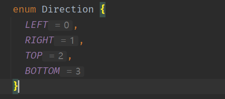

# TypeScript

## 认识 TypeScript

* **TypeScript 在 GitHub 和官网上对自己的定义：**
  * GitHub说法：TypeScript is a superset of JavaScript that compiles to clean JavaScript output.
  * TypeScript官网：TypeScript is a typed superset of JavaScript that compiles to plain JavaScript.
  * 翻译一下：TypeScript 是拥有类型的 JavaScript 超集，它可以编译成普通、干净、完整的 JavaScript 代码。
* 怎么理解上面的话呢？
  * 可以将 TypeScript 理解成**加强版的 JavaScript**。
  * JavaScript 所拥有的特性，TypeScript 全部都是支持的，并且它紧随 ECMAScript 的标准，所以 ES6、ES7、ES8 等新语法标准，它都是支持的；
  * 并且在语言层面上，不仅仅增加了类型约束，而且包括一些语法的扩展，比如枚举类型（Enum）、元组类型（Tuple）等；
  * TypeScript 在实现新特性的同时，总是保持和 ES 标准的同步甚至是领先；
  * 并且 TypeScript 最终会被编译成 JavaScript 代码，所以你并不需要担心它的兼容性问题，在编译时也不需要借助于 Babel 这样的工具；
  * 所以，我们可以把 TypeScript 理解成更加强大的 JavaScript，不仅让 JavaScript 更加安全，而且给它带来了诸多好用的特性；

## TypeScript的特点

* 官方对 TypeScript 有几段特点的描述：
* **始于 JavaScript，归于 JavaScript**
  * TypeScript 从今天数以百万计的 JavaScript 开发者所熟悉的语法和语义开始。使用现有的 JavaScript 代码，包括流行的 JavaScript库，并从 JavaScript 代码中调用 TypeScript 代码；
  * TypeScript 可以编译出纯净、 简洁的 JavaScript 代码，并且可以运行在任何浏览器上、Node.js 环境中和任何支持 ECMAScript 3（或更高版本）的 JavaScript 引擎中；
* **TypeScript 是一个强大的工具，用于构建大型项目**
  * 类型允许 JavaScript 开发者在开发 JavaScript 应用程序时使用高效的开发工具和常用操作比如静态检查和代码重构；
  * 类型是可选的，类型推断让一些类型的注释使你的代码的静态验证有很大的不同。类型让你定义软件组件之间的接口和洞察现有
     JavaScript 库的行为；
* **拥有先进的 JavaScript**
  * TypeScript 提供最新的和不断发展的 JavaScript 特性，包括那些来自 2015 年的 ECMAScript 和未来的提案中的特性，比如异步功能和 Decorators，以帮助建立健壮的组件；
  * 这些特性为高可信应用程序开发时是可用的，但是会被编译成简洁的 ECMAScript3（或更新版本）的 JavaScript；

## TypeScript 的编译环境

* TypeScript 最终会被编译成 JavaScript 来运行，所以我们需要搭建对应的环境：
  * 需要安装 TypeScript，这样就可以通过 TypeScript 的Compiler 将其编译成 JavaScript；

```js
// 安装命令
npm install typescript -g

// 查看版本
tsc --version
```

## 变量的声明

* 在 TypeScript 中定义变量需要指定**标识符**的类型。

* 完整的声明格式如下：

  * 声明了类型后 TypeScript 就会进行**类型检测**，声明的类型可以称之为**类型注解**；
  * 比如我们声明一个 message，完整的写法如下：
    * 注意：这里的 string 是小写的，和 String 是有区别的
    * string 是 TypeScript 中定义的字符串类型，String 是ECMAScript 中定义的一个类

  ```js
  let message: string = "Hello World";
  ```

* 如果我们给 message 赋值其他类型的值，那么就会报错。

## 声明变量的关键字

* 在 TypeScript 定义变量（标识符）和 ES6 之后一致，可以使用` var`、`let`、`const` 来定义。

```js
var name: string = "罗辑";
let age: number = "29";
const height: number = "1.80";
```

## 变量的类型推导（推断）

* 在开发中，有时候为了方便起见我们并不会在声明每一个变量时都写上对应的数据类型，我们更希望可以通过 TypeScript 本身的特性帮助我们推断出对应的变量类型：

  ```ts
  let message = "Hello World";
  ```

* 如果我们给 message 赋值 123：

  ```ts
  message = 123; // TS2322: Type 'number' is not assignable to type 'string'.
  ```

* 这是因为在一个变量第一次赋值时，会根据后面的赋值内容的类型，来推断出变量的类型：

  * 上面的 message 就是因为后面赋值的是一个 string 类型，所以 message 虽然没有明确的说明，但是依然是一个 string 类型；

## JavaScript 和 TypeScript 的数据类型

* TypeScript 是 JavaScript 的一个超集：


## JavaScript类型 – number类型

* 数字类型是开发中常用的类型，TypeScript 和 JavaScript 一样，不区分整数类型（int）和浮点型（double），统一为 number 类型。

* TypeScript 支持二进制、八进制、十六进制的表示：

```ts
let num:number = 100;

num = 10;
console.log(num); // 10

num = 0b10;
console.log(num); // 2

num = 0o10;
console.log(num); // 8

num = 0x10;
console.log(num); // 6
```

## JavaScript 类型 - boolean 类型

* boolean 类型只有两个取值：true 和 false

```ts
let flag: boolean = true;
flag = false;
flag = 20 > 30;
```

## JavaScript 类型 - string 类型

* string 类型是字符串类型，可以使用单引号或者双引号表示：

```ts
let message: string = "Hello World";
message = 'Hello TypeScript';
```

* 同时也支持 ES6 的模板字符串来拼接变量和字符串：

```ts
const name = "项飙";
const age = 49;
const height = 1.80;

const info = `他叫${name},今年${age}岁，身高${height}米`;
console.log(info);
```

## JavaScript 类型 – Array 类型

* 数组类型的定义有两种方式

```ts
const names: string[] = ["项飙","许知远","孙悟空"];
const names2: Array<string> = ["猪八戒","沙和尚","唐三藏"];

names.push("十三邀");
names2.push("西游记");
```

* 如果添加其他类型到数组中，那么会报错.

## JavaScript 类型 – Object 类型

* object 对象类型可以用于描述一个对象：

```ts
const info: object = {
  name: "项羽",
  age: 18,
  height: 1.80
}
```

* 但是从 info 中我们不能获取数据，也不能设置数据。

## JavaScript类型 – Symbol类型

```ts
const s1: symbol = Symbol("title");
const s2: symbol = Symbol("title");

const person = {
  [s1]: "程序员",
  [s2]: "老师"
};

console.log(person[s1])
```

## JavaScript 类型 – null 和 undefined 类型

* 在 JavaScript 中，undefined 和 null 是两个基本数据类型。
* 在TypeScript中，它们各自的类型也是 undefined 和 null，也就意味着它们既是实际的值，也是自己的类型：

```js
let n: null = null;
let u: undefined = undefined;
```

## TypeScript 类型 - any 类型

* 在某些情况下，无法确定一个变量的类型，并且它可能会发生一些变化，这个时候我们使用 any 类型。
* any 类型有点像一种讨巧的 TypeScript 手段：
  * 可以对 any 类型的变量进行任何的操作，包括获取不存在的属性、方法；
  * 可以给一个 any 类型的变量赋值任何的值，比如数字、字符串的值；

```ts
let a: any = "宋万博";
a = 123;
a = true;

const aArray: any[] = ["宋万博", 19, 1.79];
```

* 如果对于某些情况的处理过于繁琐不希望添加规定的类型注解，或者在引入一些第三方库时，缺失了类型注解，这个时候可以使用 any：
  * 在 Vue 源码中，也使用到了 any 来进行某些类型的适配；

## TypeScript类型 - unknown类型

* unknown 是 TypeScript 中比较特殊的一种类型，它用于描述类型不确定的变量。

```ts
function foo(): string {
  return "foo";
}

function bar(): number {
  return 123;
}

const flag = true;

let result: unknown;

if (flag) {
  result = foo();
} else {
  result = bar();
}

if (typeof result === "string") {
  console.log(result.length);
}
```

## TypeScript 类型 - void 类型

* void 通常用来指定一个函数是没有返回值的，那么它的返回值就是 void 类型：

  * 我们可以将 null 和 undefined 赋值给 void 类型，也就是函数可以返回 null 或者 undefined。

  ```ts
  function sum(num1: number, num2: number){
    console.log(num1 + num2);
  }
  ```

  * 这个函数我们没有写任何类型，那么它默认返回值的类型就是 void 的，我们也可以显式的来指定返回值是 void：

  ```ts
  function sum(num1: number, num2: number): void{
    console.log(num1 + num2);
  }
  ```

## TypeScript 类型 - never 类型

* never 表示永远不会发生值的类型，比如一个函数：
  * 如果一个函数中是一个死循环或者抛出一个异常，那么这个函数会返回东西吗？
  * 不会，那么写 void 类型或者其他类型作为返回值类型都不合适，我们就可以使用 never 类型；

```ts
function loopFun(): never {
  while (true) {
    console.log("123");
  }
}

function loopErr(): never {
  throw new Error();
}
```

* never 有什么样的应用场景呢？

```ts
function handleMessage(message: number | string) {
  switch (typeof message) {
    case "string":
      console.log("string的处理方式");
      break;
    case "number":
      console.log("number的处理方式");
      break;
    default:
      const check: never = message;
  }
}
```

## TypeScript类型 - tuple类型

* tuple 是元组类型

```ts
const tInfo: [string, number, string] = ["项往", 20, "但使龙城飞将在，不教胡马度阴山"];
const item1 = tInfo[0]; 
const item2 = tInfo[1];
```

* 那么 tuple 和数组有什么区别呢？
  * 首先，数组中通常建议存放相同类型的元素，不同类型的元素是不推荐放在数组中。（可以放在对象或者元组中）
  * 其次，元组中每个元素都有自己特性的类型，根据索引值获取到的值可以确定对应的类型；

```ts
const info:(string|number)[] = ["项往", 20, "但使龙城飞将在，不教胡马度阴山"];
const item1 = info[0]; // 不能确定类型

const tInfo: [string, number, string] = ["项往", 20, "但使龙城飞将在，不教胡马度阴山"];
const item2 = tInfo[0]; // 一定是 string 类型
```

## tuple 的应用场景

* tuple 通常函数作为返回的值

```ts
function useState<T>(state: T) {
  let currentState = state;

  const changeState = (newState: T) => {
    currentState = newState;
  };

  const tuple: [T, (newState: T) => void] = [currentState, changeState];

  return tuple;
}

const [state, setState] = useState(10);
setState(89);

const [title, setTitle] = useState("ads");
```

## 函数的参数类型

* 函数是 JavaScript 非常重要的组成部分，TypeScript 允许我们指定函数的参数和返回值的类型。
* 参数的类型注解
  * 声明函数时，可以在每个参数后添加类型注解，以声明函数接受的参数类型：

```js
function sum(num1: number, num2: number) {
  return num1 + num2;
}
```

## **函数的返回值类型**

* 也可以添加返回值的类型注解，这个注解出现在函数列表的后面：

```ts
function sum(num1: number, num2: number): number {
  return num1 + num2;
}
```

* 和变量的类型注解一样，我们通常情况下不需要返回类型注解，因为 TypeScript 会根据 return 返回值推断函数的返回类型：
  * 某些第三方库出于方便理解，会明确指定返回类型，但是这个看个人喜好；

## 匿名函数的参数

* 匿名函数与函数声明会有一些不同：
  * 当一个函数出现在 TypeScript 可以确定该函数会被如何调用的地方时；
  * 该函数的参数会自动指定类型；

```ts
const names = ["刘知", "钱远", "孙旭"];
names.forEach(item => {
  console.log(item);
});
```

* 我们并没有指定 item 的类型，但是 item 是一个 string 类型：
  * 这是因为 TypeScript 会根据 forEach 函数的类型以及数组的类型推断出 item 的类型；
  * 这个过程称之为上下文类型（contextual typing），因为函数执行的上下文可以帮助确定参数和返回值的类型；

## 对象类型

* 如果我们希望限定一个函数接受的参数是一个对象，这个时候要如何限定呢？
  * 我们可以使用对象类型；

```js
function printCoordinate(point: { x: number, y: number }) {
  console.log("x坐标：", point.x);
  console.log("y坐标：", point.y);
}

printCoordinate({x: 10, y: 30});
```

* 在这里我们使用了一个对象来作为类型：
  * 在对象中可以添加属性，并且告知 TypeScript 该属性需要是什么类型；
  * 属性之间可以使用 ` ,`  或者 ` ; ` 来分割，最后一个分隔符是可选的；
  * 每个属性的类型部分也是可选的，如果不指定，那么就是 any 类型；

## 可选类型

* 对象类型也可以指定哪些属性是可选的，可以在属性的后面添加一个 `?` ：

```js
function printCoordinate(point: { x: number, y: number, z?: number }) {
  console.log("x坐标：", point.x);
  console.log("y坐标：", point.y);
  console.log("z坐标：", point.z);
}

printCoordinate({x: 10, y: 30});
printCoordinate({x: 20, y: 30, z: 40});
```

## 联合类型

* TypeScript 的类型系统允许我们使用多种运算符，从现有类型中构建新类型。
* 第一种组合类型的方法：联合类型（Union Type）
  * 联合类型是由两个或者多个其他类型组成的类型；
  * 表示可以是这些类型中的任何一个值；
  * 联合类型中的每一个类型被称之为联合成员（union's members）；

```ts
function printId(id: number | string) {
  console.log("你的 id 是：", id);
}

printId(10);
printId("abc");
```

## 使用联合类型

* 传入给一个联合类型的值是非常简单的：只要保证是联合类型中的某一个类型的值即可
  * 但是我们拿到这个值之后，如何使用它呢？它可能是任何一种类型。
  * 比如我们拿到的值可能是 string 或者 number，我们就不能对其调用 string 上的一些方法；
* 那么我们怎么处理这样的问题呢？
  * 需要使用缩小（narrow）联合；
  * TypeScript 可以根据我们缩小的代码结构，推断出更加具体的类型；

```ts
function printId(id: number | string) {
  if (typeof id === "string") {
    console.log("你的 id 是：", id.toUpperCase());
  } else {
    console.log("你的 id 是", id);
  }
}

printId(10);
printId("abc");
```

## 可选类型补充

* 可选类型可以看做是 `类型` 和 `undefined` 的联合类型：

```ts
function print(message?: string) {
  console.log(message);
}

print();
print("尤感");
print(undefined);

print(null);
```

## 类型别名

```ts
type Point = {
  x: number,
  y: number
}

function printPoint(point: Point) {
  console.log(point.x, point.y);
}

function sumPoint(point: Point) {
  console.log(point.x + point.y);
}

printPoint({x: 20, y: 30});
sumPoint({x: 20, y: 30});
```

## 类型断言 as

* 有时候 TypeScript 无法获取具体的类型信息，这个事后需要使用类型断言（Type Assertions）。
  * 比如通过 document.getElementById，TypeScript 只知道该函数会返回 HTMLElement ，但并不知道它
    具体的类型：

```ts
const el = document.getElementById("cover_img") as HTMLImageElement;
el.src = "https://nwzimg.wezhan.cn/images/24666679.jpg";
```

-

```ts
class Person {

}

class Student extends Person {
  studying(){

  }
}

function sayHello(p: Person) {
  (p as Student).studying()
}

const stu = new Student();

sayHello(stu);
```

-

```ts
const message = "Hello World";
const num: number = (message as any) as number;
console.log(typeof num);
```

## 非空类型断言 !

* 当我们编写下面的代码时，在执行 ts 的编译阶段会报错：
  * 这是因为传入的 message 有可能是为 undefined 的，这个时候是不能执行方法的；

```ts
function printMessage(message?: string) {
  console.log(message.toUpperCase()); // TS2532: Object is possibly 'undefined'.
}
```

* 但是，我们确定传入的参数是有值的，这个时候可以使用非空类型断言：
  * 非空断言使用的是 ! ，表示可以确定某个标识符是有值的，跳过 ts 在编译阶段对它的检测；

```ts
function printMessage(message?: string) {
  console.log(message!.toUpperCase());
}
```

## 可选链的使用

* 可选链事实上并不是 TypeScript 独有的特性，它是ES11（ES2020）中增加的特性：
  * 可选链使用可选链操作符 ?.；
  * 它的作用是当对象的属性不存在时，会短路，直接返回 undefined，如果存在，那么才会继续执行；

```ts
type Person = {
  name: string,
  friend?: {
    name: string,
    age?: number,
    girlFriend?: {
      name: string
    }
  }
}

const info: Person = {
  name: "胡歌",
  friend: {
    name: "彭于晏",
    age: 58,
    girlFriend: {
      name: "美由瑙子"
    }
  }
};

console.log(info.friend?.name);
console.log(info.friend?.age);
console.log(info.friend?.girlFriend?.name);
```

## ?? 和 !! 的作用

* `!!` 操作符：
  * 将一个其他类型转换成 `boolean` 类型；
  * 类似于 `Boolean(变量)` 的方式；

```ts
const message: string | null = null;
console.log(!!message);
```

* `??` 操作符
  * 空值合并操作符（`??`）是一个逻辑操作符，当操作符的左侧是 `null` 或者 `undefined` 时，返回其右侧操作数，否则返回左侧操作数；

```ts
const message = null;
const result = message ?? "枫叶";
console.log(result)
```

## 字面量类型

```ts
let message: "Hello World" = "Hello World";
message = "亲爱的汪老师"; // TS2322: Type '"亲爱的汪老师"' is not assignable to type '"Hello World"'.
```

* 那这样做有什么意义呢？
  * 默认情况下这么做是没有太大的意义的，但是可以将多个类型联合在一起使用；

```ts
type Alignment = "left" | "right" | "center";

function changeAlign(align: Alignment) {
  console.log("修改方向：", align);
}
changeAlign("left")
```

## 字面量推理

* 看下面的代码：

```ts
const info = {
  url: "https://www.youtube.com/watch",
  method: "GET"
};

function request(url: string, method: "GET" | "POST") {
  console.log(url, method);
}

request(info.url, info.method); // TS2345: Argument of type 'string' is not assignable to parameter of type '"GET" | "POST"'.
```

* 这是因为对象在进行字面量推理的时候，`info` 其实是一个 `{url: string, method: string}`，所以没办法将
  一个 `string` 赋值给一个 `字面量` 类型。

* 解决方案

```ts
// 方案一
const info = {
  url: "https://www.youtube.com/watch",
  method: "GET"
} as const;

// 方案二
request(info.url, info.method as "GET");
```

## 类型缩小

* 什么是类型缩小呢？
  * 类型缩小的英文是 Type Narrowing；
  * 可以通过类似于 `typeof padding === "number"`  的判断语句，来改变 TypeScript 的执行路径；
  * 在给定的执行路径中，可以缩小比声明时更小的类型，这个过程称之为**缩小**;
  * 而编写的 `typeof padding === "number` 可以称之为 类型保护（type guards）；
* 常见的类型保护有如下几种：
  * typeof
  * 平等缩小（比如===、!==）
  * instanceof
  * in
  * 等等...

## typeof

* 在 TypeScript 中，检查返回的值 typeof 是一种类型保护：因为 TypeScript 对如何 typeof 操作不同的值进行编码。

```ts
type IDType = number | string;

function printId(id: IDType) {
  if (typeof id === "string") {
    console.log(id.toUpperCase());
  } else {
    console.log(id);
  }
}
```

## 平等缩小

* 可以使用 `Switch` 或者相等的一些运算符来表达相等性（比如`===`, `!==`, `==`,  `!=` ）：

```ts
type Direction = "left" | "right" | "center";

function turnDirection(direction: Direction) {
  switch (direction) {
    case "left":
      console.log("调用left方法");
      break;
    case "right":
      console.log("调用left方法");
      break;
    case "center":
      console.log("调用left方法");
      break;
    default:
      console.log("调用默认方法");
  }
}
```

## instanceof

* JavaScript 有一个运算符来检查一个值是否是另一个值的 “实例”：

```ts
function printValue(date: Date | string) {
  if (date instanceof Date) {
    console.log(date.toLocaleString());
  } else {
    console.log(date);
  }
}
```

## in

* `Javascript` 有一个运算符，用于确定对象是否具有带名称的属性：`in` 运算符
  * 如果指定的属性在指定的对象或其原型链中，则 `in` 运算符返回 `true`；

```ts
type Fish = {
  swim: () => void
}

type Dog = {
  run: () => void
}

function move(animal: Fish | Dog) {
  if ("swim" in animal) {
    animal.swim();
  } else {
    animal.run();
  }
}
```

## TypeScript 函数类型

* 在 JavaScript 开发中，函数是重要的组成部分，并且函数可以作为一等公民（可以作为参数，也可以作为返回值进行传递）。
* 那么在使用函数的过程中，函数是否也可以有自己的类型呢？
  * 我们可以编写函数类型的表达式（Function Type Expressions），来表示函数类型；

```ts
type CalcFunc = (num1: number, num2: number) => number ;

function calc(fn: CalcFunc) {
  console.log(fn(20, 30));
}

function sum(num1: number, num2: number) {
  return num1 + num2;
}

function mul(num1: number, num2: number) {
  return num1 * num2;
}

calc(sum);
calc(mul);
```

## TypeScript 函数类型解析

* 在上面的语法中 `(num1: number, num2: number) => void`，代表的就是一个函数类型：
  * 接收两个参数的函数：num1 和 num2，并且都是 number 类型；
  * 并且这个函数是没有返回值的，所以是 void；

## 参数的可选类型

* 可以指定某个参数是可选的：

```ts
function foo(x: number, y?: number) {
  console.log(x, y);
}
```

* 这个时候参数 `y` 依然是有类型的，它是 `number | undefined` 
* 另外，可选类型需要在必传参数的后面：

```ts
function foo(y?: number, x: number) {
  console.log(x, y);
}
// TS1016: A required parameter cannot follow an optional parameter.
```

## 默认参数

```ts
function foo(x: number, y: number = 6){
  console.log(x,y);
}
foo(10);
```

* 这个时候 y 的类型其实是 undefined 和 number 类型的联合。

## 剩余参数

* 剩余参数语法允许我们将一个不定数量的参数放到一个数组中

```ts
function fun(...names: string[]) {
  names.forEach(item => {
    console.log(item);
  });
}

fun("王二", "刘三");
```

## 可推导的 this 类型

```ts
const info = {
  name: "刘培强",
  sayHello() {
    console.log(this.name);
  }
};
info.sayHello();
```

* 上面的代码是可以正常运行的，也就是 TypeScript 在编译时，认为我们的 this 是可以正确去使用的：
  * TypeScript 认为函数 `sayHello` 有一个对应的 this 的外部对象 info，所以在使用时，就会把 this 当做该对象。

## 不确定的 this 类型

* 但是对于某些情况来说，我们并不知道 this 到底是什么？

```ts
function sayHello(){
  console.log(this.name);
}

const info = {
  name: "刘培强",
  sayHello
};
info.sayHello();
```

* 这段代码运行会报错的：
  * TypeScript 进行类型检测的目的是让代码更加的安全；
  * 所以这里对于 sayHello 的调用来说，虽然将其放到了 info 中，通过 info 去调用，this 依然是指向 info 对象的；
  * 但是对于 TypeScript 编译器来说，这个代码是非常不安全的，因为我们也有可能直接调用函数，或者通过别的对象来
    调用函数；

## 指定 this 的类型

* 这个时候，通常 TypeScript 会要求我们明确的指定 this 的类型

```ts
type nameType = {
  name: string
}

function sayHello(this: nameType) {
  console.log(this.name);
}
```

## 函数的重载

* 在 TypeScript 中，如果我们编写了一个 add 函数，希望可以对字符串和数字类型进行相加，应该如何编写呢？
* 我们可能会这样来编写，但是其实是错误的：

```ts
function add(a1: number | string, a2: number | string): number | string {
  return a1 + a2;
}
// TS2365: Operator '+' cannot be applied to types 'string | number' and 'string | number'.
```

* 那么这个代码应该如何去编写呢？
  * 在 TypeScript 中，我们可以去编写不同的重载签名（overload signatures）来表示函数可以以不同的方式进行调用；
  * 一般是编写两个或者以上的重载签名，再去编写一个通用的函数以及实现；

* 比如我们对 add 函数进行重构：
  * 在我们调用 add 的时候，它会根据我们传入的参数类型来决定执行函数体时，到底执行哪一个函数的重载签名；

```ts
function add(num1: number, num2: number): number;

function add(num1: string, num2: string): string;

function add(num1: any, num2: any): any {
  return num1 + num2;
}
```

* **注意，有实现体的函数，是不能直接被调用的：**

```js
add({name: "曹云金"}, {name: "郭德纲"});
// TS2769: No overload matches this call.   Overload 1 of 2, '(num1: number, num2: number): number', gave the following error.     Argument of type '{ name: string; }' is not assignable to parameter of type 'number'.   Overload 2 of 2, '(num1: string, num2: string): string', gave the following error.     Argument of type '{ name: string; }' is not assignable to parameter of type 'string'.
```

## 联合类型和重载

* 现在有一个需求：定义一个函数，可以传入字符串或者数组，获取它们的长度。
* 这里有两种实现方案：
  * 方案一：使用联合类型来实现；
  * 方案二：实现函数重载来实现；

```ts
function getLength(a: string | any[]): number {
  return a.length;
}
```

-

```ts
function getLength(a:string):number;
function getLength(a:any[]):number;
function getLength(a:any){
  return a.length;
}
```

* 在开发中我们选择使用哪一种呢？
  * 在可能的情况下，尽量选择使用联合类型来实现；

## 认识类的使用

* 在早期的 JavaScript 开发中（ES5）我们需要通过函数和原型链来实现类和继承，从 ES6 开始，引入了 class 关键字，可以
  更加方便的定义和使用类。
* TypeScript 作为 JavaScript 的超集，也是支持使用 class 关键字的，并且还可以对类的属性和方法等进行静态类型检测。
* 类的定义我们通常会使用 class 关键字：
  * 在面向对象的世界里，任何事物都可以使用类的结构来描述；
  * 类中包含特有的属性和方法；

## 类的定义

* 我们可以声明一些类的属性：在类的内部声明类的属性以及对应的类型
  * 如果类型没有声明，那么它们默认是 any 的；
  * 也可以给属性设置初始化值；
  * 在默认的 `strictPropertyInitialization` 模式下面属性是必须初始化的，如果没有初始化，那么编译时就会报错；
    * 如果在 `strictPropertyInitialization` 模式下确实不希望给属性初始化，可以使用 `name!: string` 语法；
* 类可以有自己的构造函数 `constructor`，当我们通过 new 关键字创建一个实例时，构造函数会被调用；
  * 构造函数不需要返回任何值，默认返回当前创建出来的实例；
*  类中可以有自己的函数，定义的函数称之为方法；

```ts
class Person {
  name!: string;
  age: number;

  constructor(name: string, age: number) {
    // this.name = name;
    this.age = age;
  }

  running() {
    console.log(`我是${this.name}, 我今年${this.age}岁了,我要跑了`);
  }
}

const p = new Person("郭德纲", 59);
p.running();
```

## 类的继承

* 面向对象的其中一大特性就是继承，继承不仅仅可以减少我们的代码量，也是多态的使用前提。
* 使用 `extends` 关键字来实现继承，子类中使用 `super` 来访问父类。

```ts
class Person {
  name: string;
  age: number;

  constructor(name: string, age: number) {
    this.name = name;
    this.age = age;
  }

  eating() {
    console.log(this.name + " eating");
  }
}

class Student extends Person {
  sno: number;

  constructor(name: string, age: number, sno: number) {
    super(name, age);
    this.sno = sno;
  }
}

class Teacher extends Person {
  title: string = "";

  constructor(name: string, age: number, title: string) {
    super(name, age);
    this.title = title;
  }

  teaching() {
    super.eating();
    console.log("teaching");
  }
}

const s1 = new Student("曹云金", 37, 56);
console.log(s1.name, s1.age, s1.sno);
s1.eating();

const t1 = new Teacher("郭德纲", 57, "德云班主");
console.log(t1.name, t1.age, t1.title);
t1.eating();
```

## 类的成员修饰符

* 在 TypeScript 中，类的属性和方法支持三种修饰符： public、private、protected
  * public 修饰的是在任何地方可见、公有的属性或方法，默认编写的属性就是 public 的；
  * private 修饰的是仅在同一类中可见、私有的属性或方法；
  * protected 修饰的是仅在类自身及子类中可见、受保护的属性或方法；

```ts
class Person {
  protected name: string;

  constructor(name: string) {
    this.name = name;
  }
}

class Student extends Person {
  constructor(name: string) {
    super(name);
  }

  running() {
    console.log(this.name + " running");
  }
}

const s1 = new Student("周伯通");
s1.running();

const p1 = new Person("黄蓉");

console.log(p1.name) // TS2445: Property 'name' is protected and only accessible within class 'Person' and its subclasses.
```

-

```ts
class Person {
  private name: string;

  constructor(name: string) {
    this.name = name;
  }
}

class Student extends Person {
  constructor(name: string) {
    super(name);
  }

  running() {
    console.log(this.name + " running"); // TS2341: Property 'name' is private and only accessible within class 'Person'.
  }
}

const s1 = new Student("周伯通");
s1.running();

const p1 = new Person("黄蓉");

console.log(p1.name) // TS2341: Property 'name' is private and only accessible within class 'Person'.
```

## 只读属性 readonly

* 如果有一个属性我们不希望外界可以任意的修改，只希望确定值后直接使用，那么可以使用 readonly：

```ts
class Person {
  readonly name: string;

  constructor(name: string) {
    this.name = name;
  }
}

const p = new Person("曹云金");

p.name = "曹金"; // TS2540: Cannot assign to 'name' because it is a read-only property
```

## getters / setters

* 一些私有属性我们是不能直接访问的，或者某些属性我们想要监听它的获取(`getter`)和设置(`setter`)的过程，这个时候我们可以使用存取器。

```ts
class Person {
  private _name:string

  set name(newName){
    this._name = newName;
  }

  get name(){
    return this._name
  }

  constructor(name: string) {
    this._name = name;
  }
}

const p = new Person("郭靖");
p.name = "黄蓉";
console.log(p.name);
```

## 静态成员

```ts
class Student {
  static time: string = "20:00";
  static attendClass(){
    console.log("去学习~");
  }
}

console.log(Student.time);
Student.attendClass();
```

## 抽象类 abstract

* 继承是多态使用的前提。
  * 所以在定义很多通用的调用接口时, 通常会让调用者传入父类，通过多态来实现更加灵活的调用方式。
  * 但是，父类本身可能并不需要对某些方法进行具体的实现，所以父类中定义的方法,，可以定义为抽象方法。
* 什么是抽象方法? 在 TypeScript 中没有具体实现的方法(没有方法体)，就是抽象方法。
  * 抽象方法，必须存在于抽象类中；
  * 抽象类是使用 abstract 声明的类；
* 抽象类有如下的特点：
  * 抽象类是不能被实例的（也就是不能通过 new 创建）
  * 抽象方法必须被子类实现，否则该类必须是一个抽象类；

```ts
abstract class Shape {
  abstract getArea():number;
}

class Rectangle extends Shape {
  private readonly width: number;
  private readonly height: number;

  constructor(width: number, height: number) {
    super();
    this.width = width;
    this.height = height;
  }

  getArea() {
    return this.width * this.height;
  }
}

class Circle extends Shape {
  private readonly radius: number;

  constructor(radius:number) {
    super();
    this.radius = radius;
  }

  getArea() {
    return Math.PI * (this.radius ** 2);
  }
}

function makeArea(shape: Shape) {
  return shape.getArea();
}

const rectangle = new Rectangle(20, 30);

const circle = new Circle(1);

console.log(makeArea(rectangle));
console.log(makeArea(circle));
```

## 类的类型

* 类本身也是可以作为一种数据类型的：

```ts
class Person {
  name: string;

  constructor(name: string) {
    this.name = name;
  }

  running() {
    console.log(this.name + " running");
  }
}

const p1: Person = new Person("曹正淳");
const p2: Person = {
  name: "段天涯",
  running() {
    console.log(this.name + " running");
  }
};
```

## 接口的声明

* 通过 type 可以声明一个对象类型：

```ts
type Point = {
  x: number,
  y: number
}
```

* 对象的另外一种声明方式就是通过接口来声明：

```ts
interface Point {
  x: number,
  y: number
}
```

## 可选属性

```ts
interface Person {
  name: string,
  age?: number,
  friend?:{
    name:string
  }
}

const p1:Person = {
  name: "海棠",
  age: 28,
  friend: {
    name: "成是非"
  }
}

console.log(p1.name);
console.log(p1.friend?.name);
```

## 只读属性

* 接口中也可以定义只读属性
  * 这就意味着初始化之后，这个值是不可以被修改的

```ts
interface Person {
  readonly name: string,
  age?: number,
  readonly friend?: {
    name: string
  }
}

const p1: Person = {
  name: "海棠",
  age: 28,
  friend: {
    name: "成是非"
  }
};

p1.name = "王冰冰"; // TS2540: Cannot assign to 'name' because it is a read-only property.

p1.friend = {}; // TS2540: Cannot assign to 'friend' because it is a read-only property.

// 下面的代码是可以执行的
if (p1.friend) {
  p1.friend.name = "赵晓卉";
}
```

## 索引类型

```ts
interface IndexLanguage {
  [index: number]: string;
}

const frontLanguage: IndexLanguage = {
  0: "丁元英",
  1: "叶子农",
  2: "宋一坤",
};

interface INameAge {
  [name: string]: number;
}

const people: INameAge = {
  "撒贝宁": 37,
  "赵晓卉": 33,
  "徐志胜": 78,
  "何广智": 54
};
```

## 函数类型

```ts
interface CalcFn {
  (n1: number, n2: number): number;
}

function calc(num1: number, num2: number, calcFn: CalcFn) {
  return calcFn(num1, num2);
}

const add: CalcFn = (num1, num2) => {
  return num1 + num2;
};

console.log(calc(20, 30, add));
```

## 接口继承

* 接口和类一样是可以进行继承的，也是使用 extends 关键字：
  * 接口是支持多继承的（类不支持多继承）

```ts
interface Person {
  name: string,
  eating: () => void
}

interface Animal {
  running: () => void;
}

interface Student extends Person, Animal {
  sno: number;
}

const stu: Student = {
  name: "刘云",
  sno: 97,
  eating(){

  },
  running(){

  }
}
```

## 接口的实现

* 接口定义后，也是可以被类实现的：
  * 如果被一个类实现，那么在之后需要传入接口的地方，都可以将这个类传入；
  * 这就是面向接口开发；

```ts
interface ISwim {
  swimming: () => void;
}

interface IRun {
  running: () => void;
}

class Person implements ISwim, IRun {
  swimming() {
    console.log("swimming");
  }

  running() {
    console.log("running");
  }
}

function swim(swimmer: ISwim) {
  swimmer.swimming();
}

const p = new Person();
swim(p);
```

## 交叉类型（Intersection Types）

* 交叉类似表示需要满足多个类型的条件，使用 & 符号；

```ts
interface Colorful {
  color: string
}

interface IRun {
  running: () => void
}

type NewType = Colorful & IRun;

const obj: NewType = {
  color: "red",
  running: function (){
    
  }
}
```

## interface 和 type 区别

* interface 和 type 都可以用来定义对象类型，那么在开发中定义对象类型时，到底选择哪一个呢？
  * 如果是定义非对象类型，通常推荐使用 type，比如Direction、Alignment、一些Function；
  * 如果是定义对象类型，那么他们是有区别的：
    * interface 可以重复的对某个接口来定义属性和方法；
    * 而 type 定义的是别名，别名是不能重复的；

```ts
interface IPerson {
  name: string,
  running: () => void
}

interface IPerson {
  age: number
}

type Person = {
  name: string,
  running: () => void
}

// TS2300: Duplicate identifier 'Person'.
type Person = {
  age: number
}
```

## 字面量赋值

```ts
interface IPerson {
  name: string,
  eating: () => void
}

const p: IPerson = {
  name: "丁元英",
  age: 18,
  eating() {

  }
};
// TS2322: Type '{ name: string; age: number; eating(): void; }' is not assignable to type 'IPerson'.   Object literal may only specify known properties, and 'age' does not exist in type 'IPerson'.
```

-

```ts
interface IPerson {
  name: string,
  eating: () => void
}

const obj = {
  name: "丁元英",
  age: 18,
  eating() {

  }
}

const p: IPerson = obj;
```

* 这是因为 TypeScript 在字面量直接赋值的过程中，为了进行类型推导会进行严格的类型限制。
  * 但是之后如果是将一个 变量标识符 赋值给其他的变量时，会进行 freshness 擦除操作。

## TypeScript 枚举类型

* 枚举类型是为数不多的 TypeScript 特有的特性之一：
  * 枚举其实就是将一组可能出现的值，一个个列举出来，定义在一个类型中，这个类型就是枚举类型；
  * 枚举允许开发者定义一组命名常量，常量可以是数字、字符串类型；

```ts
enum Direction {
  LEFT,
  RIGHT,
  TOP,
  BOTTOM
}

function turnDirection(direction: Direction) {
  switch (direction) {
    case Direction.LEFT:
      console.log("转向左边~");
      break;
    case Direction.RIGHT:
      console.log("转向右边~");
      break;
    case Direction.TOP:
      console.log("转向上边~");
      break;
    case Direction.BOTTOM:
      console.log("转向下边~");
      break;
    default:
      const myDirection: never = direction;
  }
}

turnDirection(Direction.BOTTOM);
```

## 枚举类型的值

* 枚举类型默认是有值的，比如上面的枚举，默认值是这样的：



* 当然，我们也可以给枚举其他值：
  * 这个时候会从100进行递增；


* 也可以赋值其他的类型


## 认识泛型

* 软件工程的主要目的是构建不仅仅明确和一致的API，还要让代码具有很强的可重用性：
  * 比如我们可以通过函数来封装一些API，通过传入不同的函数参数，让函数帮助我们完成不同的操作；
  * 但是对于参数的类型是否也可以参数化呢？

* 什么是类型的参数化？
  * 我们来提一个需求：封装一个函数，传入一个参数，并且返回这个参数

* 如果是 TypeScript 的思维方式，要考虑这个参数和返回值的类型需要一致：

```ts
function foo(arg: number): number {
  return arg;
}
```

* 上面的代码虽然实现了，但是不适用于其他类型，比如 string、boolean、Person 等类型：

```ts
function foo(arg: any): any {
  return arg;
}
```

* 虽然 any 是可以的，但是定义为 any 的时候，其实已经丢失了类型信息：
  * 比如传入的是一个 number，那么我们希望返回的可不是 any 类型，而是 number 类型；
  * 所以，需要在函数中可以捕获到参数的类型是 number，并且同时使用它来作为返回值的类型；

* 我们需要在这里使用一种特性的变量 - 类型变量（type variable），它作用于类型，而不是值：

```ts
function foo<Type>(arg: Type): Type {
  return arg
}

foo<number>(99);
foo(23);
```

* 这里我们可以使用两种方式来调用它：
  * 方式一：通过 <类型> 的方式将类型传递给函数；
  * 方式二：通过类型推导，自动推导出我们传入变量的类型：
    * 在这里会推导出它们是 字面量类型的，因为字面量类型对于我们的函数也是适用的

* 也可以传入多个类型：

```ts
function too<T,E>(a1:T,a2:E){
  
}
```

* 常用的名称
  * T：Type 的缩写，类型
  * K、V：key 和 value 的缩写，键值对
  * E：Element 的缩写，元素
  * O：Object 的缩写，对象

## 泛型接口

* 在定义接口的时候也可以使用泛型：

```ts
interface IFoo<T = number> {
  initialValue: T,
  valueList: T[],
  handleValue: (value: T) => void
}

const foo: IFoo = {
  initialValue: 0,
  valueList: [1, 2, 3],
  handleValue(value) {
    console.log(value);
  }
};

const foo2: IFoo<string> = {
  initialValue: "哈",
  valueList: ["哈", "哈", "哈"],
  handleValue(value) {
    console.log(value);
  }
};
```

## 泛型类

```ts
class Point<T> {
  x: T;
  y: T;

  constructor(x: T, y: T) {
    this.x = x;
    this.y = y;
  }
}

const p1 = new Point(10, 20);
const p2 = new Point<number>(10, 20);
const p3: Point<number> = new Point(10, 20);
```

## 泛型约束

* 有时候我们希望传入的类型有某些共性，但是这些共性可能不是在同一种类型中：
  * 比如 string 和 array 都是有 length 的，或者某些对象也是会有 length 属性的；
  * 那么只要是拥有 length 的属性都可以作为我们的参数类型，应该如何操作呢？

```ts
interface ILength {
  length: number;
}

function getLength<T extends ILength>(args: T) {
  return args.length;
}

console.log(getLength("abc"));
console.log(getLength(["123", "456"]));
console.log(getLength({length: 100, name: "刘天"}));
```

## 模块化开发

* TypeScript 支持两种方式来控制我们的作用域：
  * 模块化：每个文件可以是一个独立的模块，支持 ES Module，也支持 CommonJS；
  * 命名空间：通过 namespace 来声明一个命名空间

```ts
export function add(num1: number, num2: number){
  return num1 + num2;
}

export function sub(num1: number, num2: number){
  return num1 - num2;
}
```

* 命名空间在 TypeScript 早期时，称之为内部模块，主要目的是将一个模块内部再进行作用域的划分，防止一些命名冲突的问题。

```ts
export namespace Time {
  export function format(time: string) {
    return "2023-04-20";
  }
}

export namespace Price {
  export function format(price: number) {
    return "798.00";
  }
}
```

## 类型的查找

* 除了我们自己编写类型，也会用到一些其他的类型：

```ts
const imageEl = document.getElementById("image") as HTMLImageElement;
```

* 大家是否会奇怪，HTMLImageElement 类型来自哪里呢？甚至是 document 为什么可以有 getElementById 的方
  法呢？
  * 其实这里就涉及到 typescript 对类型的管理和查找规则了。
* 这里先介绍另外的一种 typescript 文件：`.d.ts` 文件
  * 它是用来做类型的声明(`declare`)。 它仅仅用来做类型检测，告知 typescript 我们有哪些类型；
* 那么 typescript 会在哪里查找我们的类型声明呢？
  * 内置类型声明；
  * 外部定义类型声明；
  * 自己定义类型声明；

##  内置类型声明

* 内置类型声明是 typescript 自带的、内置了 JavaScript 运行时的一些标准化 API 的声明文件；
  * 包括比如 Math、Date 等内置类型，也包括 DOM API，比如 Window、Document 等；

## 外部定义类型声明和自定义声明

* 外部类型声明通常是我们使用一些库（比如第三方库）时，需要的一些类型声明。
* 这些库通常有两种类型声明方式：
* 方式一：在自己库中进行类型声明（编写.d.ts文件），比如 axios
* 方式二：通过社区的一个公有库 DefinitelyTyped 存放类型声明文件
  * 该库的GitHub地址：https://github.com/DefinitelyTyped/DefinitelyTyped/
  * 大多数情况下，类型声明包的名称应始终与 上的包名称相同`npm`，但以 为前缀`@types/`
* 什么情况下需要自己来定义声明文件呢？
  * 情况一：我们使用的第三方库是一个纯的 JavaScript库，没有对应的声明文件；比如 lodash
  * 情况二：我们给自己的代码中声明一些类型，方便在其他地方直接进行使用；

## 声明变量-函数-类

```ts
let name = "丁元英";
let age = 37;
let height = 1.80;

function foo(){
  console.log('foo');
}

function bar(){
  console.log('bar');
}

function Person(name,age){
  this.name = name;
  this.age = age;
}
```

-

```ts
declare let name: string;
declare let age: number;
declare let height: number;

declare function foo(): void;
declare function bar(): void;

declare class Person {
  name: string
  age: number
  
  constructor(name: string, age: number)
}
```

## 声明模块

```ts
declare module "lodash" {
  export function join(args: any[]): any;
}
```

* 声明模块的语法： `declare module '模块名'{}`
  * 在声明模块的内部，可以通过 export 导出对应库的类、函数等；

## 声明文件

* 在某些情况下，我们也可以声明文件：
  * 比如在开发 vue 的过程中，默认是不识别我们的 `.vue` 文件的，那么我们就需要对其进行文件的声明；
  * 比如在开发中我们使用了 jpg 这类图片文件，默认 typescript 也是不支持的，也需要对其进行声明；

```ts
declare module '*.vue' {
  import { DefineComponent } from 'vue';
  const component: DefineComponent
  
  export default component
}

declare module '*.jpg' {
  const src: string
  export default src
}
```


