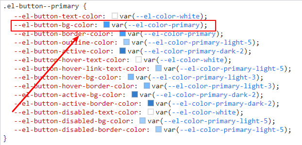

# 如何修改element-plus的样式

## 一、修改按钮的样式

```html
<el-row>
    <el-button class="primary-button" type="primary">Primary</el-button>
</el-row>
```

打开控制台，找到对应的样式。


例如我们想修改背景色，那么可以找到起作用的是



直接在css中修改即可生效

```scss
.primary-button {
  --el-button-bg-color: red;
}
```


