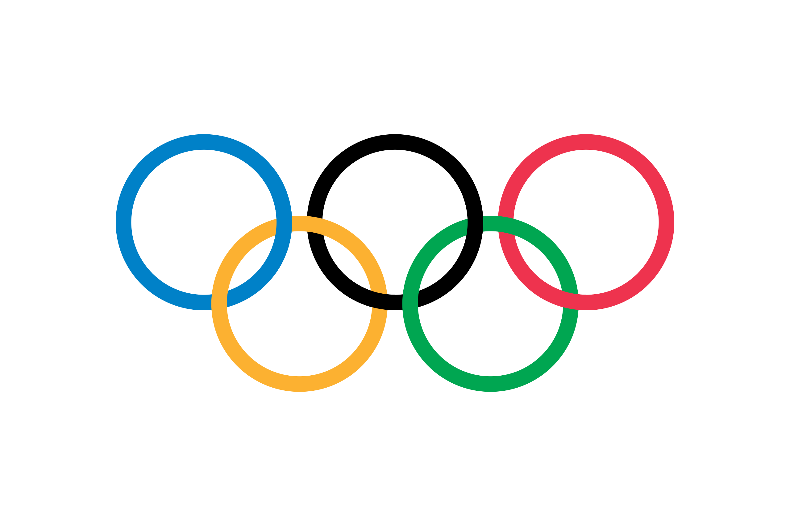
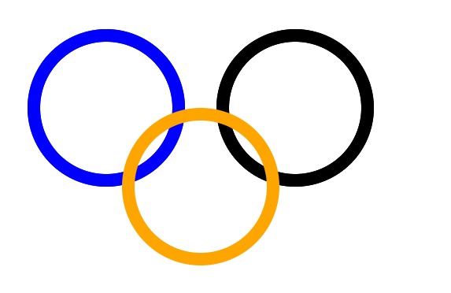
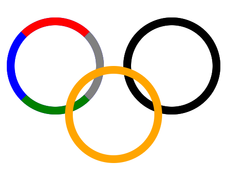
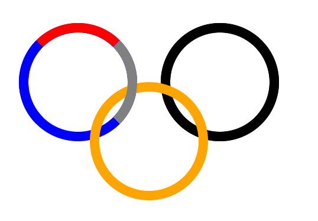
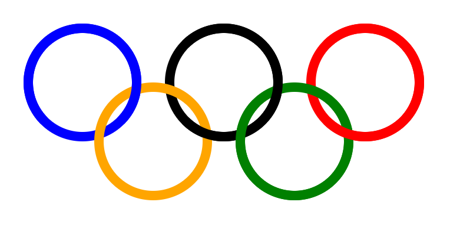

# 如何用css实现立体奥运五环？

源码：https://github.com/clouddawn/wuhuan



用css实现奥运五环的难点在于如何实现立体效果。

可以**采用after伪元素，配合z-index层级关系**。

很容易实现如下效果：



注意，此处每个圆环都是由两层同样颜色的圆环叠在一起的。

一个圆其实是由四个部分组成的，我们把第一个圆环的上层颜色变一下，可以看的更清晰一点。



此时，将第一个圆环的上层层级调高，然后将底部绿色改为透明，就形成了黄色圆环穿过第一个圆环的效果。



同理，可实现五个圆环的立体效果。

最终效果：



代码：

```html
<template>
  <div class="wuhuan">
    <div class="one item"></div>
    <div class="two item"></div>
    <div class="three item"></div>
    <div class="four item"></div>
    <div class="five item"></div>
  </div>
</template>

<style lang="scss" scoped>
.wuhuan {
  padding: 20px;
  position: relative;
  .item {
    width: 100px;
    height: 100px;
    border-radius: 50%;
  }
  .item::after {
    content: "";
    width: 100px;
    height: 100px;
    border-radius: 50%;
    position: absolute;
    top: -8px;
    left: -8px;
    z-index: 1;
  }
  .one {
    border: 8px solid blue;
    position: relative;
  }
  .one::after {
    border: 8px solid blue;
    border-bottom-color: transparent;
  }
  .two {
    border: 8px solid black;
    position: absolute;
    top: 20px;
    left: 140px;
  }
  .two::after {
    border: 8px solid black;
    border-left-color: transparent;
    z-index: 1;
  }
  .three {
    border: 8px solid red;
    position: absolute;
    top: 20px;
    left: 260px;
  }
  .three::after {
    border: 8px solid red;
    border-left-color: transparent;
    z-index: 2;
  }
  .four {
    border: 8px solid orange;
    position: absolute;
    top: 70px;
    left: 80px;
  }
  .five {
    border: 8px solid green;
    position: absolute;
    top: 70px;
    left: 200px;
  }
  .five::after {
    border: 8px solid green;
    border-top-color: transparent;
  }
}
</style>
```


