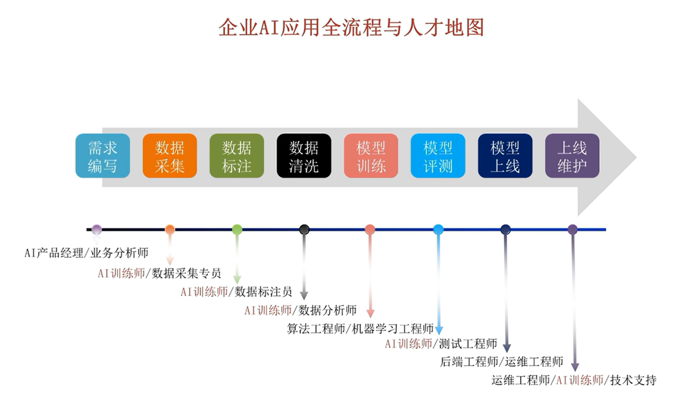
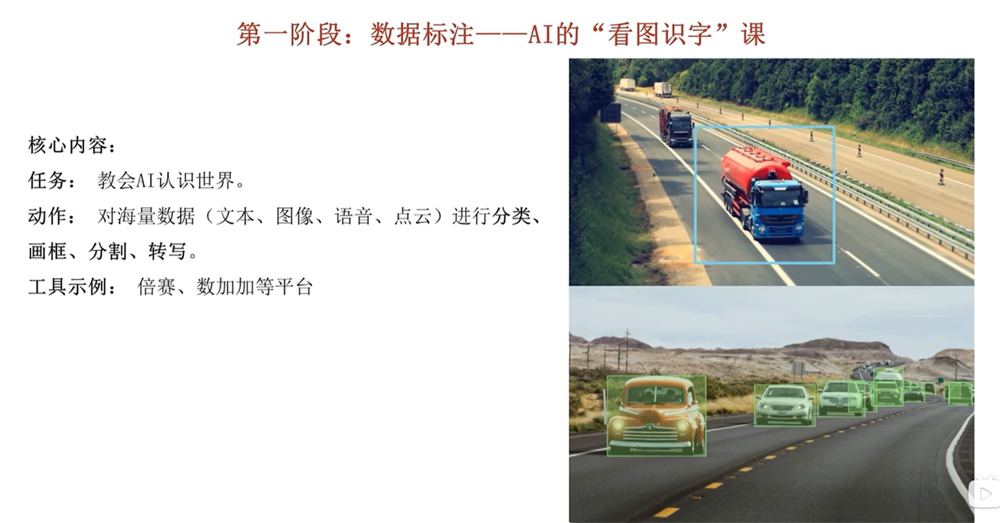
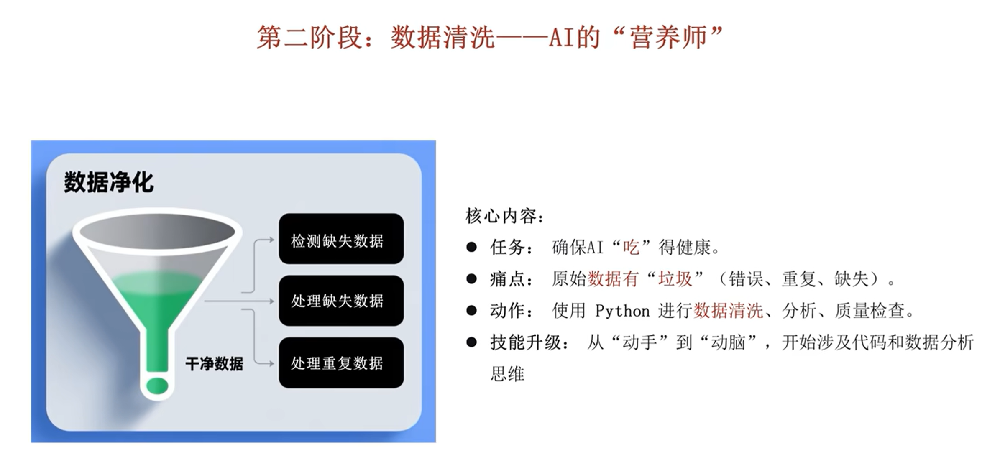
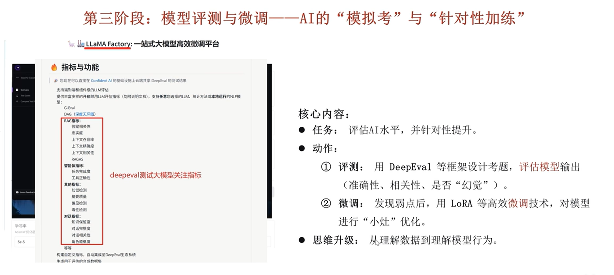
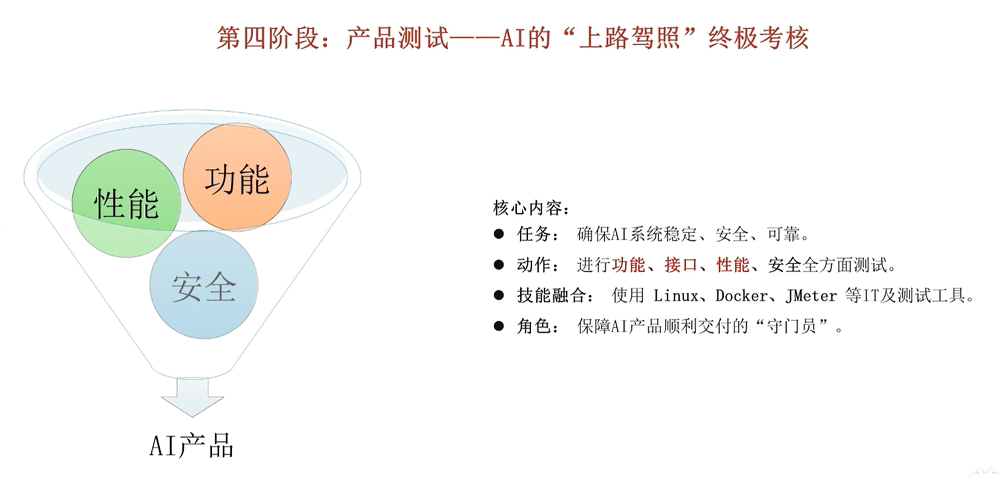
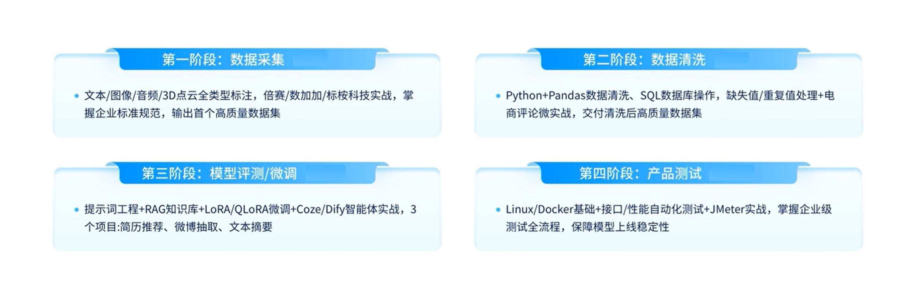

# AI 训练师

AI模型训练师，也叫人工智能训练师，可以理解为AI的 **“金牌教练”与“灵魂塑造者”** 。从专业定义上讲，他们使用智能训练软件，在AI产品落地过程中，负责数据管理、模型训练、参数调试、效果评估及人机交互优化。

如果说程序员是为AI搭建了“骨架”，那么训练师就是教导AI如何“思考、说话和做事”的人，确保它能安全、准确地融入并服务于真实的商业场景。

### 核心职责与工作内容

AI模型训练师的工作贯穿模型的全生命周期，核心职责可以分解为以下几个方面：

- **数据准备**：收集、清洗、标注文本、图像、语音等多模态数据，构建高质量的训练数据集。这是所有工作的基石，数据质量直接决定了模型的上限。
- **模型训练与调优**：构建训练流程，选择合适的模型并进行微调，或通过**指令微调（SFT）**、**思维链（CoT）** 等技术，引导模型进行逻辑推理，提升其在特定任务上的表现。
- **评估与反馈**：扮演“考官”角色，设计评估标准，对模型输出进行多维度打分、排序并找出缺陷，为模型优化提供方向。
- **场景落地与交互优化**：作为“翻译官”，将业务需求转化为训练目标，打磨AI的交互逻辑，使其回答更自然、专业，并能有效对接产品、算法等不同团队。

### 能力要求：成为“教练”的门槛

虽然“不唯学历、不唯专业”，但要成为一名合格的AI训练师，需要具备以下能力：

- **硬核技能**：了解Python编程基础、数据处理与常用标注工具及模型微调技术（如LoRA），并能系统掌握数据清洗、指令构建等知识。
- **软技能**：对数据高度敏感，具备良好的沟通协作、逻辑思维和问题解决能力，能够制定清晰的规则框架。
- **行业知识**：选择一个垂直领域（如医疗、金融、教育）深耕，成为“技术+行业”的复合型人才，以此打造职业护城河。
- **专业素养**：最重要的一点是**耐心和细心**，因为数据标注和模型优化是繁琐且需要反复迭代的过程。

参考：

https://www.bilibili.com/video/BV1ryPVzeEps

