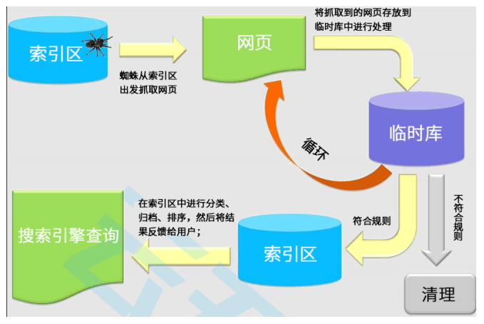

# 什么是 SEO？

* 搜索引擎优化（search engine optimization，缩写为 SEO）是通过了解搜索引擎的运作规则来调整网站，以及提高网站在有关搜索引擎内排名的方式。
* 搜索引擎爬虫的原理

## 搜索引擎如何工作？

搜索引擎的工作流程可以概括为四个步骤：

* 抓取：搜索引擎的蜘蛛程序在互联网上发现并跟踪连接，抓取网页内容。
* 索引：将抓取到的内容进行分析、分类，存入巨大的数据库中，好比图书馆为每本书建立索引卡。
* 排名：当用户搜索一个词时，搜索引擎会从索引库中快速找出最相关、最有价值的页面，按算法排序展示。
* 算法：决定排名的那套复杂计算规则，谷歌、百度等都有自己保密的算法，并会持续更新。

SEO 的本质，就是帮助搜索引擎更好地完成抓取-索引-排名这三个环节，让算法认为你的网站是优质答案。

## SEO 的主要工作

站内优化，让网站内容对搜索引擎更友好。

* 关键词研究：找出目标用户真正会搜的词。
* 标题与描述：写好吸引点击的页面标题和摘要。
* 结构化数据：添加代码标记，帮助搜索引擎理解你的内容（如让搜索结果展示评分、时间等丰富信息）。

## SEO 的价值与局限

* 价值
  * 低成本高回报：用户主动搜索时意图精准，排名靠前能持续带来免费流量。
  * 建立信任：搜索结果靠前天然带有可信的背书。
* 局限
  * 见效慢：通常需要3-6个月甚至更久才能看到明显效果。
  * 规则不透明：算法频繁更新，排名可能波动。
  * 竞争激烈：热门关键词的优化难度极高。