# Claude code

# 一、初步上手

## 1. 部署前准备

首先需要下载和安装一个 **Agent IDE**（智能体集成开发环境）。

推荐使用以下免费IDE，无需购买会员，使用免费额度即可完成后续CC部署：

| **Agent IDE**                          | **下载地址**                                    |
| :------------------------------------- | :---------------------------------------------- |
| Cursor                                 | [官网下载](https://cursor.com/cn/download)      |
| Google Anti-gravity                    | [官网下载](https://antigravity.google/download) |
| Trae                                   | [官网下载（cn）](https://www.trae.cn/)          |
| [官网下载（en）](https://www.trae.ai/) |                                                 |

以 **Cursor** 为例，下载进入后，可以构建如图的开发环境布局：

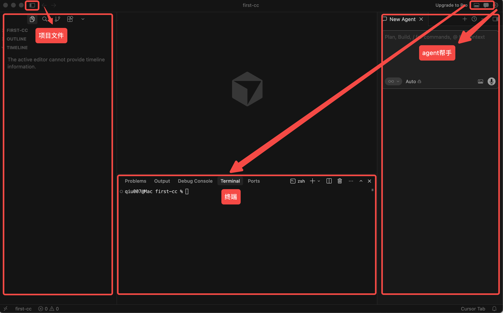


## 2. 安装Claude Code

### **方式 1：终端命令行安装**（需魔法上网）

根据自身系统，选择对应代码，在IDE终端输入并回车：

#### **Windows：**

**步骤 1：**在ide终端用WinGet先安装Git，遇到选项直接输入`y`（yes）

```Plain
winget install Git.Git
```

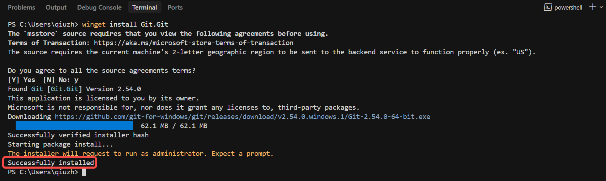

**步骤 2**：在ide终端输入代码，下载Claude code

- **Windows - PowerShell（ide终端默认用这个）：**

```Plain
irm https://claude.ai/install.ps1 | iex
```

- **Windows - CMD：**

```Plain
curl -fsSL https://claude.ai/install.cmd -o install.cmd && install.cmd && del install.cmd
```

- 下载好以后进行版本验证，**版本号正常显示，代表安装完成！**

```Plain
claude --version
```


#### **macOS：**

- 直接在ide终端输入以下代码

```Plain
curl -fsSL https://claude.ai/install.sh | bash
```

- 下载好以后进行版本验证，**版本号正常显示，代表安装完成！**

```Plain
claude --version
```

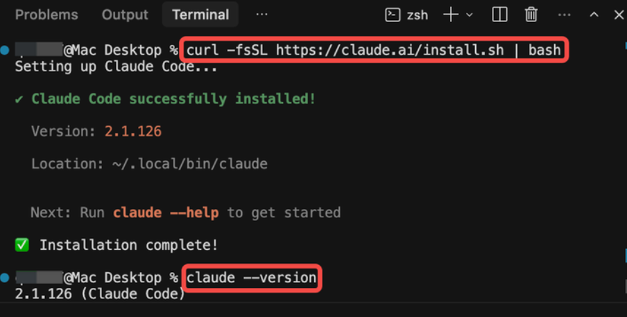

### **方式 2：Agent原生安装（需魔法上网）**

**步骤 1：**直接向IDE Agent输入提示词：

```Plain
帮我安装node并且用npm安装好最新的claude code
```

**步骤 2：**验证Claude code版本号，确认安装成功

```Plain
claude --version
```


### **方式 3：无魔法安装Claude code**

#### **Windows：**

**步骤 1：**用WinGet先安装Git，遇到选项直接y（yes）

```Plain
winget install Git.Git
```


**步骤 2**：在ide agent输入以下提示词，让agent一条龙搞定Claude code安装

```Plain
执行这条代码安装Claude code：winget install Anthropic.ClaudeCode
安装完后，把Claude Code的可执行文件路径配置到系统环境变量的Path里。
```

**步骤 3**：装完后，重启ide，验证Claude code版本号，确认安装成功

```Plain
claude --version
```

#### **macOS：**

**步骤 1**：在ide终端先装Homebrew

```Plain
/bin/bash -c "$(curl -fsSL https://raw.githubusercontent.com/Homebrew/install/HEAD/install.sh)"
```

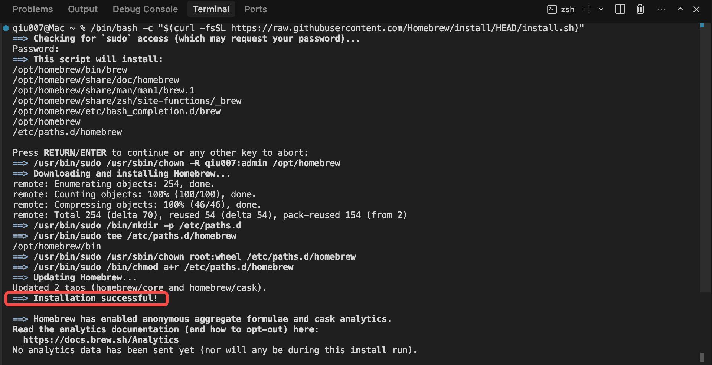

**步骤 2**：向ide agent输入提示词：

```Plain
帮我把homebrew加到PATH路径变量里面去
```

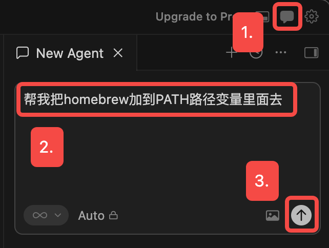

**步骤 3**：在ide终端输入代码，安装Claude Code

```Plain
brew install --cask claude-code@latest
```

**步骤 4：**验证Claude code版本号，确认安装成功

```Plain
claude --version
```


## 3. 配置大模型

1. 下载CC Switch做多模型切换和管理
   1. **CC Switch的GitHub仓库下载页：****https://github.com/farion1231/cc-switch/releases/tag/v3.14.1**

   2. **最新版本号：**v3.14.1

**步骤1：**在下载页，根据系统选择对应下载包：

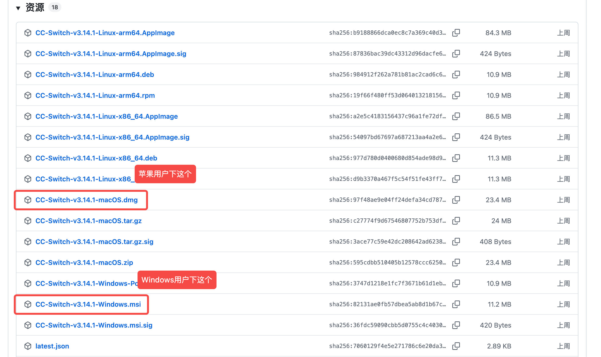

**步骤2：**安装完成后，**务必在打开Claude Code之前**，优先设置CC Switch。在CC Switch的Claude Code页面添加API Key供应商：


**步骤3：**以 **Minimax** 为例，选择对应厂商（中国版），然后填写API Key和Base URL：

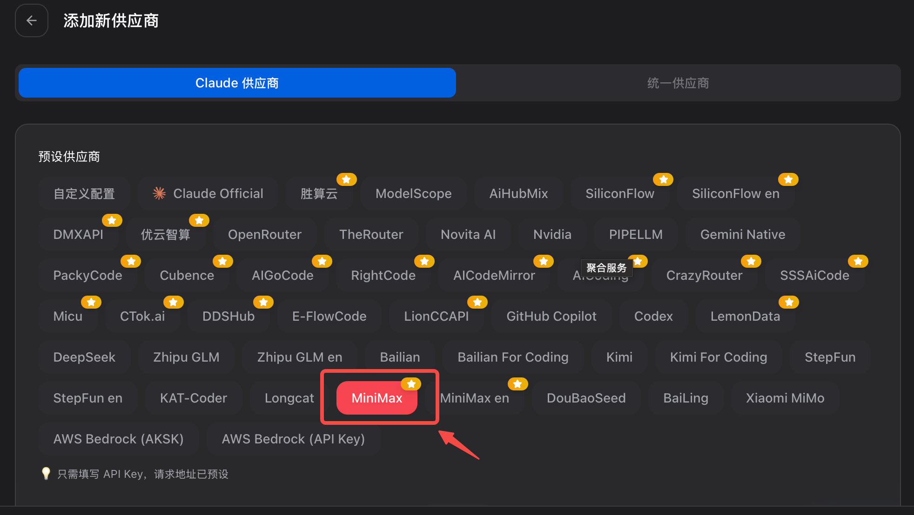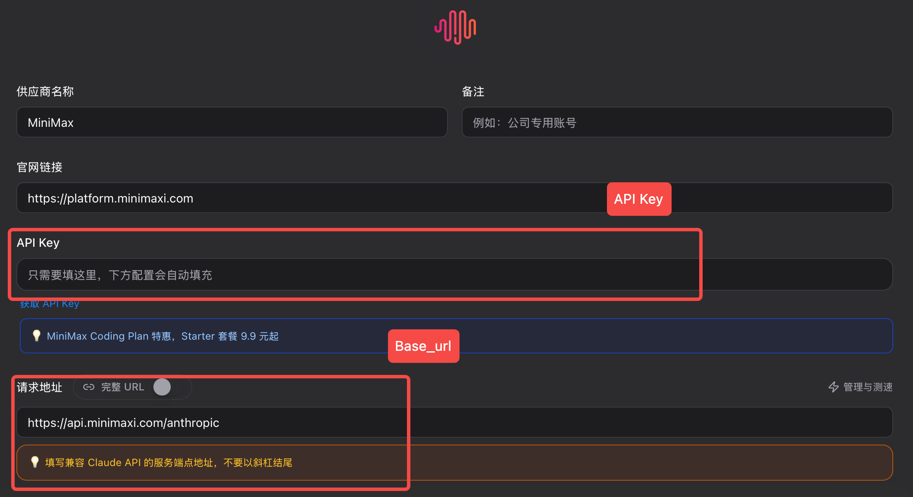


> - 如果不知道Base URL，可以在API Key的官方文档里找到（以[Minimax的官方文档](https://platform.minimaxi.com/docs/guides/models-intro)为例）
>
> 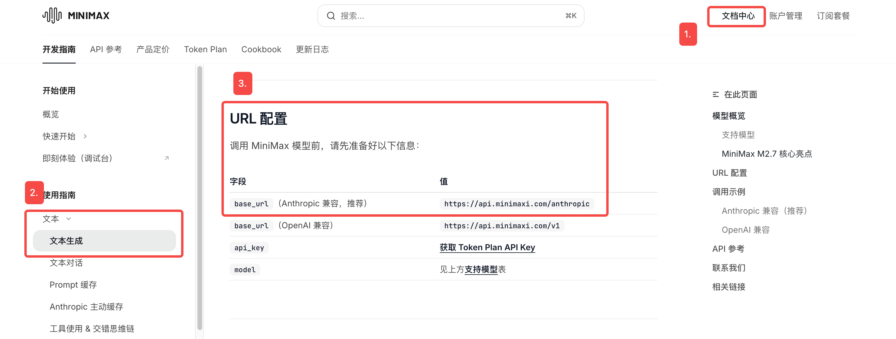

**步骤4：**选择「启用」设置好的API，CC的大模型配置完成！下一步可以准备打开Claude Code了：

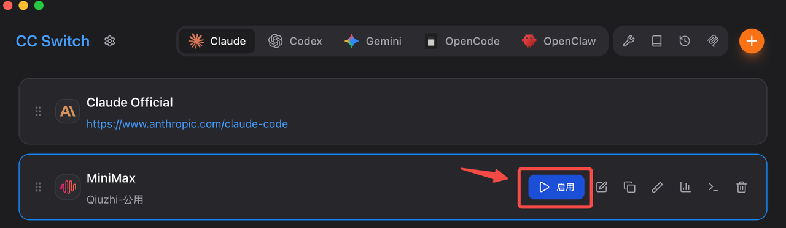


## 4. 基础实操

**步骤1：**在IDE终端打开CC，输入：

```Plain
claude
```

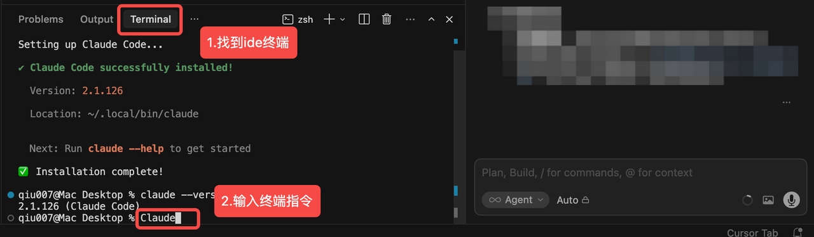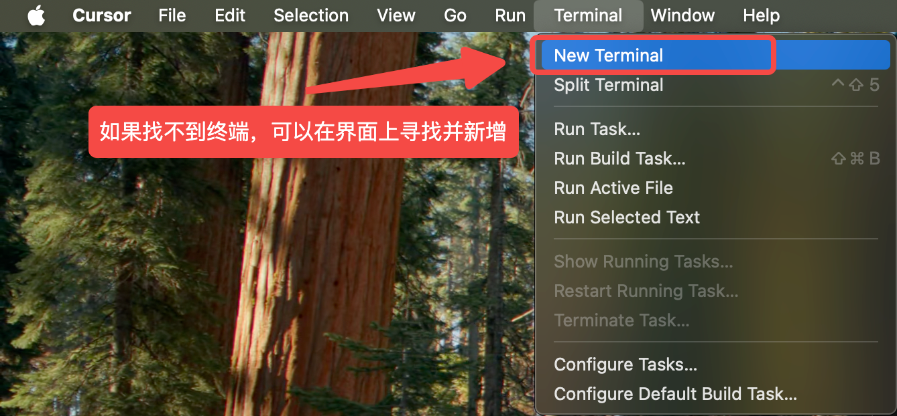


**步骤2：**根据个人喜好设置皮肤与主题，然后一路 `yes` 后，进入CC主界面：

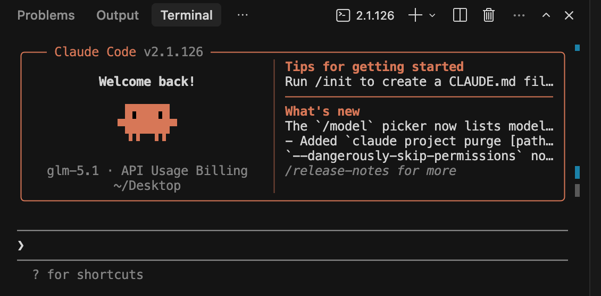

**步骤3：**默认情况下，CC接到任务后会进入 **计划模式（Plan Mode）**：

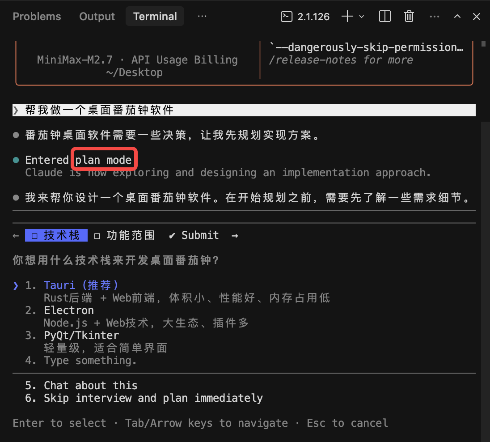

**步骤4：**使用shift+tab，可以让CC在计划模式、默认模式和Accept Edits模式之间来回切换

| 模式             | 功能                                                         |
| :--------------- | :----------------------------------------------------------- |
| 默认模式         | 启动 Claude Code 后的初始交互状态，类似于一个增强版的对话终端，用于意图确认、信息查询和简单任务。 |
| 计划模式         | Claude 进行复杂的代码更改时，它会进入这一阶段。分析需求并制定执行步骤。不直接动代码。 |
| Accept Edits模式 | 这是 Claude Code 的“落地”阶段，会执行代码变更的最终确认与写入 |

额外提醒：

1. 如果希望CC能一路绿灯执行所有操作，需要输入指令`/exit` 退出重启后，在启动CC时输入以下命令

```Plain
claude --dangerously-skip-permissions
```

1. CC在Accept Edits模式下，执行终端命令时，下图三个选项的含义依次分别是：
   1. **仅同意这一次**的命令执行
   2. **同意**，且该项目之后执行项目依赖安装时，不再询问
   3. **不同意**，再商量
   4. 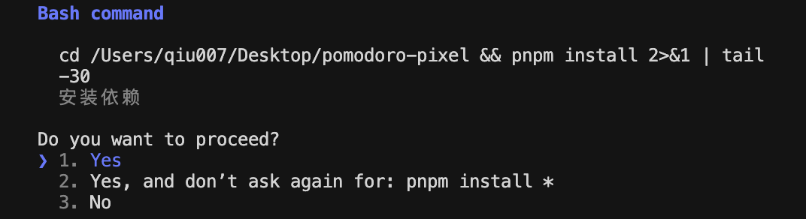


## 5. 如何提供文件给CC

### **方式 1：本地文件**

使用 `@` 指令让CC进行本地文件信息查找：

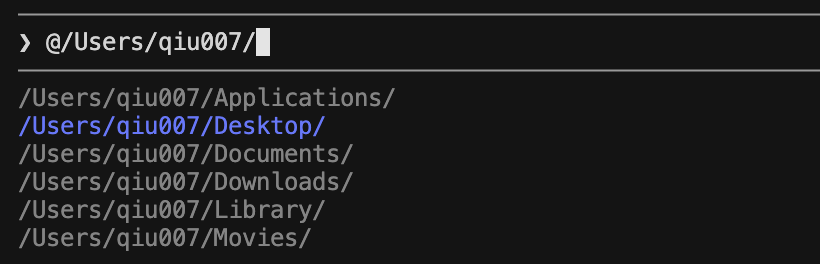

### **方式 2：图片**

直接拖拽图片至对话框，或复制/粘贴：

- **Windows：**`Alt + V`
- **macOS：**`Command + V`

### **方式 3：多行文本输入**

在CC文本框内换行的快捷键（**不是** Shift + Enter）：

- **Windows：**`Ctrl + Enter`
- **macOS：**`Option + Enter`


## 6. 指令大全

| Claude指令  | 功能说明                                                     |
| :---------- | :----------------------------------------------------------- |
| `/help`     | 提供所有指令，以及指令背后遵循的意思                         |
| `/model`    | 切换高中低档模型                                             |
| `/btw`      | By the way缩写，可以暂时切出正在执行的项目，隔离上下文，方便使用者与CC进行临时对话。会话完毕后，可按esc消除临时会话 |
| `/simplify` | 输入后会派生出3个agent，从代码质量、运行效率和复用性三个角度做一次代码审核，然后自动优化修改 |
| `/rewind`   | 进入回滚界面                                                 |
| `/compact`  | 主动压缩精简上下文                                           |
| `/clear`    | 彻底清空上下文，相当于重开一个会话                           |
| `/context`  | 详细展示agent当前的上下文信息，诸如：上下文占比，上下文类别等等 |
| `/resume`   | 在全新的上下文窗口，选择恢复到之前的对话                     |
| `/init`     | 初始化创建项目级Claude.md                                    |
| `/memory`   | 针对Claude的全局、项目记忆，以及auto memory进行操作和管理    |
| `/agents`   | 创建、调用、管理子agent                                      |
| `/plugin`   | 发现新插件，管理已下载插件，新增插件生态                     |

  更多指令可参考以下pdf文档：

暂时无法在飞书文档外展示此内容


# 二、掌控与管理

## 1. Git下载与设置

在CC中输入以下提示词，根据CC引导进行操作：

```Plain
帮我下载Git，并与我的GitHub账号绑定
```


## 2.上下文管理

**步骤1:**确认上下文进度

- 输入`/context`命令，它会详细的展示我们的上下文占比信息：
  - ```Plain
    /context
    ```

  - 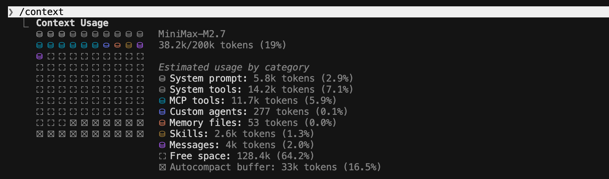

**步骤2:**主动压缩上下文

- cc会在上下文即将满的时候，会帮我们自动压缩
- 我的习惯是看到高于60%了，就大概率需要 `/compact` 

```Plain
/compact
```

**步骤3:**彻底清空上下文

```Plain
/clear
```

**步骤4:**context占用条常驻

- 对CC输入提示词，并根据CC引导完成后重启终端即可：
  - ```Plain
    帮我配一个 statusLine,显示当前目录+模型+上下文剩余百分比 
    ```

  - 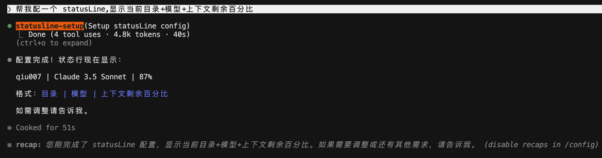

**步骤5:**对话恢复

- 输入以下指令后，选择恢复到你想要的会话即可：
  - ```Plain
    /resume
    ```


# 三、个性化

## 1. Claude.md 配置

**项目级 Claude.md** 创建方式：

```Plain
/init
```

**全局级 Claude.md** 有两种创建方式：

**方式 1：提示词交互**

```Plain
记得永远说中文，写进全局claude.md
```

**方式 2：使用指令**

输入 `/memory` 后，选择「User Memory」进入：

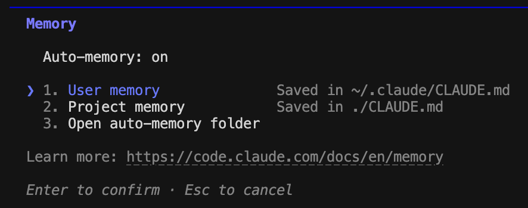


## 2. Auto Memory

- 打开Auto Memory：输入`/memory` ，选择「**Auto-memory**」并输入回车开启
  - 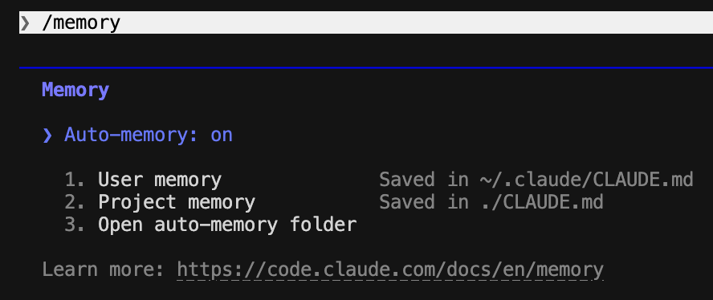

  - > 打开以后，我们与CC的工作交互过程中，那些没有显式的主动写进claude.md的一些习惯、错误、经验，都会以自动记忆形式被记录，但仅限于当前项目，不会跨项目产生影响。

# 四、能力扩展

## 1. Skill 技能扩展

1. **Claude Code优质skill推荐**

   1. 可以将skill链接给cc，让cc帮你直接下好

   2. | skill名称        | 功能                                                       | 下载链接                                                     |
      | :--------------- | :--------------------------------------------------------- | :----------------------------------------------------------- |
      | Find-Skill       | 根据用户需求，查找和安装来自agent skill开放生态的技能      | [GitHub](https://github.com/vercel-labs/skills/tree/main/skills/find-skills) |
      | Frontend- Design | 创建具有独特风格、生产级品质且设计精良的前端界面           | [GitHub](https://github.com/anthropics/skills/tree/main/skills/frontend-design) |
      | Skill- Creator   | 创建新skill、修改和改进现有skill，并衡量skill表现          | [GitHub](https://github.com/anthropics/skills/tree/main/skills/skill-creator) |
      | 卡帕西skill      | 一个依据卡帕西经验总结，用于提升Claude Code编码表现的skill | [GitHub](https://github.com/forrestchang/andrej-karpathy-skills) |

2. **skill合集网站：****lobehub**

   1. 大家既可以根据分类去寻找自己需要的skill，也可以直接在精选合集查看推荐的优质skill
   2. 

3. **想创建自己的skill？**

   1. 我们还有一份网页版教学文档，非常详细：[Agent Skills指南（Claude Code版）](https://ccnk05wgo092.aiforce.cloud/spark/faas/app_4jdqh6vm3jpdp)

4. **下载了skill怎么装？**

   1. 可根据需求，将skill文件放入**项目级skill**与**全局级skill**的存放**文件夹**
   2. 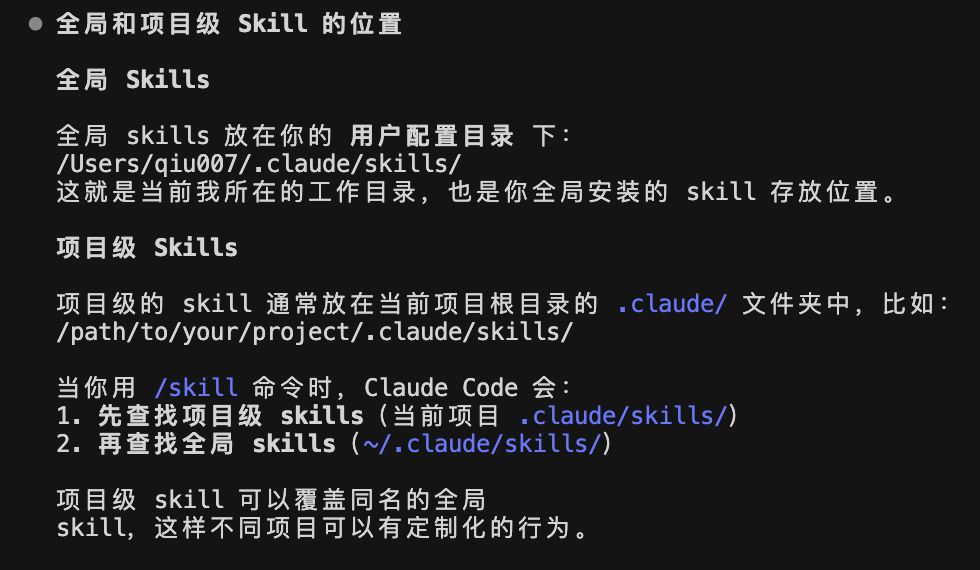


## 2. MCP 扩展

关于MCP的部分，可结合以下教程进行学习与实践：

**学习资源**

📺 **视频教程：**[用神器Claude Code！打造贴身AI秘书团【小白教程】](https://www.bilibili.com/video/BV1zqeMzfEiQ/?spm_id_from=333.1387.upload.video_card.click&vd_source=b82dea39967bb9f5eb44be501b4cae31)

📄 **文档教程：**[Claude Code教程](https://my.feishu.cn/wiki/BxLTwlkvkiQhJkkJ7vgc95aZnMe)


## 3. CLI 命令行工具

**推荐几个优质CLI，**直接将下载链接给CC，让CC全权负责下载和引导操作：

| **CLI名称** | **功能**                                                     | **下载**                                                     |
| :---------- | :----------------------------------------------------------- | :----------------------------------------------------------- |
| 飞书CLI     | 飞书官方CLI工具，覆盖消息、文档、多维表格、电子表格、幻灯片、日历、邮箱、任务、会议等核心业务域，提供200+命令及24个AI Agent Skills | [GitHub](https://github.com/larksuite/cli/blob/main/README.zh.md) |
| OpenCLI     | 万能命令行工具箱，通用命令行中心与AI原生运行平台，能将任何网站、桌面应用或本地程序变成统一命令行操作界面 | [GitHub](https://github.com/jackwener/opencli)               |
| CLI         | GitHub 的官方命令行工具。它将拉取请求、问题和其他 GitHub 概念带到终端中，与你已经在使用 `git` 和代码的地方并排显示。 | [GitHub](https://github.com/cli/cli)                         |
| gemini-CLI  | Gemini CLI 可将 Gemini 的功能直接引入终端。它提供轻量级的 Gemini 访问方式，能够以最直接的方式从终端命令访问 Gemini 模型。 | [GitHub](https://github.com/google-gemini/gemini-cli)        |

> 给大家推荐一个GitHub上的CLI主题推荐网页，大家可按需查找自己想要的CLI：[Command-line interface](https://github.com/topics/cli)


## 4. 子Agent（SubAgent）

**创建子Agent的两种方式：**

1. **自动触发：**任务复杂且存在并行可能时，CC会自动派生子Agent并行推进
2. **手动创建：**通过指令 `/agents` ，在Library界面进行创建
   1. 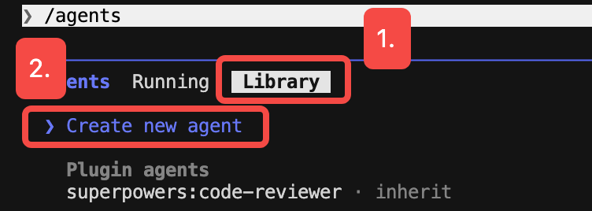

**手动创建步骤：**

**步骤1：**选择创建项目级或全局级子Agent

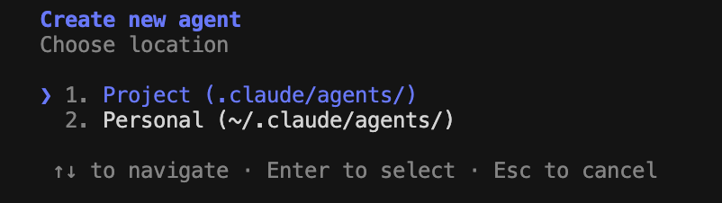

**步骤2：**选择「AI辅助创建」，让AI根据意图辅助创建

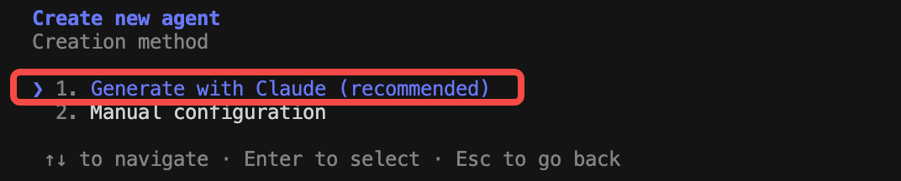

**步骤3：**描述想要的子Agent功能

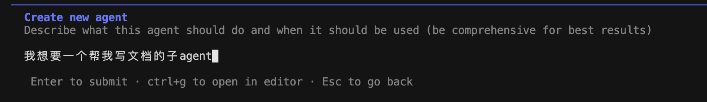

**步骤4：**决定子Agent工具权限（✓为选中）

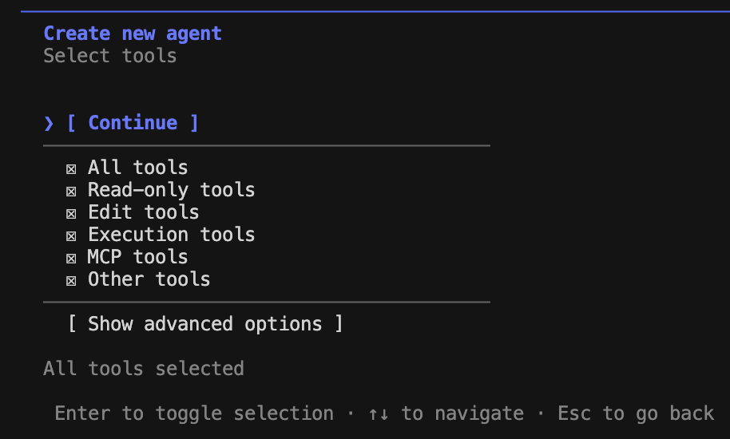

**步骤5：**选择Claude的模型

- 一般选Sonnet就可以（如果使用CC Switch配置了模型，选哪个都一样）
  - 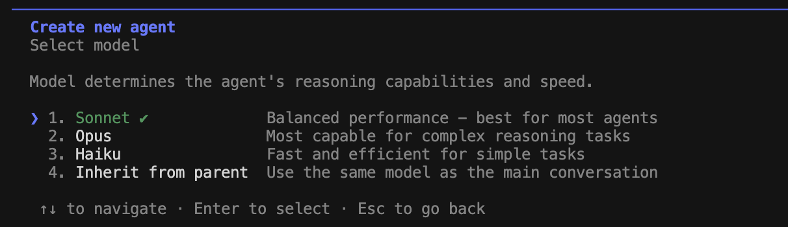

**步骤6：**为子Agent挑选区别于主Agent的颜色

- 选个好看的颜色
  - 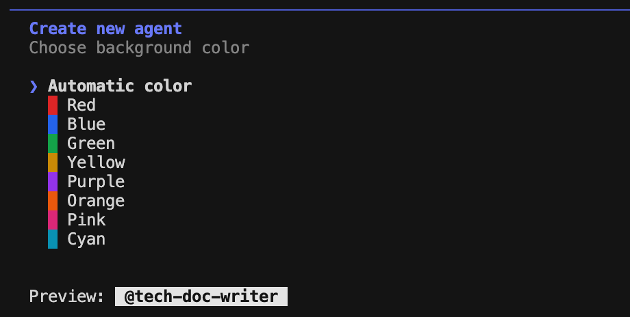

**步骤7:**调用与管理子Agent

- 输入 `/agents`，在Library下选择已创建的项目级子Agent
  - 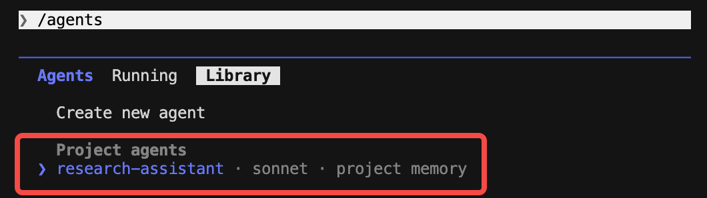
- 根据需求对子Agent进行相应操作
  - 


## 5. Hook 钩子

推荐以下Hook设置，直接告诉CC帮忙设置：

```Plain
设置一个hook，每次完成任务之后，都自动执行一个声音脚本，发出一个提示音"叮"进行提醒
设置一个hook，每次提交代码之前，都会自动触发代码格式的检查
```


## 6. 插件（Plugin）

**插件说明**

插件是打包了 **Skill**、**SubAgent**、**Hook**、**MCP** 的整合性概念

**步骤1：**通过指令 `/plugin` 进入插件管理界面

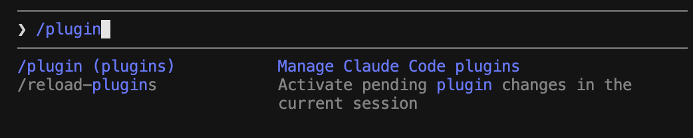

**步骤2：**在插件管理界面，可以收录下载钟意的插件，或管理已下载插件

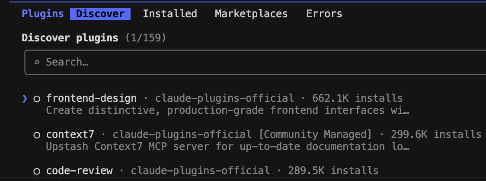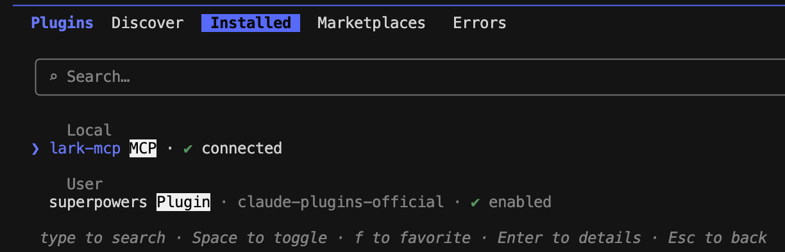


推荐给大家一些Claude Code官方精选的一些插件：

| 插件名称          | 插件功能                                                     | 链接                                                         |
| :---------------- | :----------------------------------------------------------- | :----------------------------------------------------------- |
| commit-commands   | 使用简单的命令简化 Git 工作流程，包括提交、推送和创建拉取请求 | [GitHub](https://github.com/anthropics/claude-code/tree/main/plugins/commit-commands?utm_source=claudecodeplugins.dev) |
| content-creator   | 这位内容创作者擅长跨平台内容创作，从长篇博客文章到引人入胜的视频脚本和社交媒体内容，无所不包。 | [GitHub](https://github.com/ccplugins/awesome-claude-code-plugins/tree/main/plugins/content-creator?utm_source=claudecodeplugins.dev) |
| security-guidance | 安全提醒钩子，在编辑文件时提示潜在的安全问题，包含命令注入、XSS 及不安全的代码模式 | [GitHub](https://github.com/anthropics/claude-code/tree/main/plugins/security-guidance?utm_source=claudecodeplugins.dev) |

如果仍有需求，可以去官方/三方插件网站继续查看自己需要的插件：[Plugins](https://claude.com/plugins#plugins) / [Claude Code Plugins](https://claudecodeplugins.dev/zh)