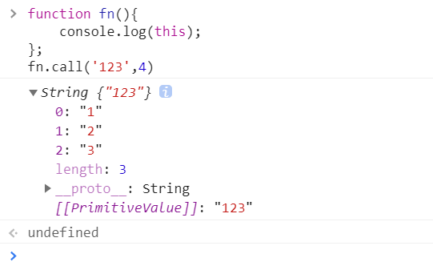
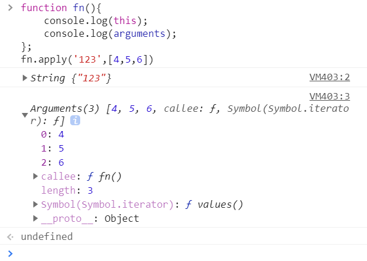

# call、apply、bind 的用法分别是什么？

### `call()` 方法使用一个指定的 `this` 值和单独给出的一个或多个参数来调用一个函数

### 语法

```js
function.call(thisArg, arg1, arg2, ...)
```

### 参数

* `thisArg`

  可选的。在 *function* 函数运行时使用的 `this` 值

* `arg1, arg2, ...`

  指定的参数列表

```js
function fn(){
    console.log(this);
};
fn.call('123',4)
```




###  apply()方法调用一个具有给定`this`值的函数，以及以一个数组（或类数组对象)的形式提供的参数

* **注意：**`call()`方法的作用和 `apply()` 方法类似，区别就是`call()`方法接受的是**参数列表**，而`apply()`方法接受的是**一个参数数组**。

```js
function fn(){
    console.log(this);
    console.log(arguments);
};
fn.apply('123',[4,5,6])
```




### `bind()` 方法创建一个新的函数，在 `bind()` 被调用时，这个新函数的 `this` 被指定为 `bind()` 的第一个参数，而其余参数将作为新函数的参数，供调用时使用

### 绑定 this 

### 使用 .bind 可以让 this 不被改变

```js
function f1(p1,p2){
    console.log(this,p1,p2)
}
let f2 = f1.bind({name:'frank'})
// f2 就是 f1 绑定了 this 之后的新函数
f2()
// 等价于 f1.call({name:'frank'})
```

### .bind 还可以绑定其他参数

```js
let f3 = f1.bind({name:'frank'},'hi')
f3()
// 等价于 f1.call({name:'frank'},hi)
```


