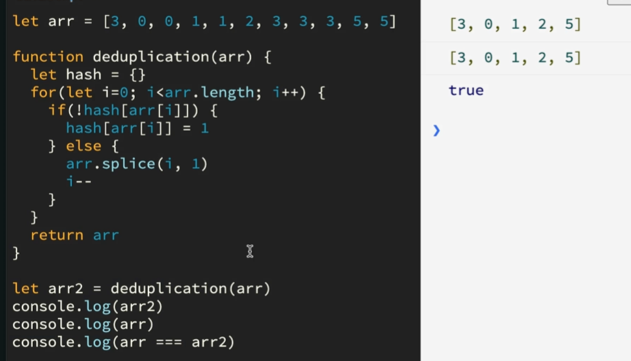

# 多种方法实现数组去重

假设有数组 array = [1,5,2,3,4,2,3,1,3,4]

你要写一个函数 unique，使得unique(array) 的值为 [1,5,2,3,4]


### indexOf 去重

indexOf() 方法返回在数组中可以找到一个给定元素的第一个索引，如果不存在，则返回-1。

> 思路：
> 1.声明一个空数组
> 2.循环需要去重的数组
> 3.用indexOf查找空数组里是否含有需要去重的数组的每一项，没有就push，如果已存在就去重。

```js
let arr = [1, 5, 2, 3, 4, 2, 3, 1, 3, 4]
const unique = (array) => {
  let result = []
  for (let i = 0; i < array.length; i++) {
    if (result.indexOf(array[i]) === -1) {
      result.push(array[i])
    }
  }
  return result
}
console.log(unique(arr))
// [1,5,2,3,4]
```

这个方法，让我们可以知道很多，只要是一个可以查找数组中有没有某个值的方法，只要和循环搭配，都可以实现；同理可得，只要是一个循环的方法，与查找有无某个值的方法，也可以实现。


### ES6 set方法去重

Set 对象是值的集合，你可以按照插入的顺序迭代它的元素。 Set中的元素只会**出现一次**，即 Set 中的元素是唯一的。

```js
let arr = [1, 5, 2, 3, 4, 2, 3, 1, 3, 4]
const unique = (array) => {
  return [...new Set(array)]
}
console.log(unique(arr))
```


### Map 数据结构去重

Map 对象保存键值对，并且能够记住键的原始插入顺序。任何值(对象或者原始值) 都可以作为一个键或一个值。

```js
let arr = [1, 5, 2, 3, 4, 2, 3, 1, 3, 4];
const unique = (array) => {
 let map = new Map();
 arr.forEach(v => map.set(v,1));
 return [...map.keys()]   
};
console.log(unique(arr));
```


## reduce

```js
const arr = [1, 5, 2, 3, 4, 2, 3, 1, 3, 4];
const unique = arr => arr.reduce((temp, v) => temp.includes(v) ? temp : [...temp, v], [])
console.log(unique(arr))
```


## filter

```js
const arr = [1, 5, 2, 3, 4, 2, 3, 1, 3, 4];
const deduplication4 = arr => arr.filter((val, index) => arr.indexOf(val) === index);
console.log(deduplication4(arr));
```




### 在原数组上进行操作

```js
let arr = [1, 5, 2, 3, 4, 2, 3, 1, 3, 4];
function unique(arr){
    let hash = {};
    for(let i=0; i<arr.length; i++){
        if(!hash[arr[i]]){
            hash[arr[i]] = 1;
        } else {
            arr.splice(i,1);
            i--;
        }
    }
}
console.log(unique(arr));
```


