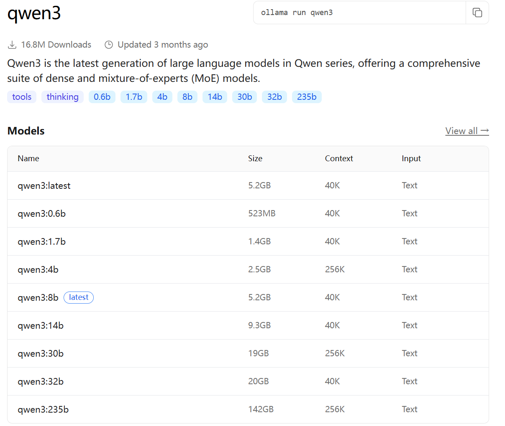
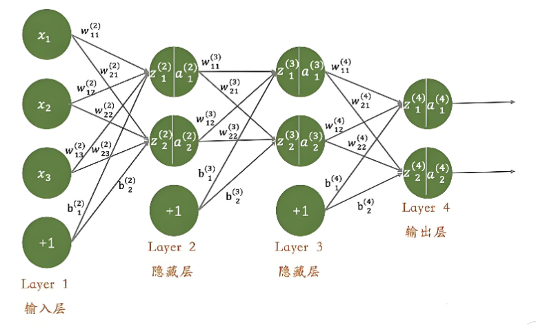

# 认识大模型

## 第1章 认识大模型

## 1.1 定义

目前关于大模型（Large Models）并没有统一的定义，通常是指`训练数据庞大`、`参数规模巨大`、`能力强大`的深度神经网络模型。

大模型的参数量通常在`10亿以上`，目前顶尖模型的参数规模已达`万亿级别`。

举例：

大模型（Large Model，通常指大型语言模型）并没有一个绝对严格的标准定义，但从研究和应用层面，可以这样理解：

**大模型是指参数规模巨大（通常在十亿甚至千亿级以上）、在海量数据上通过自监督学习训练，能够展现出涌现能力与强大泛化性能的深度学习模型。**

更具体来说，可以从以下几个维度来把握它的核心特征：

1. **规模巨大**
   - **参数规模**：最常见的量化指标。早期模型参数在百万、千万级，而大模型参数通常超过10亿。GPT-3有1750亿参数，Google的PaLM达到5400亿参数， Kimi K3 的总参数量达到**2.8万亿**。
   - **训练数据**：需要海量无标注数据，通常达到TB甚至PB级别，涵盖网页、书籍、代码、论文等。
   - **计算资源**：训练需要成百上千张GPU/TPU，计算成本高达数百万甚至数千万美元。
2. **核心架构**
   - 绝大多数现代大模型基于**Transformer**架构，利用其自注意力机制捕捉长距离依赖关系。
   - 主流形式通常是**解码器架构**（如GPT系列），擅长自回归生成。
3. **训练方式**
   - **预训练**：在海量无标注数据上进行自监督学习（如下一个词预测）。这是核心环节，模型在此阶段学习语言知识、事实、推理等通用能力。
   - **微调/对齐**：预训练后，通过指令微调、人类反馈强化学习等方法，让模型更好理解人类意图并遵守安全规范。
4. **关键能力：涌现**
   - 这是大模型区别于小规模模型的本质特征。当模型参数跨过某个阈值后，会突然出现小模型不具备的能力，并且不是简单的能力提升，比如：
     - **上下文学习**：仅通过提示词中的几个例子就能执行新任务。
     - **思维链推理**：能解决复杂逻辑问题（如数学应用题）。
     - **指令遵循**：能理解并执行人类自然语言指令。

**总结一下：**

> **大模型是基于海量数据、耗费巨大算力训练而成的拥有巨量参数（通常≥10亿）的神经网络模型。它不仅能记忆知识，更重要的是能够“涌现”出小模型不具备的复杂推理、上下文学习和泛化能力，通常表现为像ChatGPT、GPT-4、文心一言等这类对话或生成式AI系统。**

简单说，大模型就是**通过“大力出奇迹”——即用超大网络和海量数据——让AI系统“涌现”出类似人类的通用语言理解和生成能力**。

在AI领域，“涌现”并非一个玄学概念，而是一个有严格定义的**系统科学现象**。

**“涌现”是指：当模型的参数量、数据量和算力突破某个临界点（阈值）后，模型会突然“无师自通”地展现出小模型无论怎么优化都绝对不具备的全新高阶能力。**

**1. 本质：量变引发的“非线性”质变**
这不是简单的“更聪明一点”，而是**性能曲线的突然陡峭化**。
例如，让模型做三位数加减法。当参数量在10亿级时，准确率可能接近0%（完全不会）；但当参数量突破千亿级，准确率可能瞬间飙升至90%以上。在数学图像上，这不是平滑上升的斜坡，而是**断崖式的跳跃**。这种跳跃无法通过外推小模型的表现来预测，所以被称为“涌现”。

**2. 具体“涌现”出了什么能力**

- **上下文学习（In-Context Learning）**：小模型面对几个示例（Few-shot）往往学不会规律，而大模型能瞬间“看懂”示例中的隐含模式，并立即应用到新问题上——**你没教它“怎么学习”，但它自己会了**。
- **复杂推理（Chain-of-Thought）**：小模型通常只会“直觉性”地猜下一个词，而大模型能“自言自语”地分步推导（如解数学题时先写步骤再给答案）。**你只训练它预测下一个字，但它自发演化出了逻辑链条**。
- **泛化与心智理论**：它能理解反讽、隐喻，甚至能推测对话中人类隐藏的意图。这些能力在训练数据中**从未被显式标注过**，完全是规模放大后“长”出来的副产品。

**3. 为什么小模型没有？**
大模型在训练时，本质是在**高维空间**里压缩海量知识。当参数足够多，神经网络的“连接路径”就变得极其稠密。
小模型的“高维空间”太窄，知识只能以孤立“碎片”存储；而大模型的“高维空间”足够宽广，使得原本不相关的知识碎片（比如“物理定律”和“诗歌韵律”）发生了**交叉连接**，从而“缝合”出全新的抽象规律。这种连接数量随参数增加是**指数级**增长的，一旦跨过门槛，智能就“冒”出来了。

**4. 一个重要的科学提醒**
AI科学家（如Google研究团队）发现，**“涌现”现象有时取决于“测量标尺”**。如果你用“准确率”来测，小模型是0，大模型是90%，这看起来是涌现；如果你换一种“连续得分”的测量方式，可能会发现模型其实是一直在缓慢进步的。
但无论如何，**当模型规模达到数百亿甚至千亿级时，它确实出现了小模型（如数十亿参数）绝对无法完成的复杂任务处理能力**——这是业界公认的客观事实。

**用一个极简的类比总结：**
这就像**水**。单个水分子没有“流动性”和“波浪”；但当分子数量积聚到临界点（变成江河湖海）时，“波浪”和“潮汐”就**涌现**出来了。你无法通过研究一个水分子来预测波浪的样子，同样，你也无法通过研究小模型来预测GPT-4的推理能力。

##  1.2 为什么会出现大模型？

大模型的出现并非偶然，而是**数据**、**算力**与**模型架构**协同演进的结果。

**1）数据够多**：训练范式的改变使得训练数据规模获得了数量级上的跃迁

 

- 传统监督学习高度依赖`人工标注数据(对原始数据进行标记、分类、注释或结构化的过程，便于机器可识别和理解)`，获取成本高、规模受限。比如，
  - 分类标注：为整张图像分配类别标签（如"猫"、"狗"，人工标注的）
  - 命名实体识别：标注文本中的人名、地名、组织名等实体
  - 情感分析：标注文本的情感倾向（正面、负面、中性）
  - 语音转写：将语音内容转换为文本

- 大模型主要采用`自监督学习范式`（如“预测下一个token”），能够直接利用海量的未标注文本与多模态数据进行模型的训练，可用数据规模获得了**数量级上的跃迁**。
  - 自监督学习，本质上属于无监督学习的一种特殊形式，但采用了监督学习的训练方式。核心思想是利用数据本身的内在结构或属性，`自动为无标签数据生成伪标签`，然后像监督学习一样训练模型，`无需依赖人工标注`。比如，掩码语言建模。
  - 如Qwen3的预训练阶段使用了约`36T`个token（近似理解为词）的语料，这一数据规模远超传统机器学习时代的训练数据总量。

**2）算力够强：GPU/TPU等并行计算设备性能发展与分布式训练成熟**

 

深度学习训练本质是**大规模矩阵运算**，这类计算具有高度**并行性**，与GPU/TPU的硬件架构天然契合。

随着硬件性能的不断提升，单卡算力不断突破，目前英伟达最新一代的**B200**在**FP16（半精度浮点数）**条件下的峰值算力已达**5PFLOPS**。

与此同时，**数据并行**、**张量并行**、**流水线并行**等分布式训练体系日趋成熟，使得跨节点、跨集群`训练超大规模参数模型`成为可能。

- 数据并行：每个设备持有完整的模型副本，不同设备处理不同的数据子集，通过梯度聚合同步更新模型参数。
- 张量并行：将模型中的张量（如权重矩阵）按维度切分到不同设备上，每个设备只处理部分张量，通过集合通信合并结果。
- 流水线并行：将模型按层或模块切分成多个阶段，每个阶段分配到不同设备，数据按流水线方式依次传递。

**3）架构合理：Transformer架构的出现**

Transformer架构支持**并行计算**，并且在**模型规模**、**数据规模**、**训练步数（算力开销）**提升时展现出稳定的性能收益（即良好的“**可扩展性**”，如下图所示，图中的Test Loss表示损失函数的值，用于衡量模型性能）。

- `损失函数（Loss Function）`是用于量化模型预测值与真实值之间差异的数学函数，也称为代价函数或目标函数。它通过计算预测错误程度来评估模型性能，**值越小表示预测越准确**，值越大表示预测误差越大。比如，均方误差（MSE）、平均绝对误差（MAE）等。

 

**4）总结**

综上，**数据规模**的跃迁、**算力基础设施**的发展，和**Transformer架构**优异的可扩展性，共同推动了模型规模和性能的持续膨胀，迎来了“大模型时代”。

Transformer架构是当前几乎所有大模型（如GPT、BERT、Llama、文心一言等）的底层技术基石。它由Google团队在2017年论文《Attention Is All You Need》中首次提出，最初用于机器翻译，但很快因其强大的并行计算能力和长距离依赖建模能力，成为自然语言处理乃至多模态领域的绝对主流架构。

### 1. 核心思想：抛弃循环，只用注意力

在Transformer之前，主流序列模型（如RNN、LSTM）是**循环**的：需要逐个词处理，当前词的输出依赖之前所有词的计算结果。这导致两个问题：

- **难以并行**：无法同时处理一句话中的所有词，训练慢。
- **长距离遗忘**：句子太长时，开头的词对结尾的影响会衰减。

Transformer的革命性在于**完全抛弃循环结构**，仅通过**自注意力（Self-Attention）** 机制来捕捉序列中任意两个位置之间的关系。这样：

- 一句话中的所有词可以**并行输入**网络。
- 任何两个词之间都只有一步之遥，不存在长距离遗忘问题。

### 2. 核心组件

一个标准的Transformer模型由**编码器（Encoder）** 和**解码器（Decoder）** 堆叠而成（实际应用中常只使用其中一半，比如GPT只用解码器，BERT只用编码器）。

每个编码器和解码器内部又包含以下核心模块：

#### (1) 自注意力（Self-Attention）

这是最关键的部件。它的作用是为序列中的每个词计算一个**增强后的表示**——让该词能够“看到”并融合其他相关词的信息。

- **如何工作**：对每个输入词，生成三个向量：**查询（Q）**、**键（K）**、**值（V）**。
  - 用当前词的 **Q** 与序列中所有词的 **K** 做匹配，得到每个词的“注意力分数”（即相关性）。
  - 用softmax将分数归一化为权重。
  - 用这些权重对所有词的 **V** 做加权求和，结果就是该词新的表示。
- **效果举例**：当处理句子“他吃了一个苹果”中的“吃”时，“他”和“苹果”的注意力分数会很高，因此“吃”的新表示会融合进主语和宾语信息。

#### (2) 多头注意力（Multi-Head Attention）

单次自注意力可能只关注一种关系（比如主谓关系）。为了捕捉不同种类的依赖（如语法、语义、指代等），Transformer同时计算多个独立的注意力（每个称为一个“头”），然后将各头的结果拼接起来。这大大增强了模型的表达能力。

#### (3) 前馈网络（Feed-Forward Network, FFN）

每个注意力层之后跟着一个简单的全连接网络（两层线性层加一个激活函数）。它的作用是对每个词的表示进行**非线性变换**，提升模型的拟合能力。注意：FFN是对每个词独立作用的，词与词之间不共享参数但互不影响。

#### (4) 位置编码（Positional Encoding）

由于自注意力本身不关心词的顺序（它看到的是无序的集合），需要**显式注入位置信息**。Transformer原始论文使用正弦/余弦函数生成固定位置编码，与词嵌入相加。后来的模型（如GPT-2/3）常用可学习的位置编码，或采用旋转位置编码（RoPE）等更先进的形式。

#### (5) 残差连接 + 层归一化

- **残差连接**：将每个子层（注意力或前馈）的输入直接加到输出上（类似`x + SubLayer(x)`）。这解决了深层网络梯度消失问题，使得模型可以堆叠上百层。
- **层归一化（LayerNorm）**：在每个残差连接之后进行归一化，稳定训练过程。

### 3. 整体架构图解

一个典型的用于机器翻译的Transformer是**编码器-解码器**结构：

- **编码器（左侧）**：由N个相同层堆叠，每层包含：多头自注意力 + 残差+层归一化 → 前馈网络 + 残差+层归一化。输入是源语言句子（如英语），输出是其深层语义表示。
- **解码器（右侧）**：也由N个相同层堆叠，但每层多了一个**交叉注意力（Cross-Attention）** 子层。交叉注意力用解码器当前已生成词的Q去“查询”编码器输出的K、V，从而在生成目标语言时聚焦于源语言相关部分。此外，解码器的自注意力是**带掩码的**（Masked），保证生成第t个词时看不到未来的词。

**常见变体**：

- **仅编码器**（如BERT）：适合理解任务（分类、填空、序列标注）。
- **仅解码器**（如GPT系列）：适合生成任务（文本续写、对话、代码生成）。这也是如今大语言模型最常用的形式。

### 4. 为什么Transformer如此重要？

1. **并行计算**：相比RNN，训练速度快一个数量级以上，使得在海量数据上训练千亿参数模型成为可能。
2. **超长距离依赖**：理论上可以捕捉任意距离的两个词的关系，对大上下文理解至关重要。
3. **可扩展性**：增加参数、层数、头数都能平稳提升性能，且对硬件（GPU/TPU）友好。
4. **通用性**：不仅用于自然语言，还被扩展到计算机视觉（ViT）、语音、多模态（CLIP、Flamingo）等领域。

### 5. 一个直观的例子

假设输入句子：“我 爱 北京 天安门”。

- Transformer不是像RNN那样先处理“我”，再处理“爱”……而是把所有词同时输入。
- 自注意力会让“爱”这个词的表示融合进“我”和“北京天安门”的信息，同时“北京天安门”也可能注意到“爱”来理解其作为宾语的角色。
- 经过多头注意力，模型可能在一个头中学习主谓关系，在另一个头中学习地点修饰关系。
- 最终输出的是每个词融合了上下文信息后的增强向量，这些向量后续可以用于翻译、分类或生成。

**总结**：Transformer是一种**完全基于自注意力机制**的序列模型，它抛弃了传统的循环和卷积结构，通过并行计算、多头注意力、残差连接等设计，实现了高效的训练和强大的长程依赖建模能力，成为大模型时代不可或缺的基础架构。

## 1.3 大模型计量单位

在大语言模型（LLM）及更一般的大模型研究中，通常从**参数规模**、**训练数据集规模**和**计算规模**三个维度来度量模型的规模。

**1）参数规模（Parameters Scale）**

`参数`是指深度神经网络里面“神经元数量、层数、神经元权重、神经元偏移量、超参数”等数据的集合。

大模型参数规模通常以**B**为单位，B是**Billion**的缩写，即**10亿**，109。

如：7B模型的参数量为70亿。

**2）训练数据集规模**

LLM的训练是在文本语料上进行的，语料处理的第一步是分词为一系列token，所以通常用**token的数量**衡量LLM**训练数据集规模**。

1B token = 109token = **10亿**token

1T token = 103B token = 1012token = **1万亿**token

> 多模态模型的数据集格式五花八门，无法用统一单位度量，此处不讨论。

**说明：token是什么**

- 可能是一个英文单词，也可能是半个，三分之一个
- 可能是一个中文词，或者一个汉字

token是计算机理解人类语言的`基础单位`。大模型在开训前，需要先训练一个`tokenizer模型`。它能把所有的文本，切成token。

- 1个英文字符≈0.3个token。1个中文字符≈0.6个token。
- 测试网址：https://platform.openai.com/tokenizer

**3）计算规模**

计算规模是指大模型训练消耗的计算量。

大模型是一系列浮点数的组合，训练过程涉及大量浮点数运算，因此计算规模通常用**FLOPs**（Floating Point Operations，浮点运算次数）来衡量。

1FLOPs=1次浮点运算

1**P**FLOPs=1015FLOPs

1**E**FLOPs=103**P**FLOPs=1018FLOPs

在大模型（尤其是基于Transformer的语言模型）的语境下，**Token（词元）** 是模型处理文本时的**最小基本单位**。它不是我们日常理解的“单词”或“字符”，而是介于两者之间的一种编码单元。

为了便于理解，可以从以下几个层面来说明：

### 1. 为什么需要Token？

计算机只能理解数字，不能直接理解文字。因此，需要把原始文本转换成数字序列。如果每个字或每个单词都当作一个独立单元，会遇到问题：

- **按字符**：中文常用字符约3000-5000个，但序列会变得非常长（例如10个字就是10个token），模型处理长序列效率低。
- **按单词**：英语单词几十万，生僻词无法处理；中文词边界不明确，词表过大。

**Token** 是一种折中方案：把文本切分成常见的有意义的子串（如“ing”、“apple”、“##ing”），既能控制词表大小（几万到几十万），又能覆盖绝大多数文本。

### 2. Token的常见形式

具体切分方法由**分词器（Tokenizer）** 决定。以GPT系列使用的Byte Pair Encoding为例：

| 文本                 | 切分结果（Token）                           | 说明                                                         |
| :------------------- | :------------------------------------------ | :----------------------------------------------------------- |
| `ChatGPT is great!`  | `["Chat", "G", "PT", " is", " great", "!"]` | 常见词“Chat”可能单独成token，“GPT”被拆成“G”和“PT”；“ is”前面的空格也被保留为token的一部分。 |
| `苹果很好吃`（中文） | `["苹果", "很好", "吃"]`                    | 常用词组合成一个token，有时单个字也是一个token。             |
| `unhappiness`        | `["un", "happiness"]`                       | 前缀“un”和词根“happiness”分别编码。                          |

### 3. Token在大模型中的角色

- **输入与输出**：用户输入的一句话被切分成若干token → 每个token映射为一个数字ID → 输入模型；模型输出的数字ID序列 → 解码回token文本 → 拼接成回答。
- **上下文长度限制**：大模型有一个最大上下文长度（例如GPT-4的128k、Claude的200k），单位就是**token数**，而不是字符数或单词数。例如说“最大上下文128k”意味着可以处理约128k个token。
- **计费单位**：商业API（如OpenAI、Claude、文心）按输入和输出的**token总数**计费。1k token大约对应750个英文单词或400-500个汉字。

### 4. 一个直观例子

用户输入：“今天天气怎么样？”

经过分词器后可能变成：`["今天", "天气", "怎么样", "？"]` → 4个token。
模型内部处理这4个token，然后输出：`["今天", "天气", "不错", "，", "适合", "出门"]` → 6个token。

### 5. 注意

- **Token ≠ 单词**：英文单词经常被拆成多个token（例如“unhappiness”=2个），而中文一个汉字有时是一个token，有时和相邻字组合成一个token。
- **Token ≠ 字符**：一个token通常对应几个字符，特殊字符（如换行、制表符）也各是一个token。
- **Token长度与字符长度不成正比**：例如英文中“hello”可能是一个token，“hello!!!”可能是多个token（因为感叹号是单独token）。

### 总结

> **Token是大模型读写文本时使用的“最小语义子单元”，通过分词器将原始文本切分成固定词表中的条目。它决定了模型的上下文长度上限、API调用成本，也是理解和调试大模型行为的关键概念。**

## 1.4 大模型分类

| 分类标准         | 类别           | 示例                                |
| ---------------- | -------------- | ----------------------------------- |
| **按照模态分类** | 大语言模型     | Qwen3/DeepSeek-V3/GPT-5语言模块     |
|                  | 多模态理解模型 | Qwen3-VL/GPT-5/Gemini-3             |
|                  | 多模态生成模型 | Stable Diffusion/DALL·E/Nano-Banana |
| **按照功能分类** | 生成式大模型   | GPT-5/DeepSeek-V3/Qwen3             |
|                  | 嵌入模型       | BGE/E5/GTE                          |
|                  | 重排序模型     | BGE-Reranker/ms-marco-MiniLM        |
|                  | 分类模型       | 通常是经过微调的小尺寸模型          |

### ① 根据模态分类

根据模态，可以将大模型分为：`语言大模型`、`多模态理解大模型`和`多模态生成大模型`。

> 注意：如果没有特别说明，“大模型”通常是指“语言大模型”。

**什么是模态（Modality）？**

模态是指人或机器`感知世界的方式`，常见的模态有：文本、图像、音频/语音、视频等。

 

**类型1：大语言模型（Large Language Model，LLM）**

又称为语言/文本大模型（Language/Text Model），专门处理文本数据的AI模型

 

（1）输入/输出

- 输入：文本

- 输出：文本（token序列）

（2）技术架构：Transformer文本编码

（3）典型应用：对话、写作、推理、翻译、代码生成

（4）示例：Qwen3系列 / DeepSeek-V3.2系列 / GPT-5系列（语言模块） / Gemini-3系列（语言模块）

> 注意：ChatGPT和Gemini都是一个以语言大模型为中枢的智能体系统，是面向用户推出的AI产品，支持文本生成、图像理解和生成。并`不属于单一的某一类`。
>

**类型2：多模态理解大模型（Multimodal Understanding Model）**

多模态理解大模型，能够同时处理和理解多种类型的数据，包括文本、图像、音频、视频等。通过`对比学习`等技术将不同模态映射到统一语义空间。

（1）输入/输出：

- 输入：文本 + 图像 / 音频 / 视频

- 输出：通常是文本

（2）技术架构：多编码器+跨模态融合

（3）典型应用：看图说话（VQA）、视频理解、音频理解、文档理解（PDF / 表格 / 图像）

（4）示例：GPT-5系列 / Qwen3-VL系列 / Gemini-3系列

**类型3：多模态生成模型（Multimodal Generative Model）**

多模态生成模型，不仅能够理解多种模态，还能实现跨模态的内容生成。其核心是生成式架构，通过扩散模型、自回归生成等技术实现从一种模态到另一种模态的转换。

 （1）输入/输出：

- 输入：文本 / 图像

- 输出：图像 / 视频 / 音频

（2）技术架构：生成式架构（扩散/自回归）

（3）典型应用：文生图（Text-to-Image）、文/图片生视频（Text/Image-to-Video）、文生音频（TTS / Music）

（4）示例

- 图像生成：Stable Diffusion系列 / DALL·E / GPT-Image-1.5 / Nano-Banana系列

- 视频生成：Sora系列 / Veo系列

- 音频生成：AudioLM / VALL-E

### ② 按模型功能/输出形态分类

按“模型输出的数学形态 + 使用方式”分类，可以分为：`生成式大模型`、`嵌入模型`、`重排序模型`、`分类模型`。

 

**类型1：生成式大模型（Generative LLM）**

能够根据指令或提示，从无到有生成原创内容，包括文本、图像、音频、视频等。

 （1）说明

​	输出：token序列

​	目标：最大化条件概率P(token | context)

（2）典型应用：对话、推理、Agent、RAG最终回答生成

（3）示例：GPT-5系列 / DeepSeek-V3系列 / Qwen3系列 / DALL-E图像生成、Sora视频生成

（4）核心特征：自回归（Autoregressive）生成，即不断预测下一个Token以产出内容。

**类型2：嵌入模型/向量表征模型（Embedding Model / Representation Model）**

将`文本、图像等离散数据`转换为`高维向量`表示，在向量空间中捕捉语义关系。语义相似的文本在向量空间中距离更近，便于快速检索和比较。

 （1）说明

​	输出：固定维度向量（dense vector），不生成文本

（2）典型应用：语义搜索、推荐系统、知识库检索、文档相似度计算

（3）示例：BGE系列 / E5系列 / GTE系列

**类型3：重排序 / 相关性打分模型（Reranking / Scoring Model）**

对初步检索结果进行精细化排序，通过深度语义分析重新计算查询与文档的相关性得分，将最相关的内容排在最前面。

（1）输入/输出：

- 输入：(query, doc)

- 输出：相关性分数（scalar）

（2）典型应用：RAG系统中的检索结果优化、搜索引擎的排序优化、推荐系统的精排阶段

（3）示例：BGE-Reranker系列 / Cross-Encoder的ms-marco-MiniLM系列

（Cross-Encoder是Huggingface的一个Organization，训练了很多Text Reranking模型）

**类型4：分类器 / 判别模型（Classifier / Judge Model）**

根据数据特征预测其所属的预定义类别，输出离散的类别标签或概率分布。

 （1）输出：标签 / 概率 / Yes-No

（2）典型应用：垃圾邮件识别、情感分析、图像分类、疾病诊断等二分类或多分类任务

（3）示例：通常是经过微调的小模型，如基于BERT微调的分类模型。

**小结：四者关系对比**

| 维度         | 生成式大模型       | 嵌入模型          | 重排序模型    | 分类模型            |
| ------------ | ------------------ | ----------------- | ------------- | ------------------- |
| **核心任务** | 内容生成           | 语义编码          | 相关性排序    | 类别预测            |
| **输出形式** | 自然语言/图像/音频 | 高维向量          | 相关性分数    | 类别标签            |
| **模型规模** | 百亿~千亿参数      | 百万~亿级参数     | 千万~亿级参数 | 百万~千万参数       |
| **计算成本** | 极高               | 极低              | 中低          | 低                  |
| **典型架构** | Transformer解码器  | Transformer编码器 | 交叉编码器    | 逻辑回归/SVM/决策树 |

**协同工作流程：**

在实际应用中，这四类模型往往协同工作：

嵌入模型将知识库文档转换为向量存入向量数据库  --->   

用户查询时，先用嵌入模型检索候选文档  --->   重排序模型对候选结果进行精排  --->   

分类模型可能用于过滤或分类  --->   最终由生成式大模型基于精排结果生成答案。

这种组合架构在RAG系统中广泛应用，实现了检索与生成的完美结合。

## 1.5 大模型的开源vs闭源

### 1.5.1 大模型四要素

 大模型由四个要素构成：`模型权重（参数）`、`推理代码`、`训练代码`、`训练数据集`。

**四个要素的调用关系：**

### 1.5.2 开源 vs 闭源大模型

**开源大模型：**不同于传统软件的开源，大模型开源主要指开源权重（模型参数），可能包含推理代码，通常不包含训练代码和数据集。任何人都可以查看、修改和分发。

- `典型代表`：DeepSeek系列、Qwen系列、Llama系列、文心大模型4.5。

**闭源大模型：**特定企业开发并保密，源代码和内部实现不对外公开。

- `典型代表`：GPT系列（不包括早期的GPT-1、GPT-2，以及最近开源的GPT-OSS系列）、Gemini系列（大多数）、Claude系列。

**开源 vs 闭源对比：**

| 维度         | 开源大模型                     | 闭源大模型                           |
| ------------ | ------------------------------ | ------------------------------------ |
| **透明度**   | 代码和算法完全透明，可审查验证 | 内部机制不透明，存在"黑箱"问题       |
| **可访问性** | `免费使用`，降低技术门槛       | 需要特定许可或授权，通常`付费`       |
| **定制性**   | 支持深度定制和优化             | 定制能力受限，仅限API参数调整        |
| **创新速度** | 社区协作推动`快速迭代`         | 依赖单一团队，`创新速度较慢`         |
| **成本结构** | 免费使用，但需硬件和运维投入   | 按使用量付费，前期投入低但长期成本高 |
| **技术支持** | 依赖社区，缺乏官方专业支持     | 提供企业级技术支持和维护服务         |
| **安全性**   | 透明可审计，但可能被恶意利用   | 代码不公开，保护知识产权和用户数据   |

### 1.5.3 核心策略与商业考量

**开源大模型的商业逻辑**

`核心策略`：技术扩散换取生态影响。开源企业通过"免费厨房"模式吸引开发者，构建庞大的用户生态，最终通过云服务、工具链、行业解决方案等增值服务实现盈利。

`具体变现路径`：云服务变现、企业级定制、硬件生态、工具链和平台等

`优势`：快速占领市场、建立行业标准、降低用户采用门槛，形成"创新飞轮"效应——企业贡献基础模型，学术界优化算法，开发者创造应用，最终反哺模型迭代。

**闭源大模型的商业逻辑**

`核心策略`：专有技术换取商业利润。通过技术垄断建立护城河，通过API调用、企业级定制解决方案、云平台集成等直接变现。

`具体盈利模式`：API订阅服务、企业级解决方案、技术授权和专利变现、云平台增值服务等

`优势`：直接盈利能力强、技术溢价高、服务质量稳定、保护知识产权。闭源模式能够保障企业在短期激烈市场竞争中获得利润。

### 1.5.4 混合模式的兴起

随着市场竞争加剧，许多企业开始采用"开源引流，闭源变现"的混合策略：

- `谷歌Gemini+Gemma`：开源Gemma吸引开发者生态，闭源Gemini专注高利润企业客户
- `Meta`：闭源模型用于商业服务，同时开源LLaMA系列模型构建生态
- `阿里巴巴`：拥有中国最大的开源模型家族（通义千问系列），同时提供闭源企业级服务
- `百度文心`：2025年6月开源文心大模型4.5系列，同时提供闭源API服务

这种模式既能通过开源快速建立生态，又能通过闭源保障商业回报，成为当前主流策略。

DeepSeek选择开源，并非一时兴起或简单的“理想主义”，而是一套深思熟虑的战略布局。其核心逻辑可以概括为：**以技术开放为杠杆，撬动全球开发者生态，在避开与巨头正面竞争的同时，构建起以自身为核心的商业闭环，并最终推动AI技术的普惠**。

具体可以从以下几个层面来理解：

### 战略一：技术突围，打破垄断与瓶颈

在算力和数据被巨头垄断的背景下，开源是DeepSeek实现技术突破的聪明选择。

- **“以软补硬”破局**：DeepSeek通过极致的**软件架构创新和算法优化**（如MoE混合专家模型），用相对有限的算力实现了顶尖性能。例如，671B参数的DeepSeek-V3训练成本仅**557.6万美元**，而R1的推理成本更是低至OpenAI o1的**3%**。这种“花小钱办大事”的能力，本身就是对“算力至上”路线的一种颠覆。
- **汇聚全球智慧**：AI模型的训练成本指数级增长，闭源模式意味着独自承担所有成本。开源则能实现“众包式”创新，全球开发者可以贡献代码优化模型（如量化压缩、稀疏激活），企业用户则能提供行业数据反哺模型精度。这种“技术-数据-应用”的正循环，是闭源模型难以复制的。

### 战略二：生态为王，建立事实标准

在AI领域，生态的繁荣度往往比单纯的技术领先更具价值。

- **构建开发者生态**：开源是吸引开发者的最佳方式。一个活跃的开发者生态构成了DeepSeek真正的技术壁垒。Hugging Face平台的数据显示，**62%的开发者会优先使用自己参与开发的模型进行商业部署**。通过吸引全球开发者贡献代码、构建工具、开发应用，DeepSeek迅速成为了一个生机勃勃的生态核心。
- **争夺技术话语权**：通过开源，DeepSeek有机会让自己的技术架构成为行业标准。例如，其提出的“动态注意力机制”已被其他开源项目采纳，这本身就是一种强大的技术领导力。

### 战略三：商业闭环，开创“第三条路”

DeepSeek的开源并非“用爱发电”，而是开创了一种被36氪等媒体称为 **“开源模型+收费API”** 的独特商业模式。

- **开源引流，建立信任**：将模型权重和代码完全公开，让任何企业、开发者都可以免费下载、部署和二次开发。这种透明度极大地降低了用户的决策成本，因为“你不需要再相信一家中国公司的benchmark报告，你可以直接下载下来跑”。
- **API变现，收割市场**：大部分企业和开发者缺乏足够的算力和技术实力来自己部署和维护大模型。因此，他们最终会选择DeepSeek官方提供的、经过优化的、稳定且便宜的API服务。这就形成了一个完美的商业闭环：**用开源吸引用户，用API服务赚钱**。
- **生态反哺，强化品牌**：当越来越多的第三方云平台和服务商（如硅基流动、阿里百炼等）都开始围绕DeepSeek模型建立业务时，DeepSeek就成了“中国AI的事实标准”。这种生态的繁荣反过来又进一步强化了其品牌价值和市场地位。

### 战略四：理念先行，推动AI普惠

除了精密的商业考量，DeepSeek的选择也带有鲜明的价值观色彩。

- **推动技术平权**：DeepSeek的开源大幅降低了AI技术的门槛，让中小企业和个人开发者也能平等地参与到AI创新中，打破了巨头对技术的垄断。
- **践行长期主义**：DeepSeek创始人梁文锋曾明确表示：“**开源，发论文，其实并没有失去什么。对于技术人员来说，被follow是很有成就感的事。开源更像一个文化行为，而非商业行为……我们认为先有一个强大的技术生态更重要。**”这体现了DeepSeek追求长期技术影响力、而非短期商业利益的理念。其目标直指实现AGI（通用人工智能），而开源被认为是实现这一宏伟目标的更优路径。

### 总结

总而言之，DeepSeek的开源是一场**技术、生态与商业的多维棋局**。

它通过开源这个支点，巧妙地解决了自身算力受限的短板，快速构建了全球化的开发者生态，并建立了一种可持续的商业模式。这种策略不仅让它在巨头的夹缝中成功突围，更推动了整个AI行业向着更开放、更普惠的方向发展。

