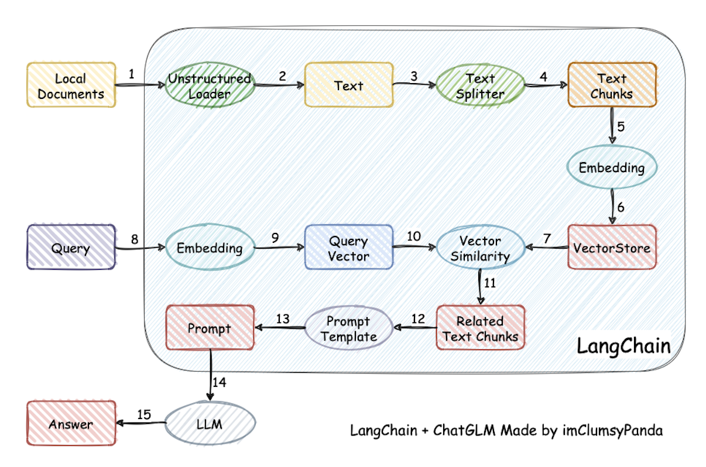
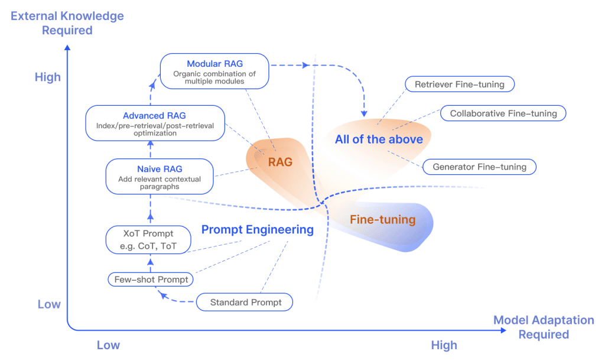

# RAG、微调与续训

## 4.5 模块2：RAG

### 4.5.1 什么是RAG

**1）定义**

RAG（Retrieval-Augmented Generation，检索增强生成）是一种结合信息检索（Retrieval）与文本生成（Generation）的技术，AI应用接收到用户请求后，先从外部**知识库检索**相关资料，并将这些资料与用户请求一并提供给大模型。模型在此基础上生成更准确、更有依据的回答。

**2）工作流程**

 

### 4.5.2 何时需要RAG

当模型缺乏必要的参考信息时，RAG可以用来补充外部知识与上下文。例如：需要获取最新信息（如当月新闻）、需要查阅或引用公司内部资料等场景。

### 4.5.3 实现方式

（1）在线平台

（2）离线客户端

（3）借助LangChain等框架或纯Python代码实现

## 4.6 模块3：微调（Fine-tuning）

### 4.6.1 什么是微调

在已经训练好的模型上，按照SFT或RLHF/RLAIF的范式训练模型。通常采用SFT的训练范式。

`训练目标`：适应特定任务或领域，提升在具体场景下的性能。

`数据特点`：小规模、高质量、任务相关的**标注数据**

`参数更新`：调整部分或全部参数（0.1%-100%）

### 4.6.2 何时需要微调

**（1）模型能力不足**

模型的指令遵循能力不足、风格/话术不能满足要求，反复调整提示词效果欠佳。

**（2）希望固化知识**

如果提示词很长，每次调用消耗大量token，长期服务成本高昂。并且不好维护，甚至有可能超出上下文窗口。此时可以通过微调将知识固化在模型权重中。

### 4.6.3 何时可以微调

**（1）数据充足**

微调需要的数据规模通常比提示词示例和RAG知识库更大，收集到足够的数据微调才有效果，否则容易`过拟合`。

**（2）硬件资源充足**

> 整体来说，微调成本较低（仅需少量标注数据）

### 4.6.4 微调的技术方法

随着模型规模越来越大，如何低成本地微调模型成为核心问题。

**（1）全参数微调（Full Fine-tuning）**

更新模型所有参数，理论上限最高但资源消耗巨大。7B模型全参微调需要约`80GB+显存`，适合资源充足、追求极致性能的场景。 

**（2）参数高效微调（PEFT, Parameter-Efficient Fine-Tuning）**

`LoRA（低秩适配）`：冻结原模型权重，在attention层插入低秩矩阵，仅训练新增的低秩参数。7B模型仅需训练`0.1%-1%参数（约4-20MB）`，显存占用减少90%以上。

`QLoRA`：在LoRA基础上引入4位量化，进一步降低显存占用。7B模型可在单卡24G显存上微调，成本降至全参微调的1/10。

**（3）其他高效方法**

- `Adapter Tuning`：在模型层间插入小型适配器模块
- `Prefix Tuning`：在输入前添加可学习的虚拟前缀
- `P-Tuning v2`：在模型每一层添加可训练的提示向量

### 4.6.5 主要风险

灾难性遗忘（学习新任务忘记旧任务）或过拟合

### 4.6.6 RAG vs 微调

RAG 和微调之间的差异，一直是热门话题。

RAG 特别适合于融合新知识，而微调则能够通过优化模型内部知识、输出格式以及提升复杂指令的执行能力，来增强模型的性能和效率。

下面这张图表展示了RAG在与其他模型优化方法相比时的独特特性：

## 4.7 模块4：续训（Continued Training）

### 4.7.1 什么是续训

在模型已经完成预训练和可能的微调之后，在大量语料上采用和预训练相同的范式继续训练，提升模型基础能力。

本质上，续训仍然属于 **Pre-Training 阶段的延续**。

### 4.7.2 何时需要续训

如果微调效果不理想，且问题来自模型对领域语言/知识分布的`系统性缺失`，可以考虑续训。

### 4.7.3 何时可以续训

（1）数据充足

大量的原始文本（无标注），数据规模大（GB - TB）。比如法律文档、医疗论文、企业日志、代码仓库。

（2）硬件资源充足

续训要求的`数据量`和`硬件资源`远高于微调，`成本`相应更高。

### 4.7.4 工程实践中的常见误区

**误区 1：用 SFT 数据去做“续训”**

→ 会破坏语言建模能力

**误区 2：想靠微调解决“领域知识缺失”**

→ 应该先续训，再微调

**误区 3：企业场景盲目续训**

→ 多数场景 `RAG + 微调` 已足够
